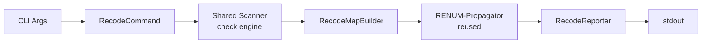

# Design Specification

## Overview

This design implements the `awa spec recode` command (REQ-RCOD-recode.md) by building a recode map that translates IDs from a source feature code to a target feature code with offset numbering, then delegating propagation to the existing RENUM propagator. The recode map is compatible with the `RenumberMap` interface, enabling direct reuse of the two-pass placeholder replacement.

## Architecture

### High-Level Architecture

Sequential pipeline: scan, build recode map, propagate (reuse RENUM), report.



### Module Organization

```
src/
├── commands/
│   └── recode.ts              # CLI entry, validation, orchestration
└── core/
    └── recode/
        ├── types.ts           # RecodeCommandOptions, RecodeResult
        ├── map-builder.ts     # Builds recode map with offset numbering
        └── reporter.ts        # Text and JSON output formatting
```

### Architectural Decisions

- RENUM PROPAGATOR REUSE: The recode map builder produces a RenumberMap-compatible structure so the RENUM propagator can be called directly. Alternatives: duplicate propagation logic, create abstract base
- SEPARATE OFFSETS: Requirements and properties use independent offset counters since they occupy different ID namespaces (CODE-N vs CODE_P-N). Alternatives: shared counter
- NO FILE RENAMING: Recoding only rewrites ID content within files. Filename changes are left to the user or a future merge command. Alternatives: auto-rename spec files

## Components and Interfaces

### RCOD-RecodeMapBuilder

Scans the target REQ file and DESIGN file to determine the highest existing requirement number and property number. Walks the source REQ file in document order, assigning each source ID a target ID offset past the maximum. Maps subrequirements (updated parent prefix), ACs (updated parent prefix), properties (separate offset), and component name prefixes. Returns a RenumberMap-compatible structure for the propagator.

IMPLEMENTS: RCOD-1_AC-1, RCOD-1_AC-2, RCOD-1_AC-3, RCOD-1_AC-4, RCOD-1_AC-5

```typescript
interface RecodeMapBuildResult {
  readonly map: RenumberMap;
  readonly noChange: boolean;
}

function buildRecodeMap(
  sourceCode: string,
  targetCode: string,
  specs: SpecParseResult
): RecodeMapBuildResult;
```

### RCOD-RecodeCommand

CLI orchestrator. Validates that both source and target codes have REQ files, invokes the recode pipeline, and returns the appropriate exit code. Delegates scanning to the shared scanner, map building to RecodeMapBuilder, propagation to the RENUM Propagator, and output to RecodeReporter.

IMPLEMENTS: RCOD-2_AC-1, RCOD-2_AC-2, RCOD-3_AC-1, RCOD-3_AC-2, RCOD-4_AC-1, RCOD-4_AC-4

```typescript
interface RecodeCommandOptions {
  readonly sourceCode: string;
  readonly targetCode: string;
  readonly dryRun?: boolean;
  readonly json?: boolean;
  readonly config?: string;
}

async function recodeCommand(options: RecodeCommandOptions): Promise<number>;
```

### RCOD-RecodeReporter

Formats recode results for display. Shows the source→target code mapping, the recode map table, and list of affected files. In dry-run mode, prefixes with a banner. In JSON mode, outputs structured JSON.

IMPLEMENTS: RCOD-4_AC-2, RCOD-4_AC-3

```typescript
function formatText(result: RecodeResult, dryRun: boolean): string;
function formatJson(result: RecodeResult): string;
```

## Data Models

### Core Types

- RECODE_RESULT: Aggregated output of the recode pipeline

```typescript
interface RecodeResult {
  readonly sourceCode: string;
  readonly targetCode: string;
  readonly map: RenumberMap;
  readonly affectedFiles: readonly AffectedFile[];
  readonly totalReplacements: number;
  readonly noChange: boolean;
}
```

### Command Types

- RECODE_COMMAND_OPTIONS: CLI options passed to the recode command

```typescript
interface RecodeCommandOptions {
  readonly sourceCode: string;
  readonly targetCode: string;
  readonly dryRun?: boolean;
  readonly json?: boolean;
  readonly config?: string;
}
```

## Correctness Properties

- RCOD_P-1 [Offset Correctness]: Target requirement IDs start at max(existing target requirement number) + 1; target property IDs start at max(existing target property number) + 1
  VALIDATES: RCOD-1_AC-1, RCOD-1_AC-4

- RCOD_P-2 [Family Completeness]: Every subrequirement, AC, and property derived from a recoded requirement appears in the map with the correct target prefix and offset
  VALIDATES: RCOD-1_AC-2, RCOD-1_AC-3, RCOD-1_AC-4

- RCOD_P-3 [Prefix Isolation]: Only IDs matching the source feature code prefix are modified; other prefixes are unchanged
  VALIDATES: RCOD-2_AC-1, RCOD-2_AC-2

## Error Handling

### RecodeError

Errors during recode execution.

- SOURCE_NOT_FOUND: No REQ file matches the source feature code
- TARGET_NOT_FOUND: No REQ file matches the target feature code

### Strategy

PRINCIPLES:

- Fail fast when either code has no REQ file
- Dry run never writes files
- Exit codes: 0 = no changes, 1 = changes applied/previewed, 2 = error

## Testing Strategy

### Property-Based Testing

- FRAMEWORK: fast-check
- MINIMUM_ITERATIONS: 100
- TAG_FORMAT: @awa-test: RCOD_P-{n}

### Unit Testing

- AREAS: recode map builder offset calculation, derived ID mapping, component prefix mapping, reporter output formatting

### Integration Testing

- SCENARIOS: basic recode, dry-run preview, JSON output, empty target (offset 0), missing source REQ, missing target REQ

## Requirements Traceability

### REQ-RCOD-recode.md

- RCOD-1_AC-1 → RCOD-RecodeMapBuilder (RCOD_P-1)
- RCOD-1_AC-2 → RCOD-RecodeMapBuilder (RCOD_P-2)
- RCOD-1_AC-3 → RCOD-RecodeMapBuilder (RCOD_P-2)
- RCOD-1_AC-4 → RCOD-RecodeMapBuilder (RCOD_P-1, RCOD_P-2)
- RCOD-1_AC-5 → RCOD-RecodeMapBuilder
- RCOD-2_AC-1 → RCOD-RecodeCommand (RCOD_P-3)
- RCOD-2_AC-2 → RCOD-RecodeCommand (RCOD_P-3)
- RCOD-3_AC-1 → RCOD-RecodeCommand
- RCOD-3_AC-2 → RCOD-RecodeCommand
- RCOD-4_AC-1 → RCOD-RecodeCommand
- RCOD-4_AC-2 → RCOD-RecodeReporter
- RCOD-4_AC-3 → RCOD-RecodeReporter
- RCOD-4_AC-4 → RCOD-RecodeCommand
