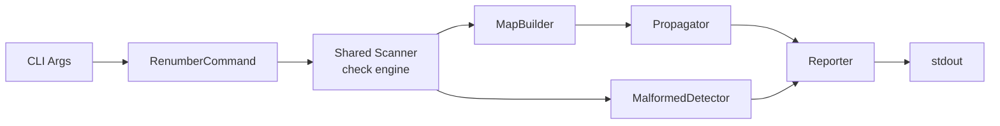

# Design Specification

## Overview

This design implements a pipeline architecture for `awa renumber` (REQ-RENUM-renumber.md). The pipeline reuses the shared scanner from the check/trace infrastructure to parse specs and scan code markers, then builds a renumber map from document order, applies it across all artifacts with collision-safe replacement, and reports results. A separate detector catches malformed ID tokens as warnings.

## Architecture

### High-Level Architecture

Sequential pipeline: scan, build map, propagate, detect malformed, report.



### Module Organization

```
src/
├── commands/
│   └── renumber.ts              # CLI entry, arg parsing, orchestration
└── core/
    └── renumber/
        ├── types.ts             # RenumberMap, RenumberOptions, AffectedFile
        ├── map-builder.ts       # Builds renumber map from spec document order
        ├── propagator.ts        # Applies map across all files safely
        ├── malformed-detector.ts # Detects malformed ID tokens
        └── reporter.ts          # Text and JSON output formatting
```

### Architectural Decisions

- SHARED SCANNER REUSE: Import the shared `scan()` from `core/trace/scanner.ts` rather than duplicating check engine wiring. Alternatives: direct check engine calls, custom parser
- TWO-PASS PLACEHOLDER REPLACEMENT: Replace old IDs with unique placeholders in pass one, then placeholders with new IDs in pass two, to eliminate swap collisions. Alternatives: topological sort of replacements, rename-via-temp-files
- LINE-LEVEL REGEX OVER AST: Use regex-based whole-ID matching on file content rather than parsing ASTs. Matches the existing spec-parser and marker-scanner approach. Alternatives: mdast manipulation, TypeScript AST transforms
- AUTHORITATIVE SOURCE PER ID KIND: REQ file determines requirement, subrequirement, and AC ordering; DESIGN file determines property ordering. Each source is walked in document order independently. Alternatives: single unified ordering file

## Components and Interfaces

### RENUM-MapBuilder

Walks the REQ file for a feature code in document order, assigns sequential numbers to requirements, subrequirements, and ACs. Walks the DESIGN file for properties. Produces a RENUMBER_MAP with old-to-new entries for every ID whose number changes. Returns an empty map when IDs are already sequential.

IMPLEMENTS: RENUM-1_AC-1, RENUM-1_AC-2, RENUM-1_AC-3, RENUM-2_AC-1, RENUM-2_AC-2, RENUM-3_AC-1, RENUM-3_AC-2, RENUM-4_AC-1, RENUM-4_AC-2

```typescript
interface MapBuildResult {
  readonly map: RenumberMap;
  readonly noChange: boolean;
}

function buildRenumberMap(
  code: string,
  specs: SpecParseResult
): MapBuildResult;
```

### RENUM-Propagator

Applies the renumber map to all file content using two-pass placeholder replacement. First pass substitutes every old ID with a unique placeholder. Second pass substitutes placeholders with new IDs. Uses whole-ID boundary matching to avoid partial matches. Operates on spec files, code files with markers, and cross-reference lines.

IMPLEMENTS: RENUM-5_AC-1, RENUM-5_AC-2, RENUM-5_AC-3, RENUM-6_AC-1, RENUM-6_AC-2

```typescript
interface PropagationResult {
  readonly affectedFiles: readonly AffectedFile[];
  readonly totalReplacements: number;
}

async function propagate(
  map: RenumberMap,
  specs: SpecParseResult,
  markers: MarkerScanResult,
  dryRun: boolean
): Promise<PropagationResult>;
```

### RENUM-MalformedDetector

Scans file content for tokens that start with the target feature code prefix followed by a separator but do not conform to standard ID formats. Reports each as a warning with file path, line number, and the invalid token. Does not block renumbering.

IMPLEMENTS: RENUM-12_AC-1, RENUM-12_AC-2, RENUM-12_AC-3

```typescript
interface MalformedWarning {
  readonly filePath: string;
  readonly line: number;
  readonly token: string;
}

function detectMalformed(
  code: string,
  fileContents: ReadonlyMap<string, string>
): readonly MalformedWarning[];
```

### RENUM-Reporter

Formats renumber results for display. In text mode, shows the renumber map as a table and lists affected files. In dry-run mode, prefixes output with a dry-run banner. In JSON mode, outputs a structured JSON object to stdout.

IMPLEMENTS: RENUM-7_AC-1, RENUM-11_AC-1

```typescript
function formatText(
  result: RenumberResult,
  dryRun: boolean
): string;

function formatJson(result: RenumberResult): string;
```

### RENUM-RenumberCommand

CLI orchestrator. Parses arguments, validates inputs, discovers feature codes for `--all` mode, runs the renumber pipeline per code, and returns the appropriate exit code. Delegates scanning to the shared scanner, map building to MapBuilder, propagation to Propagator, detection to MalformedDetector, and output to Reporter.

IMPLEMENTS: RENUM-8_AC-1, RENUM-8_AC-2, RENUM-9_AC-1, RENUM-9_AC-2, RENUM-9_AC-3, RENUM-9_AC-4, RENUM-10_AC-1

```typescript
interface RenumberCommandOptions {
  readonly code?: string;
  readonly all?: boolean;
  readonly dryRun?: boolean;
  readonly json?: boolean;
  readonly config?: string;
}

async function renumberCommand(options: RenumberCommandOptions): Promise<number>;
```

## Data Models

### Core Types

- RENUMBER_MAP: Mapping from old ID strings to new ID strings for one feature code

```typescript
interface RenumberMap {
  readonly code: string;
  readonly entries: ReadonlyMap<string, string>;
}
```

- AFFECTED_FILE: A file touched by propagation with per-line replacement details

```typescript
interface AffectedFile {
  readonly filePath: string;
  readonly replacements: readonly Replacement[];
}

interface Replacement {
  readonly line: number;
  readonly oldId: string;
  readonly newId: string;
}
```

### Command Types

- RENUMBER_COMMAND_OPTIONS: CLI options passed to the renumber command

```typescript
interface RenumberCommandOptions {
  readonly code?: string;
  readonly all?: boolean;
  readonly dryRun?: boolean;
  readonly json?: boolean;
  readonly config?: string;
}
```

- RENUMBER_RESULT: Aggregated output of the renumber pipeline for one feature code

```typescript
interface RenumberResult {
  readonly code: string;
  readonly map: RenumberMap;
  readonly affectedFiles: readonly AffectedFile[];
  readonly totalReplacements: number;
  readonly malformedWarnings: readonly MalformedWarning[];
  readonly noChange: boolean;
}
```

## Correctness Properties

- RENUM_P-1 [Map Determinism]: The same REQ file content always produces the same renumber map
  VALIDATES: RENUM-1_AC-1

- RENUM_P-2 [Family Completeness]: Every subrequirement and AC derived from a renumbered requirement appears in the map with updated parent prefix
  VALIDATES: RENUM-1_AC-2, RENUM-2_AC-2, RENUM-3_AC-2

- RENUM_P-3 [No-Op Idempotence]: Renumbering an already-sequential spec produces an empty map
  VALIDATES: RENUM-1_AC-3

- RENUM_P-4 [Collision Freedom]: Two-pass placeholder replacement never produces intermediate duplicate IDs
  VALIDATES: RENUM-6_AC-1

- RENUM_P-5 [Prefix Isolation]: Only IDs matching the target feature code prefix are modified; other prefixes are unchanged
  VALIDATES: RENUM-6_AC-2, RENUM-8_AC-2

- RENUM_P-6 [Exit Code Correctness]: Exit code is 0 when no changes needed, 1 when changes applied or previewed, 2 on error
  VALIDATES: RENUM-10_AC-1

## Error Handling

### RenumberError

Errors during renumber execution.

- CODE_NOT_FOUND: No REQ file matches the specified feature code
- NO_ARGS: Neither a feature code nor `--all` was provided
- WRITE_FAILED: File system error during propagation

### Strategy

PRINCIPLES:

- Malformed ID warnings do not block renumbering
- Fail fast when no REQ file exists for the given code
- Dry run never writes files
- Exit codes: 0 = no changes, 1 = changes applied/previewed, 2 = error

## Testing Strategy

### Property-Based Testing

- FRAMEWORK: fast-check
- MINIMUM_ITERATIONS: 100
- TAG_FORMAT: @awa-test: RENUM_P-{n}

### Unit Testing

- AREAS: map-builder sequential assignment, propagator two-pass replacement, malformed-detector token matching, reporter text/JSON formatting

### Integration Testing

- SCENARIOS: single code renumber, `--all` batch renumber, `--dry-run` preview, `--json` output, no-change detection, missing REQ file error, malformed ID warning

## Requirements Traceability

### REQ-RENUM-renumber.md

- RENUM-1_AC-1 → RENUM-MapBuilder (RENUM_P-1)
- RENUM-1_AC-2 → RENUM-MapBuilder (RENUM_P-2)
- RENUM-1_AC-3 → RENUM-MapBuilder (RENUM_P-3)
- RENUM-2_AC-1 → RENUM-MapBuilder
- RENUM-2_AC-2 → RENUM-MapBuilder (RENUM_P-2)
- RENUM-3_AC-1 → RENUM-MapBuilder
- RENUM-3_AC-2 → RENUM-MapBuilder (RENUM_P-2)
- RENUM-4_AC-1 → RENUM-MapBuilder
- RENUM-4_AC-2 → RENUM-MapBuilder
- RENUM-5_AC-1 → RENUM-Propagator
- RENUM-5_AC-2 → RENUM-Propagator
- RENUM-5_AC-3 → RENUM-Propagator
- RENUM-6_AC-1 → RENUM-Propagator (RENUM_P-4)
- RENUM-6_AC-2 → RENUM-Propagator (RENUM_P-5)
- RENUM-7_AC-1 → RENUM-Reporter
- RENUM-8_AC-1 → RENUM-RenumberCommand
- RENUM-8_AC-2 → RENUM-RenumberCommand (RENUM_P-5)
- RENUM-9_AC-1 → RENUM-RenumberCommand
- RENUM-9_AC-2 → RENUM-RenumberCommand
- RENUM-9_AC-3 → RENUM-RenumberCommand
- RENUM-9_AC-4 → RENUM-RenumberCommand
- RENUM-10_AC-1 → RENUM-RenumberCommand (RENUM_P-6)
- RENUM-11_AC-1 → RENUM-Reporter
- RENUM-12_AC-1 → RENUM-MalformedDetector
- RENUM-12_AC-2 → RENUM-MalformedDetector
- RENUM-12_AC-3 → RENUM-MalformedDetector
