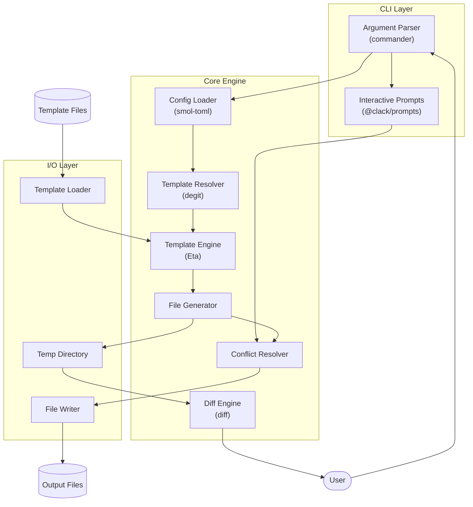
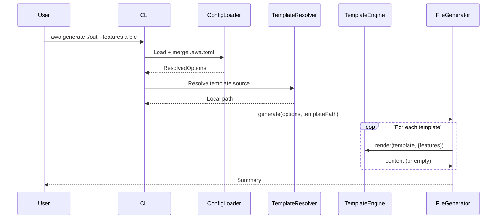
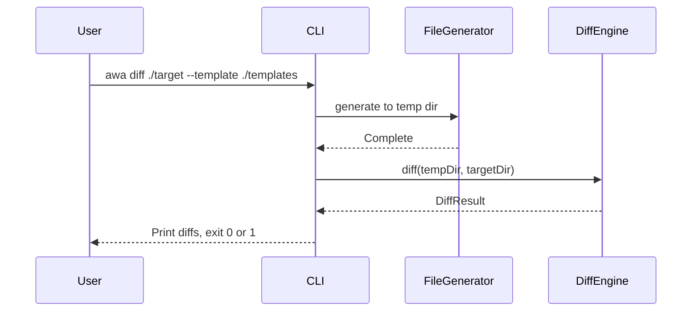

# Architecture

## Project Purpose

awa CLI is a TypeScript-based command-line tool that generates AI coding agent configuration files via templating. It produces the awa agent system prompt files (`.github/agents/*.agent.md`) from customizable templates with conditional output support based on user-specified feature flags.

## System Overview

- CLI LAYER: Command parsing, argument validation, user prompts
- CONFIGURATION LOADER: TOML config file parsing, CLI override merging
- TEMPLATE RESOLVER: Resolve template source (local path or Git repo)
- TEMPLATE ENGINE: Template loading, rendering with conditional logic
- FILE GENERATOR: Output file creation, directory management, conflict resolution
- DIFF ENGINE: Template comparison against target directory with diff reporting
- CHECK ENGINE: Traceability chain validation — scans code markers and spec IDs, reports findings

## Technology Stack

| Technology | Purpose |
|------------|---------|
| Node.js 24 | Runtime environment |
| TypeScript 5.x | Type-safe implementation |
| tsup | Build/bundling (ESM output) |
| Vitest | Testing framework |
| Biome | Linting and formatting |
| commander | CLI framework (mature, full-featured, supports positional args in help) |
| @clack/prompts | Interactive CLI prompts (overwrite confirmations) |
| @clack/core | Low-level prompt primitives (custom delete multiselect) |
| Eta | Template engine (lightweight, fast, TypeScript-native, v4) |
| chalk 5.x | Terminal output coloring |
| smol-toml | TOML parser (lightweight, spec-compliant) |
| degit | Git repository template fetching (no full clone) |
| diff | Cross-platform unified diff generation |
| yaml | YAML parsing for schema rule files |
| unified + remark-parse | Markdown → mdast AST parsing |
| remark-gfm | GFM table support in remark pipeline |

## High-Level Architecture



## Directory Structure

```
awa/
├── src/
│   ├── cli/               # CLI entry point and argument parsing
│   │   └── index.ts       # Main CLI entry
│   ├── commands/          # Command implementations
│   │   ├── generate.ts    # Generate command orchestration
│   │   ├── diff.ts        # Diff command orchestration
│   │   └── check.ts    # Validate command orchestration
│   ├── core/              # Core business logic
│   │   ├── batch-runner.ts # Multi-target batch processing
│   │   ├── config.ts      # Configuration loader
│   │   ├── delete-list.ts # Delete list parser (feature-gated)
│   │   ├── differ.ts      # Diff-based comparison
│   │   ├── feature-resolver.ts # Feature resolution (presets, removals)
│   │   ├── generator.ts   # File generation logic
│   │   ├── resolver.ts    # Conflict and delete resolution
│   │   ├── template-resolver.ts  # Template source resolver
│   │   ├── template.ts    # Template engine wrapper
│   │   └── validate/      # Traceability validation
│   │       ├── types.ts           # Config, finding, marker types
│   │       ├── errors.ts          # CheckError class
│   │       ├── glob.ts            # Shared glob + ignore filtering
│   │       ├── marker-scanner.ts  # Scans code for @awa-* markers
│   │       ├── spec-parser.ts     # Parses spec files for IDs
│   │       ├── code-spec-checker.ts # Matches markers against spec IDs
│   │       ├── spec-spec-checker.ts # Validates cross-references
│   │       ├── reporter.ts        # Text/JSON output formatting
│   │       ├── rule-types.ts      # Schema rule type definitions
│   │       ├── rule-loader.ts     # YAML rule file loader/validator
│   │       └── schema-checker.ts  # mdast-based structural validator
│   ├── utils/             # Utility functions
│   │   ├── fs.ts          # File system helpers
│   │   └── logger.ts      # Console output helpers (uses chalk)
│   ├── types/             # TypeScript type definitions
│   │   └── index.ts
│   └── _generated/        # Auto-generated files
│       └── package_info.ts
├── templates/             # Default template files (bundled)
│   ├── awa/               # Default awa agent templates
│   │   ├── _delete.txt    # Delete list with feature-gated sections
│   │   ├── _partials/     # Shared content blocks (not output directly)
│   │   └── *.md           # Agent configuration templates
│   └── example/           # Example template set
├── scripts/               # Build and utility scripts
├── package.json
├── tsconfig.json
├── tsup.config.ts
├── vitest.config.ts
└── biome.json
```

## Component Details

### CLI Layer

Entry point and argument parsing.

RESPONSIBILITIES

- Parse command-line arguments (positional output directory, `--template`, `--force`, `--dry-run`, `--delete`, `--config`, `--refresh`, `--features`, `--preset`, `--remove-features`)
- Validate inputs
- Invoke configuration loader then core commands
- Display help and version info
- Support `generate`, `diff`, and `check` subcommands

CONSTRAINTS

- Uses commander for command definition
- Output directory is an optional positional argument (can come from CLI or config)
- `--features` accepts variadic string values
- `--config` specifies alternate config file path
- `diff` command shares options with `generate` (except `--force`, `--dry-run`, `--delete`)
- `diff` command adds `--list-unknown` option
- Help output displays positional argument syntax

### Configuration Loader

Loads and merges configuration from file and CLI.

RESPONSIBILITIES

- Load `.awa.toml` from current directory (default) or `--config` path
- Parse TOML configuration
- Merge CLI arguments over config file values (CLI wins)
- Provide unified options object to commands

CONSTRAINTS

- Uses smol-toml for parsing
- Missing config file is not an error (all options have defaults or are CLI-provided)
- CLI arguments always override config file values
- Arrays (features, preset, remove-features) are replaced, not merged
- Supports nested TOML tables (`[presets]`, `[check]`, `[targets.*]`)
- `[targets.*]` sections define per-agent configurations with generation-related fields only

### Target Resolver

Resolves per-agent target configurations by merging with root config.

RESPONSIBILITIES

- Parse `[targets.*]` sections from config into TargetConfig map
- Merge target config with root config using nullish coalescing (target overrides root)
- Validate target names and error on unknown targets
- Error when `--all` is used with no targets defined

CONSTRAINTS

- Target fields limited to generation-related options: output, template, features, preset, remove-features
- Boolean flags (force, dry-run, delete, refresh) are NOT per-target — they apply globally
- Target features replace root features entirely (no deep merge)

### Batch Runner

Processes multiple targets in a single command invocation.

RESPONSIBILITIES

- Iterate targets, invoke generate/diff for each
- Suppress interactive prompting in batch mode (non-interactive)
- Prefix log lines with `[target-name]` for per-target reporting
- Handle CLI positional output override logic (`--all` ignores, `--target` allows override)
- Aggregate exit codes for diff batch mode (0/1/2)

CONSTRAINTS

- `--all` processes all named targets; `--target` processes one
- First error short-circuits in diff batch mode (exit code 2)
- Template deduplication: shared templates resolved once across targets

### Template Resolver

Resolves template source to a local directory.

RESPONSIBILITIES

- Detect template source type (local path vs Git repo)
- Fetch Git repositories to local cache
- Support branch/tag/commit references
- Return resolved local path for template engine

CONSTRAINTS

- Uses degit for shallow Git fetches (no .git folder, fast)
- Git URL formats supported:
  - `owner/repo` (GitHub shorthand)
  - `github:owner/repo`
  - `gitlab:owner/repo`
  - `bitbucket:owner/repo`
  - `https://github.com/owner/repo`
  - `git@github.com:owner/repo`
- Subdirectory support: `owner/repo/path/to/templates`
- Ref support: `owner/repo#branch`, `owner/repo#v1.0.0`, `owner/repo#commit`
- Cache location: `~/.cache/awa/templates/`
- Local paths used directly (no caching)
- `--refresh` re-fetches cached Git templates

### Template Engine

Wrapper around Eta for template rendering.

RESPONSIBILITIES

- Load templates from specified directory
- Render templates with context (feature flags as `features` array)
- Support conditional output via template logic
- Handle empty template output (skip file creation)
- Support partials (shared content blocks) for composition

CONSTRAINTS

- Templates use Eta syntax (`<%= %>`, `<% %>`, `<%~ %>`)
- Feature flags accessible as `it.features` array in templates
- Empty string output = skip file creation
- Special marker `<!-- AWA:EMPTY_FILE -->` = create empty file
- Partials stored in `_partials/` directory (prefixed with `_` = not output directly)
- Include partials via `<%~ include('_partials/header', it) %>`

### File Generator

Orchestrates file creation from rendered templates.

RESPONSIBILITIES

- Walk template directory structure
- Invoke template engine for each file
- Create output directory structure
- Delegate conflict resolution to resolver

CONSTRAINTS

- Mirrors template directory structure in output
- Creates missing directories automatically
- Template filename = output filename (no `.eta` extension in template names)
- Files/directories starting with `_` are excluded from output (partials, helpers)
- Loads `_delete.txt` from template root to delete obsolete files after generation (requires `--delete` flag)
- Delete list entries that conflict with generated files are skipped with a warning
- Supports interactive multi-tool selection when no tool feature flags are present

### Delete List

Declares files to delete in the output directory when generating from a template set.

RESPONSIBILITIES

- Parse `_delete.txt` from template root directory
- Support feature-gated sections for conditional deletion
- Resolve relative paths against output directory
- Coordinate with generator to skip deletions that conflict with generated files

CONSTRAINTS

- File name: `_delete.txt` (underscore prefix = excluded from output)
- Format: one relative path per line, `#` comments, blank lines ignored
- Feature-gated sections: `# @feature <name> [<name2> ...]` marks subsequent paths as stale tool output — deleted only when NONE of the listed features are active
- Any other `#` comment line resets to always-delete behaviour
- Paths are relative to the output directory
- Absent file = no deletions (not an error)
- Deletions require `--delete` flag (without it, warns only)
- Deletions happen after file generation
- Files that don't exist in output are silently skipped
- User is prompted to confirm deletions via destructive-styled multiselect (red checkboxes, all pre-selected)
- `--force` deletes without prompting
- `--dry-run` logs deletions without executing them

### Conflict Resolver

Handles existing file conflicts.

RESPONSIBILITIES

- Detect existing files and compare content
- Auto-skip files with identical content (skip-equal)
- Prompt user for action (overwrite/skip) on changed files unless `--force`
- Skip prompts in `--dry-run` mode

CONSTRAINTS

- Uses @clack/prompts multiselect for batch conflict resolution
- All conflicting files shown in a single prompt (all checked by default)
- Respects `--force` flag to auto-overwrite
- Respects `--dry-run` to simulate without changes
- Files with identical content are skipped automatically (reported as "Skipped (equal)")

### Delete Resolver

Handles delete list confirmation.

RESPONSIBILITIES

- Prompt user to confirm file deletions from delete list
- Support force and dry-run modes

CONSTRAINTS

- Uses @clack/core `MultiSelectPrompt` for destructive-styled multiselect (red checkboxes)
- All candidates pre-selected by default
- `--force` deletes without prompting
- `--dry-run` returns all candidates (caller logs without deleting)

### Diff Engine

Compares generated output against existing target files.

RESPONSIBILITIES

- Generate templates to a temporary directory
- Compare generated files against target directory
- Produce unified diff output for each differing file
- Report generated-only files by default; optionally report target-only files when flag is enabled
- Report files in `_delete.txt` that exist in target as "delete-listed" (respecting feature-gated sections)
- Clean up temporary directory after diff

CONSTRAINTS

- Uses Node.js built-in `os.tmpdir()` for cross-platform temp directory
- Uses `diff` npm package for cross-platform unified diff generation
- Exact comparison (whitespace-sensitive) for all text files
- Binary files compared byte-for-byte
- Exit code 0 = all files match, exit code 1 = differences found
- No modifications to target directory (read-only comparison)

### Check Engine

Checks traceability chain integrity between code markers and spec files.

RESPONSIBILITIES

- Scan source files for `@awa-impl`, `@awa-test`, `@awa-component` markers
- Parse spec files to extract requirement IDs, AC IDs, property IDs, component names
- Match code markers against spec IDs and report orphaned markers
- Report acceptance criteria with no corresponding `@awa-test`
- Validate IMPLEMENTS/VALIDATES cross-references between DESIGN and REQ specs
- Report orphaned spec files (feature codes not referenced anywhere)
- Validate ID format against configurable regex
- Output findings as text (human-readable) or JSON (CI-friendly)
- Load declarative schema rules from `*.rules.yaml` files
- Parse Markdown into mdast AST and check against schema rules
- Detect missing sections, wrong heading levels, missing content, bad table columns, prohibited patterns
- Support `schema-enabled = false` to skip schema checking

CONSTRAINTS

- Uses Node.js 24 built-in `fs.glob` for file discovery (no external glob dependency)
- All behavior configurable via `[check]` section in `.awa.toml`
- Default configuration matches the bundled awa workflow conventions
- CLI `--ignore` patterns append to config ignore (not replace)
- Orphaned markers and broken cross-refs are errors; uncovered ACs and orphaned specs are warnings
- Warnings are treated as errors by default (exit code 1); `--allow-warnings` or `[check].allow-warnings = true` restores previous behavior
- Exit code 0 = clean, 1 = errors or warnings found (unless `--allow-warnings`), 2 = internal error
- `ARCHITECTURE.md` is excluded from orphaned spec detection (has no feature code)
- Markers support comma-separated IDs and partial annotations

## Component Interactions



### Diff Command Flow



## Architectural Rules

- Template compilation cached per session; parallel file operations where possible
- Single responsibility per module; max 200 lines per source file
- No eval or dynamic code execution outside template engine
- Template sandbox prevents file system access from templates
- Unit tests for core logic, integration tests for CLI; coverage target 80%
- Biome for linting/formatting; strict TypeScript; ESM-only output
- Empty template output (after trim) = skip file; `<!-- AWA:EMPTY_FILE -->` = create empty file
- Feature flags as `it.features: string[]`; partials in `_partials/` (not output)
- `_delete.txt` lists files to delete; `# @feature <name>` for feature-gated sections
- Deletions require `--delete` flag; `--force` skips prompts; `--dry-run` simulates
- `awa diff` generates to temp dir, compares against target, cleans up on exit
- Exit codes: 0 = clean/match, 1 = errors/differences, 2 = internal error
- Configuration via `.awa.toml` with `[presets]` and `[check]` tables; CLI overrides config
- Template sources: local path, GitHub shorthand (`owner/repo`), Git URL, SSH; cache in `~/.cache/awa/templates/`

## Developer Commands

NOTE: These commands use the local development version via `npm run`. For the installed CLI, use `npx awa` or `awa` directly.

| Command | Description |
|---------|-------------|
| `npm install` | Install dependencies |
| `npm run build` | Build for production (outputs to `dist/`) |
| `npm run dev` | Run CLI in development mode via tsx |
| `npm run start` | Run built CLI from `dist/` |
| `npm run init` | Run initialization script (generate package info) |
| `npm run gen:example` | Generate example template to `outputs/example` |
| `npm run gen:awa` | Generate awa templates to `outputs/awa` |
| `npm run gen:awa:this` | Generate awa templates for this project |
| `npm run diff:awa:this` | Diff awa templates against this project |
| `npm test` | Run tests once |
| `npm run test:watch` | Run tests in watch mode |
| `npm run test:coverage` | Run tests with coverage report |
| `npm run lint` | Check code with Biome |
| `npm run lint:fix` | Fix linting issues automatically |
| `npm run format` | Format code with Biome |
| `npm run typecheck` | TypeScript type checking |
| `npm run clean` | Clean build artifacts |

## Change Log

- 1.0.0 (2025-12-11): Initial architecture
- 1.1.0 (2025-12-11): Added Diff Engine component and diff command flow
- 1.2.0 (2025-12-16): Added list-unknown flag for target-only file reporting
- 2.0.0 (2025-12-19): Schema alignment update - removed Table of Contents, replaced bold with CAPITALS, added Change Log
- 2.1.0 (2026-02-24): Added delete list (`_delete.txt`) convention, delete-listed diff reporting, skip-equal file action type
- 2.2.0 (2026-02-24): Aligned with code — added feature-gated delete sections, `--delete` flag, `DeleteResolver`, interactive multi-tool selection, `delete`/`list-unknown` config options, fixed directory structure, updated developer commands
- 2.4.0 (2026-07-14): Added schema validation — declarative YAML rules for Markdown structural checks via remark/mdast, rule-loader, schema-checker components
- 2.3.0 (2026-07-14): Added Check Engine component — traceability chain validation (`awa check`), `[check]` config table, marker scanning, spec parsing, cross-reference checking, JSON/text reporting
- 2.5.0 (2026-02-27): Schema upgrade — fixed H1 title to match ARCHITECTURE schema, replaced bold formatting with CAPITALS in System Overview
- 2.6.0 (2026-02-28): Condensed sequence diagrams, consolidated Architectural Rules into flat list, removed over-detailed subsections to meet 500-line limit
- 2.7.0 (2026-02-28): Check Engine warnings treated as errors by default; added `--allow-warnings` flag