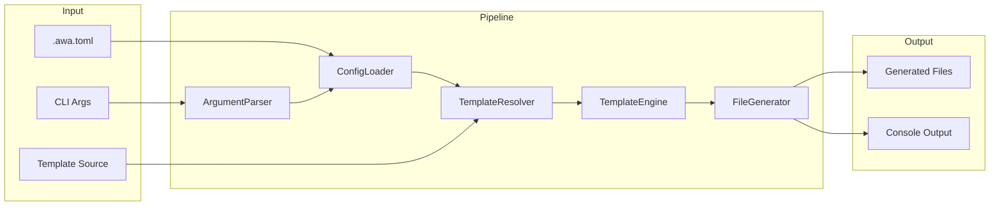

# Design Specification

## Overview

This document defines the technical design for awa CLI, a TypeScript command-line tool that generates AI coding agent configuration files from templates. The design implements a pipeline architecture: CLI parses arguments, loads configuration, resolves template sources, renders templates with feature flags, and writes output files with conflict resolution.

## Architecture

### Affected Layers

CLI Layer, Core Engine, I/O Layer

### High-Level Architecture



### Module Organization

```
src/
├── cli/
│   └── index.ts           # CLI entry, command definitions
├── commands/
│   ├── generate.ts        # Generate command orchestration
│   └── diff.ts            # Diff command orchestration
├── core/
│   ├── config.ts          # ConfigLoader
│   ├── delete-list.ts     # DeleteList parser (feature-gated)
│   ├── differ.ts          # DiffEngine
│   ├── feature-resolver.ts # FeatureResolver
│   ├── template-resolver.ts # TemplateResolver
│   ├── template.ts        # TemplateEngine
│   ├── generator.ts       # FileGenerator
│   └── resolver.ts        # ConflictResolver, DeleteResolver
├── utils/
│   ├── fs.ts              # File system helpers
│   └── logger.ts          # Console output (chalk)
└── types/
    └── index.ts           # Shared type definitions
```

### Architectural Decisions

- PIPELINE OVER EVENT: Sequential pipeline for predictable flow and error handling. Alternatives: event-driven (complexity), middleware chain (over-engineering)
- FAIL-FAST: Stop on first error to prevent partial/inconsistent output. Alternatives: continue-on-error (complex recovery), collect-all-errors (confusing UX)
- SHALLOW GIT FETCH: Use degit for fast, minimal fetches without .git history. Alternatives: full clone (slow, wasteful), sparse checkout (complex)
- BINARY DETECTION BEFORE DIFF: The `diff` library is text-only; binary files must be detected before diffing. Use `isbinaryfile` npm package (well-maintained, popular) for null-byte detection. Alternatives: manual null-byte scan (reinventing wheel), file extension heuristic (incomplete)

## Components and Interfaces

### CLI-ArgumentParser

Parses CLI arguments using commander, validates inputs, and produces a raw options object for downstream processing. Supports both `generate` and `diff` subcommands with positional arguments displayed in help output.

IMPLEMENTS: CLI-1_AC-1, CLI-1_AC-2, CLI-1_AC-3, CLI-1_AC-4, CLI-1_AC-5, CLI-2_AC-1, CLI-2_AC-2, CLI-2_AC-5, CLI-2_AC-6, CLI-3_AC-1, CLI-4_AC-1, CLI-4_AC-2, CLI-5_AC-1, CLI-6_AC-1, CLI-7_AC-1, CLI-8_AC-1, CLI-9_AC-1, CLI-9_AC-2, CLI-9_AC-3, CLI-10_AC-1, CLI-10_AC-2, CLI-11_AC-1, CLI-11_AC-2, CLI-11_AC-3, CLI-12_AC-1, CFG-5_AC-2, DIFF-7_AC-1, DIFF-7_AC-2, DIFF-7_AC-3, DIFF-7_AC-4, DIFF-7_AC-5, DIFF-7_AC-6, DIFF-7_AC-7, DIFF-7_AC-8, DIFF-7_AC-9, DIFF-7_AC-10, DIFF-7_AC-12, DIFF-7_AC-13, FP-2_AC-1, FP-2_AC-2, FP-2_AC-4, FP-4_AC-1, FP-4_AC-2, FP-4_AC-3, FP-4_AC-5, GEN-10_AC-1, GEN-10_AC-2

```typescript
interface RawCliOptions {
  output?: string;  // Optional positional argument (required if not in config)
  template?: string;
  features?: string[];
  preset?: string[];
  removeFeatures?: string[];
  force?: boolean;
  dryRun?: boolean;
  delete?: boolean;
  config?: string;
  refresh?: boolean;
  listUnknown?: boolean;
}

interface ArgumentParser {
  parse(argv: string[]): RawCliOptions;
}
```

### CFG-ConfigLoader

Loads TOML configuration from file, merges with CLI arguments (CLI wins), and produces resolved options with defaults applied. Parses the `[presets]` table for named feature bundles.

IMPLEMENTS: CFG-1_AC-1, CFG-1_AC-2, CFG-1_AC-3, CFG-1_AC-4, CFG-2_AC-1, CFG-2_AC-2, CFG-2_AC-3, CFG-3_AC-1, CFG-3_AC-2, CFG-3_AC-3, CFG-3_AC-4, CFG-3_AC-5, CFG-3_AC-6, CFG-3_AC-7, CFG-3_AC-8, CFG-3_AC-9, CFG-3_AC-10, CFG-4_AC-1, CFG-4_AC-2, CFG-4_AC-3, CFG-4_AC-4, CFG-5_AC-1, CFG-6_AC-1, CFG-6_AC-2, CLI-2_AC-3, CLI-2_AC-4, CLI-4_AC-3, CLI-7_AC-2, FP-1_AC-1, FP-1_AC-2, FP-1_AC-3, FP-1_AC-4, FP-3_AC-1, FP-3_AC-2, FP-3_AC-3, FP-5_AC-1, FP-5_AC-2, FP-5_AC-3

```typescript
interface PresetDefinitions {
  [presetName: string]: string[];
}

interface FileConfig {
  output?: string;  // Optional in config file; CLI positional arg takes precedence
  template?: string;
  features?: string[];
  preset?: string[];
  'remove-features'?: string[];
  force?: boolean;
  'dry-run'?: boolean;
  delete?: boolean;
  refresh?: boolean;
  presets?: PresetDefinitions;
  'list-unknown'?: boolean;
}

interface ResolvedOptions {
  output: string;
  template: string | null;
  features: string[];
  preset: string[];
  removeFeatures: string[];
  force: boolean;
  dryRun: boolean;
  delete: boolean;
  refresh: boolean;
  presets: PresetDefinitions;
  listUnknown: boolean;
}

interface ConfigLoader {
  load(configPath: string | null): Promise<FileConfig | null>;
  merge(cli: RawCliOptions, file: FileConfig | null): ResolvedOptions;
}
```

### FP-FeatureResolver

Computes the final feature set from base features, activated presets, and removals. Validates that referenced preset names exist in the presets table.

IMPLEMENTS: FP-2_AC-3, FP-6_AC-1, FP-6_AC-2, FP-6_AC-3, FP-6_AC-4, FP-6_AC-5, FP-7_AC-1, FP-7_AC-2, FP-4_AC-4

```typescript
interface FeatureResolutionInput {
  baseFeatures: string[];
  presetNames: string[];
  removeFeatures: string[];
  presetDefinitions: PresetDefinitions;
}

interface FeatureResolver {
  resolve(input: FeatureResolutionInput): string[];
  validatePresets(presetNames: string[], definitions: PresetDefinitions): void;
}
```

### TPL-TemplateResolver

Detects template source type (local vs Git), fetches remote templates to cache, and returns a resolved local path.

IMPLEMENTS: CLI-3_AC-2, CLI-3_AC-3, CLI-8_AC-2, TPL-1_AC-1, TPL-1_AC-2, TPL-1_AC-3, TPL-1_AC-4, TPL-2_AC-1, TPL-2_AC-2, TPL-2_AC-3, TPL-2_AC-4, TPL-2_AC-5, TPL-2_AC-6, TPL-3_AC-1, TPL-3_AC-2, TPL-3_AC-3, TPL-3_AC-4, TPL-10_AC-1, TPL-10_AC-2, TPL-10_AC-3

```typescript
type TemplateSourceType = 'local' | 'git' | 'bundled';

interface ResolvedTemplate {
  type: TemplateSourceType;
  localPath: string;
  source: string;
}

interface TemplateResolver {
  resolve(source: string | null, refresh: boolean): Promise<ResolvedTemplate>;
  detectType(source: string): TemplateSourceType;
  getCachePath(source: string): string;
}
```

### TPL-TemplateEngine

Wraps Eta for template rendering. Loads templates, provides feature flag context, handles empty output detection, and supports partials.

IMPLEMENTS: TPL-4_AC-1, TPL-4_AC-2, TPL-4_AC-3, TPL-4_AC-4, TPL-5_AC-1, TPL-5_AC-2, TPL-5_AC-3, TPL-6_AC-1, TPL-6_AC-2, TPL-7_AC-1, TPL-7_AC-2, TPL-8_AC-1, TPL-8_AC-2, TPL-8_AC-3, TPL-8_AC-4, TPL-11_AC-1, TPL-11_AC-2

```typescript
interface TemplateContext {
  features: string[];
}

interface RenderResult {
  content: string;
  isEmpty: boolean;
  isEmptyFileMarker: boolean;
}

interface TemplateEngine {
  configure(templateDir: string): void;
  render(templatePath: string, context: TemplateContext): Promise<RenderResult>;
}
```

### GEN-FileGenerator

Orchestrates the generation process: walks template directory, invokes template engine, manages output structure, coordinates conflict resolution, and processes the delete list. When `dryRun` is true, it computes and reports actions without creating directories or writing files.

IMPLEMENTS: GEN-1_AC-1, GEN-1_AC-2, GEN-1_AC-3, GEN-2_AC-1, GEN-2_AC-2, GEN-2_AC-3, GEN-3_AC-1, GEN-3_AC-2, GEN-3_AC-3, GEN-8_AC-1, GEN-8_AC-2, GEN-8_AC-3, GEN-11_AC-3, GEN-12_AC-1, GEN-12_AC-2, GEN-12_AC-3, GEN-12_AC-4, GEN-12_AC-5, GEN-12_AC-6, GEN-12_AC-7, GEN-12_AC-8, TPL-9_AC-1, TPL-9_AC-2, CLI-6_AC-2

```typescript
interface GenerateOptions {
  templatePath: string;
  outputPath: string;
  features: string[];
  force: boolean;
  dryRun: boolean;
  delete: boolean;
}

type FileAction =
  | { type: 'create'; sourcePath: string; outputPath: string }
  | { type: 'overwrite'; sourcePath: string; outputPath: string }
  | { type: 'skip-user'; sourcePath: string; outputPath: string }
  | { type: 'skip-empty'; sourcePath: string; outputPath: string }
  | { type: 'skip-equal'; sourcePath: string; outputPath: string }
  | { type: 'delete'; outputPath: string };

interface GenerationResult {
  actions: FileAction[];
  created: number;
  overwritten: number;
  deleted: number;
  skipped: number;
  skippedEmpty: number;
  skippedUser: number;
  skippedEqual: number;
}

interface FileGenerator {
  generate(options: GenerateOptions): Promise<GenerationResult>;
  walkTemplates(dir: string): AsyncIterable<string>;
  computeOutputPath(templatePath: string, templateRoot: string, outputRoot: string): string;
}
```

### GEN-ConflictResolver

Handles file conflicts by comparing existing file content with new content, skipping identical files without prompting. For actual conflicts, prompts user with multi-select interface (all files checked by default) for action (overwrite/skip) unless force mode is enabled.

IMPLEMENTS: CLI-5_AC-2, CLI-5_AC-3, GEN-4_AC-1, GEN-4_AC-2, GEN-4_AC-3, GEN-5_AC-1, GEN-5_AC-2, GEN-5_AC-3, GEN-5_AC-4, GEN-5_AC-5, GEN-5_AC-6, GEN-5_AC-7, GEN-6_AC-3, GEN-10_AC-3

```typescript
type ConflictChoice = 'overwrite' | 'skip';

interface ConflictItem {
  outputPath: string;
  sourcePath: string;
  newContent: string;
  existingContent: string;
}

interface BatchConflictResolution {
  overwrite: string[]; // List of output paths to overwrite
  skip: string[]; // List of output paths to skip
  equal: string[]; // List of output paths skipped because content is identical
}

interface ConflictResolver {
  resolveBatch(conflicts: ConflictItem[], force: boolean, dryRun: boolean): Promise<BatchConflictResolution>;
}
```

### GEN-DeleteList

Parses `_delete.txt` from template root directory. Supports feature-gated sections (`# @feature <name>`) where paths are deleted only when none of the listed features are active. Resolves which paths should be deleted given the active feature set.

IMPLEMENTS: GEN-12_AC-1, GEN-12_AC-8

```typescript
interface DeleteEntry {
  path: string;
  features?: string[]; // Keep (don't delete) if any listed feature is active
}

function parseDeleteList(content: string): DeleteEntry[];
function resolveDeleteList(entries: DeleteEntry[], activeFeatures: string[]): string[];
function loadDeleteList(templatePath: string): Promise<DeleteEntry[]>;
```

### GEN-DeleteResolver

Prompts user to confirm which files to delete from the delete list. Uses a destructive-styled multiselect with red checkboxes. All candidates are pre-selected by default. Supports force and dry-run modes.

IMPLEMENTS: GEN-12_AC-3, GEN-12_AC-4, GEN-12_AC-5

```typescript
interface DeleteResolver {
  resolveDeletes(candidates: string[], force: boolean, dryRun: boolean): Promise<string[]>;
}
```

### GEN-Logger

Provides styled console output using chalk. Handles info, success, warning, error messages and generation summary display. Displays warning when no files are created or overwritten. For diff output, colorizes additions (green), deletions (red), and displays summary.

IMPLEMENTS: CLI-6_AC-3, GEN-6_AC-4, GEN-7_AC-1, GEN-7_AC-2, GEN-7_AC-3, GEN-7_AC-4, GEN-9_AC-1, GEN-9_AC-2, GEN-9_AC-3, GEN-9_AC-4, GEN-9_AC-5, GEN-9_AC-6, GEN-9_AC-7, GEN-9_AC-8, GEN-11_AC-1, GEN-11_AC-2, GEN-11_AC-4, TPL-7_AC-3, DIFF-4_AC-3, DIFF-4_AC-4, DIFF-4_AC-5

```typescript
interface Logger {
  info(message: string): void;
  success(message: string): void;
  warn(message: string): void;
  error(message: string): void;
  fileAction(action: FileAction): void;
  summary(result: GenerationResult): void;
  diffLine(line: string, type: 'add' | 'remove' | 'context'): void;
  diffSummary(result: DiffResult): void;
}
```

### DIFF-DiffEngine

Compares generated template output against existing target files. Generates to a temp directory, performs byte-for-byte comparison, produces unified diff output, reports delete-listed files from `_delete.txt`, and only includes target-only files when explicitly requested.

IMPLEMENTS: DIFF-1_AC-1, DIFF-1_AC-2, DIFF-1_AC-3, DIFF-2_AC-1, DIFF-2_AC-2, DIFF-2_AC-3, DIFF-2_AC-4, DIFF-2_AC-5, DIFF-3_AC-1, DIFF-3_AC-2, DIFF-3_AC-3, DIFF-3_AC-4, DIFF-4_AC-1, DIFF-4_AC-2, DIFF-4_AC-3, DIFF-4_AC-4, DIFF-4_AC-5, DIFF-5_AC-1, DIFF-5_AC-2, DIFF-5_AC-3, DIFF-6_AC-1, DIFF-6_AC-2, DIFF-6_AC-3, DIFF-7_AC-11, DIFF-8_AC-1, DIFF-8_AC-2, DIFF-8_AC-3, DIFF-8_AC-4

```typescript
interface DiffOptions {
  templatePath: string;
  targetPath: string;
  features: string[];
  listUnknown: boolean; // when true, include target-only files in results
}

type FileDiffStatus = 'identical' | 'modified' | 'new' | 'extra' | 'binary-differs' | 'delete-listed';

interface FileDiff {
  relativePath: string;
  status: FileDiffStatus;
  unifiedDiff?: string; // Present only for 'modified' text files
}

interface DiffResult {
  files: FileDiff[];
  identical: number;
  modified: number;
  newFiles: number;
  extraFiles: number;
  binaryDiffers: number;
  deleteListed: number;
  hasDifferences: boolean;
}

interface DiffEngine {
  diff(options: DiffOptions): Promise<DiffResult>;
  createTempDir(): Promise<string>;
  cleanupTempDir(tempPath: string): Promise<void>;
  compareFiles(generatedPath: string, targetPath: string, relativePath: string): Promise<FileDiff>;
  isBinaryFile(filePath: string): Promise<boolean>;
}
```

### DIFF-DiffCommand

Orchestrates the diff pipeline: resolve config, resolve template, run DiffEngine, display results, set exit code.

IMPLEMENTS: DIFF-5_AC-1, DIFF-5_AC-2, DIFF-5_AC-3, DIFF-7_AC-1, DIFF-7_AC-2, DIFF-7_AC-3, DIFF-7_AC-4, DIFF-7_AC-5, DIFF-7_AC-6, DIFF-7_AC-7, DIFF-7_AC-8, DIFF-7_AC-9, DIFF-7_AC-10

```typescript
interface DiffCommand {
  execute(target: string | undefined, options: RawCliOptions): Promise<number>;
}
```

### GEN-GenerateCommand

Orchestrates the generation pipeline: resolve config, resolve template, generate files, handle conflicts, set exit code.

IMPLEMENTS: CLI-1_AC-1, CLI-1_AC-2, CLI-1_AC-3

```typescript
interface GenerateCommand {
  execute(target: string, options: RawCliOptions): Promise<number>;
}
```

### GEN-FileSystem

Provides file system utilities: path existence, directory creation, file reading/writing, cache directory management.

IMPLEMENTS: GEN-1_AC-1, GEN-1_AC-2

```typescript
interface FileSystem {
  exists(path: string): Promise<boolean>;
  readFile(path: string): Promise<string>;
  writeFile(path: string, content: string): Promise<void>;
  mkdir(path: string): Promise<void>;
}
```

### GEN-CoreTypes

Defines shared type definitions and error classes used across all command modules.

IMPLEMENTS: CLI-1_AC-1

```typescript
interface CoreTypes {
  RawCliOptions: Record<string, unknown>;
  ResolvedOptions: Record<string, unknown>;
}
```

## Data Models

### Core Types

- RESOLVED_OPTIONS: Fully resolved configuration with all defaults applied, used throughout the pipeline
- FILE_ACTION: Represents a single file operation with its outcome, used for logging and summary
- GENERATION_RESULT: Aggregated results of a generation run with counts by action type
- CONFLICT_ITEM: Individual file conflict containing paths and content for comparison
- BATCH_CONFLICT_RESOLUTION: Result of batch conflict resolution with overwrite, skip, and equal lists
- DELETE_ENTRY: A delete list entry with optional feature gate
- FILE_DIFF: Represents comparison result for a single file with status and optional unified diff
- DIFF_RESULT: Aggregated diff results with file list and summary counts

```typescript
// ResolvedOptions - immutable after construction
interface ResolvedOptions {
  readonly output: string;
  readonly template: string | null;
  readonly features: readonly string[];
  readonly preset: readonly string[];
  readonly removeFeatures: readonly string[];
  readonly force: boolean;
  readonly dryRun: boolean;
  readonly delete: boolean;
  readonly refresh: boolean;
  readonly presets: PresetDefinitions;
  readonly listUnknown: boolean;
}

// FileAction - tagged union for file operations
type FileAction =
  | { type: 'create'; sourcePath: string; outputPath: string }
  | { type: 'overwrite'; sourcePath: string; outputPath: string }
  | { type: 'skip-user'; sourcePath: string; outputPath: string }
  | { type: 'skip-empty'; sourcePath: string; outputPath: string }
  | { type: 'skip-equal'; sourcePath: string; outputPath: string }
  | { type: 'delete'; outputPath: string };

// GenerationResult - aggregated outcome
interface GenerationResult {
  readonly actions: readonly FileAction[];
  readonly created: number;
  readonly overwritten: number;
  readonly deleted: number;
  readonly skipped: number;
  readonly skippedEmpty: number;
  readonly skippedUser: number;
  readonly skippedEqual: number;
}

// ConflictItem - individual file conflict for batch resolution
interface ConflictItem {
  readonly outputPath: string;
  readonly sourcePath: string;
  readonly newContent: string;
  readonly existingContent: string;
}

// BatchConflictResolution - result of batch conflict resolution
interface BatchConflictResolution {
  readonly overwrite: string[]; // Output paths to overwrite
  readonly skip: string[]; // Output paths to skip (user declined)
  readonly equal: string[]; // Output paths skipped because content is identical
}

// DeleteEntry - delete list entry with optional feature gate
interface DeleteEntry {
  readonly path: string;
  readonly features?: string[]; // Keep (don't delete) if any listed feature is active
}

// FileDiff - comparison result for a single file
type FileDiffStatus = 'identical' | 'modified' | 'new' | 'extra' | 'binary-differs' | 'delete-listed';

interface FileDiff {
  readonly relativePath: string;
  readonly status: FileDiffStatus;
  readonly unifiedDiff?: string; // Present only for 'modified' text files
}

// DiffResult - aggregated diff outcome
interface DiffResult {
  readonly files: readonly FileDiff[];
  readonly identical: number;
  readonly modified: number;
  readonly newFiles: number;
  readonly extraFiles: number;
  readonly binaryDiffers: number;
  readonly deleteListed: number;
  readonly hasDifferences: boolean;
}
```

### Entities

### TemplateFile

Represents a template file discovered during directory traversal.

- PATH (string, required): Relative path from template root
- ABSOLUTE_PATH (string, required): Absolute file system path
- IS_PARTIAL (boolean, required): Whether file is in _partials/ or starts with _

### CachedTemplate

Represents a cached Git template.

- SOURCE (string, required): Original Git source specifier
- LOCAL_PATH (string, required): Path in cache directory
- FETCHED_AT (Date, required): When template was fetched
- REF (string, optional): Git ref (branch/tag/commit) if specified

## Correctness Properties

- CFG_P-1 [CLI Override]: CLI arguments always override config file values for the same option
  VALIDATES: CFG-4_AC-1, CFG-4_AC-2

- CFG_P-2 [Features Replace]: Features from CLI completely replace config features (no merge)
  VALIDATES: CFG-4_AC-4

- TPL_P-1 [Empty Skip]: Empty or whitespace-only template output results in no file creation
  VALIDATES: TPL-7_AC-1

- TPL_P-2 [Empty Marker]: Template containing only `<!-- AWA:EMPTY_FILE -->` creates an empty file
  VALIDATES: TPL-7_AC-2

- GEN_P-1 [Underscore Exclusion]: Files/directories starting with `_` are never written to output
  VALIDATES: GEN-8_AC-1, GEN-8_AC-2, TPL-9_AC-1, TPL-9_AC-2

- GEN_P-2 [Directory Mirror]: Output directory structure exactly mirrors template structure (excluding underscore paths)
  VALIDATES: GEN-1_AC-1, GEN-1_AC-2

- GEN_P-3 [Dry Run Immutable]: Dry-run mode never modifies the file system
  VALIDATES: GEN-6_AC-1, GEN-6_AC-2

- GEN_P-4 [Force No Prompt]: Force mode never prompts for conflict resolution
  VALIDATES: GEN-4_AC-3, CLI-5_AC-2

- GEN_P-5 [Content Identity Skip]: When existing file content exactly matches new content, file is skipped without prompting
  VALIDATES: GEN-5_AC-7

- TPL_P-3 [Local No Cache]: Local template paths are used directly without caching
  VALIDATES: TPL-1_AC-4

- TPL_P-4 [Git Cache Reuse]: Git templates use cached version unless --refresh is specified
  VALIDATES: TPL-3_AC-2

- DIFF_P-1 [Diff Read-Only]: Diff command never modifies the target directory
  VALIDATES: DIFF-1_AC-3

- DIFF_P-2 [Temp Cleanup Guaranteed]: Temp directory is always deleted, even on error
  VALIDATES: DIFF-6_AC-1, DIFF-6_AC-2, DIFF-6_AC-3

- DIFF_P-3 [Exact Comparison]: File comparison is byte-for-byte exact (whitespace-sensitive)
  VALIDATES: DIFF-2_AC-1

- DIFF_P-4 [Exit Code Semantics]: Exit 0 means identical, exit 1 means differences, exit 2 means error
  VALIDATES: DIFF-5_AC-1, DIFF-5_AC-2, DIFF-5_AC-3

- DIFF_P-5 [Unknown Opt-In]: Target-only files are excluded unless `listUnknown` is true; when true, they are reported as extras without altering generation scope
  VALIDATES: DIFF-3_AC-2, DIFF-3_AC-3, DIFF-3_AC-4, DIFF-7_AC-11

- GEN_P-6 [Delete Feature Gating]: Delete list entries under a `# @feature <name>` section are deleted only when NONE of the listed features are active
  VALIDATES: GEN-12_AC-8

- DIFF_P-6 [Delete-Listed Priority]: Files appearing in both the delete list and the extra list are reported only as `delete-listed`, never duplicated as `extra`
  VALIDATES: DIFF-8_AC-1, DIFF-8_AC-2, DIFF-8_AC-3

- FP_P-1 [Preset Validation]: Referencing a non-existent preset name results in an error
  VALIDATES: FP-2_AC-3

- FP_P-2 [Feature Resolution Order]: Final features = (baseFeatures union presetFeatures) minus removeFeatures
  VALIDATES: FP-6_AC-1, FP-6_AC-2, FP-6_AC-3, FP-6_AC-4

- FP_P-3 [Feature Deduplication]: Final feature set contains no duplicates
  VALIDATES: FP-6_AC-5, FP-7_AC-2

- FP_P-4 [Preset Union]: Multiple presets are merged via set union
  VALIDATES: FP-7_AC-1

- FP_P-5 [Silent Removal]: Removing a non-existent feature does not cause an error
  VALIDATES: FP-4_AC-4

## Error Handling

### ConfigError

Configuration loading and parsing errors.

- FILE_NOT_FOUND: Specified config file does not exist (when --config provided)
- PARSE_ERROR: TOML syntax error with line number
- INVALID_TYPE: Config value has wrong type
- INVALID_PRESET: Preset value is not an array of strings
- UNKNOWN_PRESET: Referenced preset name does not exist in presets table

### TemplateError

Template resolution and rendering errors.

- SOURCE_NOT_FOUND: Local template path does not exist
- FETCH_FAILED: Git fetch failed (network, auth, repo not found)
- RENDER_ERROR: Eta template syntax error with location

### GenerationError

File generation errors.

- PERMISSION_DENIED: Cannot create directory or write file
- DISK_FULL: Insufficient disk space

### DiffError

Diff operation errors.

- TARGET_NOT_FOUND: Target directory does not exist
- TARGET_NOT_READABLE: Cannot read target directory or files
- TEMP_DIR_FAILED: Failed to create or write to temp directory

### Strategy

PRINCIPLES:

- Fail fast on first error
- Provide actionable error messages with file paths
- Write errors to stderr
- Exit with non-zero code on any error
- Include suggestions for common errors

## Testing Strategy

### Property-Based Testing

- FRAMEWORK: fast-check
- MINIMUM_ITERATIONS: 100
- TAG_FORMAT: @awa-test: {CODE}_P-{n}

### Unit Testing

- AREAS: CFG-ConfigLoader merge logic, TPL-TemplateResolver type detection, TPL-TemplateEngine empty detection, GEN-ConflictResolver prompt logic, GEN-DeleteList parsing, GEN-DeleteResolver confirmation flow

### Integration Testing

- SCENARIOS: Local template generation, Git template caching, Conflict resolution flow, Dry-run output verification, Delete list processing with feature gating, Diff with delete-listed files

## Requirements Traceability

### REQ-CLI-cli.md

- CLI-1_AC-1 → CLI-ArgumentParser
- CLI-1_AC-2 → CLI-ArgumentParser
- CLI-1_AC-3 → CLI-ArgumentParser
- CLI-1_AC-4 → CLI-ArgumentParser
- CLI-1_AC-5 → CLI-ArgumentParser
- CLI-2_AC-1 → CLI-ArgumentParser
- CLI-2_AC-2 → CFG-ConfigLoader
- CLI-2_AC-3 → CFG-ConfigLoader
- CLI-2_AC-4 → CFG-ConfigLoader
- CLI-2_AC-5 → CLI-ArgumentParser
- CLI-2_AC-6 → CLI-ArgumentParser
- CLI-3_AC-1 → CLI-ArgumentParser
- CLI-3_AC-2 → TPL-TemplateResolver
- CLI-3_AC-3 → TPL-TemplateResolver
- CLI-4_AC-1 → CLI-ArgumentParser
- CLI-4_AC-2 → CLI-ArgumentParser
- CLI-4_AC-3 → CFG-ConfigLoader
- CLI-5_AC-1 → CLI-ArgumentParser
- CLI-5_AC-2 → GEN-ConflictResolver (GEN_P-4)
- CLI-5_AC-3 → GEN-ConflictResolver
- CLI-6_AC-1 → CLI-ArgumentParser
- CLI-6_AC-2 → GEN-FileGenerator (GEN_P-3)
- CLI-6_AC-3 → GEN-Logger
- CLI-7_AC-1 → CLI-ArgumentParser
- CLI-7_AC-2 → CFG-ConfigLoader
- CLI-8_AC-1 → CLI-ArgumentParser
- CLI-8_AC-2 → TPL-TemplateResolver (TPL_P-4)
- CLI-9_AC-1 → CLI-ArgumentParser
- CLI-9_AC-2 → CLI-ArgumentParser
- CLI-9_AC-3 → CLI-ArgumentParser
- CLI-10_AC-1 → CLI-ArgumentParser
- CLI-10_AC-2 → CLI-ArgumentParser
- CLI-11_AC-1 → CLI-ArgumentParser
- CLI-11_AC-2 → CLI-ArgumentParser
- CLI-11_AC-3 → CLI-ArgumentParser
- CLI-12_AC-1 → CLI-ArgumentParser
- CLI-12_AC-2 → GEN-FileGenerator
- CLI-12_AC-3 → GEN-DeleteResolver
- CLI-13_AC-1 → CLI-ArgumentParser
- CLI-13_AC-2 → CLI-ArgumentParser
- CLI-14_AC-1 → CLI-ArgumentParser
- CLI-14_AC-2 → CLI-ArgumentParser

### REQ-CFG-config.md

- CFG-1_AC-1 → CFG-ConfigLoader
- CFG-1_AC-2 → CFG-ConfigLoader
- CFG-1_AC-3 → CFG-ConfigLoader
- CFG-1_AC-4 → CFG-ConfigLoader
- CFG-2_AC-1 → CFG-ConfigLoader
- CFG-2_AC-2 → CFG-ConfigLoader
- CFG-2_AC-3 → CFG-ConfigLoader
- CFG-3_AC-1 → CFG-ConfigLoader
- CFG-3_AC-2 → CFG-ConfigLoader
- CFG-3_AC-3 → CFG-ConfigLoader
- CFG-3_AC-4 → CFG-ConfigLoader
- CFG-3_AC-5 → CFG-ConfigLoader
- CFG-3_AC-6 → CFG-ConfigLoader
- CFG-3_AC-7 → CFG-ConfigLoader
- CFG-3_AC-8 → CFG-ConfigLoader
- CFG-3_AC-9 → CFG-ConfigLoader
- CFG-3_AC-10 → CFG-ConfigLoader
- CFG-4_AC-1 → CFG-ConfigLoader (CFG_P-1)
- CFG-4_AC-2 → CFG-ConfigLoader (CFG_P-1)
- CFG-4_AC-3 → CFG-ConfigLoader
- CFG-4_AC-4 → CFG-ConfigLoader (CFG_P-2)
- CFG-5_AC-1 → CFG-ConfigLoader
- CFG-5_AC-2 → CLI-ArgumentParser
- CFG-6_AC-1 → CFG-ConfigLoader
- CFG-6_AC-2 → CFG-ConfigLoader

### REQ-TPL-templates.md

- TPL-1_AC-1 → TPL-TemplateResolver
- TPL-1_AC-2 → TPL-TemplateResolver
- TPL-1_AC-3 → TPL-TemplateResolver
- TPL-1_AC-4 → TPL-TemplateResolver (TPL_P-3)
- TPL-2_AC-1 → TPL-TemplateResolver
- TPL-2_AC-2 → TPL-TemplateResolver
- TPL-2_AC-3 → TPL-TemplateResolver
- TPL-2_AC-4 → TPL-TemplateResolver
- TPL-2_AC-5 → TPL-TemplateResolver
- TPL-2_AC-6 → TPL-TemplateResolver
- TPL-3_AC-1 → TPL-TemplateResolver
- TPL-3_AC-2 → TPL-TemplateResolver (TPL_P-4)
- TPL-3_AC-3 → TPL-TemplateResolver
- TPL-3_AC-4 → TPL-TemplateResolver
- TPL-4_AC-1 → TPL-TemplateEngine
- TPL-4_AC-2 → TPL-TemplateEngine
- TPL-4_AC-3 → TPL-TemplateEngine
- TPL-4_AC-4 → TPL-TemplateEngine
- TPL-5_AC-1 → TPL-TemplateEngine
- TPL-5_AC-2 → TPL-TemplateEngine
- TPL-5_AC-3 → TPL-TemplateEngine
- TPL-6_AC-1 → TPL-TemplateEngine
- TPL-6_AC-2 → TPL-TemplateEngine
- TPL-7_AC-1 → TPL-TemplateEngine (TPL_P-1)
- TPL-7_AC-2 → TPL-TemplateEngine (TPL_P-2)
- TPL-7_AC-3 → GEN-Logger
- TPL-8_AC-1 → TPL-TemplateEngine
- TPL-8_AC-2 → TPL-TemplateEngine
- TPL-8_AC-3 → TPL-TemplateEngine
- TPL-8_AC-4 → TPL-TemplateEngine
- TPL-9_AC-1 → GEN-FileGenerator (GEN_P-1)
- TPL-9_AC-2 → GEN-FileGenerator (GEN_P-1)
- TPL-10_AC-1 → TPL-TemplateResolver
- TPL-10_AC-2 → TPL-TemplateResolver
- TPL-10_AC-3 → TPL-TemplateResolver
- TPL-11_AC-1 → TPL-TemplateEngine
- TPL-11_AC-2 → TPL-TemplateEngine

### REQ-GEN-generation.md

- GEN-1_AC-1 → GEN-FileGenerator (GEN_P-2)
- GEN-1_AC-2 → GEN-FileGenerator (GEN_P-2)
- GEN-1_AC-3 → GEN-FileGenerator
- GEN-2_AC-1 → GEN-FileGenerator
- GEN-2_AC-2 → GEN-FileGenerator
- GEN-2_AC-3 → GEN-FileGenerator
- GEN-3_AC-1 → GEN-FileGenerator
- GEN-3_AC-2 → GEN-FileGenerator
- GEN-3_AC-3 → GEN-FileGenerator
- GEN-4_AC-1 → GEN-ConflictResolver
- GEN-4_AC-2 → GEN-ConflictResolver
- GEN-4_AC-3 → GEN-ConflictResolver (GEN_P-4)
- GEN-5_AC-1 → GEN-ConflictResolver
- GEN-5_AC-2 → GEN-ConflictResolver
- GEN-5_AC-3 → GEN-ConflictResolver
- GEN-5_AC-4 → GEN-ConflictResolver
- GEN-5_AC-5 → GEN-ConflictResolver
- GEN-5_AC-6 → GEN-ConflictResolver
- GEN-5_AC-7 → GEN-ConflictResolver (GEN_P-5)
- GEN-6_AC-1 → GEN-FileGenerator (GEN_P-3)
- GEN-6_AC-2 → GEN-FileGenerator (GEN_P-3)
- GEN-6_AC-3 → GEN-ConflictResolver
- GEN-6_AC-4 → GEN-Logger
- GEN-7_AC-1 → GEN-Logger
- GEN-7_AC-2 → GEN-Logger
- GEN-7_AC-3 → GEN-Logger
- GEN-7_AC-4 → GEN-Logger
- GEN-8_AC-1 → GEN-FileGenerator (GEN_P-1)
- GEN-8_AC-2 → GEN-FileGenerator (GEN_P-1)
- GEN-8_AC-3 → GEN-FileGenerator (GEN_P-1)
- GEN-9_AC-1 → GEN-Logger
- GEN-9_AC-2 → GEN-Logger
- GEN-9_AC-3 → GEN-Logger
- GEN-9_AC-4 → GEN-Logger
- GEN-9_AC-5 → GEN-Logger
- GEN-9_AC-6 → GEN-Logger
- GEN-9_AC-7 → GEN-Logger
- GEN-9_AC-8 → GEN-Logger
- GEN-10_AC-1 → CLI-ArgumentParser
- GEN-10_AC-2 → CLI-ArgumentParser
- GEN-10_AC-3 → GEN-ConflictResolver
- GEN-11_AC-1 → GEN-Logger
- GEN-11_AC-2 → GEN-Logger
- GEN-11_AC-3 → GEN-FileGenerator
- GEN-11_AC-4 → GEN-Logger
- GEN-12_AC-1 → GEN-FileGenerator
- GEN-12_AC-2 → GEN-FileGenerator
- GEN-12_AC-3 → GEN-DeleteResolver
- GEN-12_AC-4 → GEN-FileGenerator
- GEN-12_AC-5 → GEN-FileGenerator
- GEN-12_AC-6 → GEN-FileGenerator
- GEN-12_AC-7 → GEN-FileGenerator
- GEN-12_AC-8 → GEN-DeleteList (GEN_P-6)

### REQ-DIFF-diff.md

- DIFF-1_AC-1 → DIFF-DiffEngine
- DIFF-1_AC-2 → DIFF-DiffEngine
- DIFF-1_AC-3 → DIFF-DiffEngine (DIFF_P-1)
- DIFF-2_AC-1 → DIFF-DiffEngine (DIFF_P-3)
- DIFF-2_AC-2 → DIFF-DiffEngine
- DIFF-2_AC-3 → DIFF-DiffEngine
- DIFF-2_AC-4 → DIFF-DiffEngine
- DIFF-2_AC-5 → DIFF-DiffEngine
- DIFF-3_AC-1 → DIFF-DiffEngine
- DIFF-3_AC-2 → DIFF-DiffEngine (DIFF_P-5)
- DIFF-3_AC-3 → DIFF-DiffEngine (DIFF_P-5)
- DIFF-3_AC-4 → DIFF-DiffEngine (DIFF_P-5)
- DIFF-4_AC-1 → DIFF-DiffEngine
- DIFF-4_AC-2 → DIFF-DiffEngine
- DIFF-4_AC-3 → GEN-Logger
- DIFF-4_AC-4 → GEN-Logger
- DIFF-4_AC-5 → GEN-Logger
- DIFF-5_AC-1 → DIFF-DiffEngine (DIFF_P-4)
- DIFF-5_AC-2 → DIFF-DiffEngine (DIFF_P-4)
- DIFF-5_AC-3 → DIFF-DiffEngine (DIFF_P-4)
- DIFF-6_AC-1 → DIFF-DiffEngine (DIFF_P-2)
- DIFF-6_AC-2 → DIFF-DiffEngine (DIFF_P-2)
- DIFF-6_AC-3 → DIFF-DiffEngine (DIFF_P-2)
- DIFF-7_AC-1 → CLI-ArgumentParser
- DIFF-7_AC-2 → CLI-ArgumentParser
- DIFF-7_AC-3 → CLI-ArgumentParser
- DIFF-7_AC-4 → CLI-ArgumentParser
- DIFF-7_AC-5 → CLI-ArgumentParser
- DIFF-7_AC-6 → CLI-ArgumentParser
- DIFF-7_AC-11 → CLI-ArgumentParser
- DIFF-7_AC-12 → CLI-ArgumentParser
- DIFF-7_AC-13 → CLI-ArgumentParser
- DIFF-8_AC-1 → DIFF-DiffEngine (DIFF_P-6)
- DIFF-8_AC-2 → DIFF-DiffEngine (DIFF_P-6)
- DIFF-8_AC-3 → DIFF-DiffEngine (DIFF_P-6)
- DIFF-8_AC-4 → DIFF-DiffEngine

### REQ-FP-feature-presets.md

- FP-1_AC-1 → CFG-ConfigLoader
- FP-1_AC-2 → CFG-ConfigLoader
- FP-1_AC-3 → CFG-ConfigLoader
- FP-1_AC-4 → CFG-ConfigLoader
- FP-2_AC-1 → CLI-ArgumentParser
- FP-2_AC-2 → CLI-ArgumentParser
- FP-2_AC-3 → FP-FeatureResolver (FP_P-1)
- FP-2_AC-4 → CLI-ArgumentParser
- FP-3_AC-1 → CFG-ConfigLoader
- FP-3_AC-2 → CFG-ConfigLoader
- FP-3_AC-3 → CFG-ConfigLoader
- FP-4_AC-1 → CLI-ArgumentParser
- FP-4_AC-2 → CLI-ArgumentParser
- FP-4_AC-3 → CLI-ArgumentParser
- FP-4_AC-4 → FP-FeatureResolver (FP_P-5)
- FP-4_AC-5 → CLI-ArgumentParser
- FP-5_AC-1 → CFG-ConfigLoader
- FP-5_AC-2 → CFG-ConfigLoader
- FP-5_AC-3 → CFG-ConfigLoader
- FP-6_AC-1 → FP-FeatureResolver (FP_P-2)
- FP-6_AC-2 → FP-FeatureResolver (FP_P-2)
- FP-6_AC-3 → FP-FeatureResolver (FP_P-2)
- FP-6_AC-4 → FP-FeatureResolver (FP_P-2)
- FP-6_AC-5 → FP-FeatureResolver (FP_P-3)
- FP-7_AC-1 → FP-FeatureResolver (FP_P-4)
- FP-7_AC-2 → FP-FeatureResolver (FP_P-3)

## Library Usage

### Framework Features

- COMMANDER: Command definition, argument parsing, help generation with positional args, version display
- ETA: Template rendering, partial includes, context passing
- SMOL_TOML: TOML parsing with error location
- DEGIT: Shallow Git fetches, ref support, subdirectory extraction
- CLACK_PROMPTS: Interactive select prompts for conflict resolution
- CLACK_CORE: Custom multiselect prompts for destructive-styled delete confirmation (red checkboxes)
- CHALK: Styled terminal output (colors, bold, dim)

### External Libraries

- commander (latest): CLI framework — argument parsing, help with positional args, subcommands
- eta (3.x): Template engine — fast, TypeScript-native, partials
- smol-toml (1.x): TOML parser — lightweight, spec-compliant
- degit (2.x): Git fetcher — shallow clones without .git
- @clack/prompts (latest): Interactive prompts — styled, accessible
- @clack/core (latest): Custom prompt primitives — used for destructive-styled delete multiselect
- chalk (5.x): Terminal colors — ESM-native, no dependencies
- fast-check (3.x): Property-based testing — generators, shrinking
- diff (latest): Unified diff generation — cross-platform text comparison
- isbinaryfile (latest): Binary file detection — null-byte heuristic, well-maintained

## Change Log

- 1.0.0 (2025-12-11): Initial design based on requirements
- 2.2.0 (2026-02-24): Added CLI-12/13/14 ACs, CFG-3_AC-7/8/9/10, GEN-12 and GEN-9_AC-7/8, DIFF-8 and DIFF-7_AC-12/13; added @clack/core library; added GEN_P-6, DIFF_P-6 properties
- 3.0.0 (2026-02-27): Schema upgrade — consolidated properties, traceability, and library usage from split files; fixed H1 to Design Specification; fixed Strategy heading
