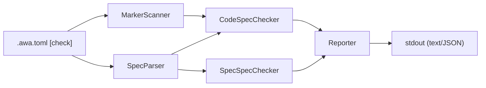

# Design Specification

## Overview

This design implements the `awa check` command as a pipeline: config → scanner/parser → checkers → reporter. It reuses the existing config loader (extended with a `[check]` section) and follows the same command pattern as `diff` and `generate`.

## Architecture

AFFECTED LAYERS: CLI Layer, Core Engine

### High-Level Architecture

Pipeline architecture: load config, scan code and parse specs in parallel, run checkers, report findings.


```mermaid
flowchart LR
    Config[".awa.toml [check]"] --> Scanner[MarkerScanner]
    Config --> Parser[SpecParser]
    Scanner --> CSC[CodeSpecChecker]
    Parser --> CSC
    Parser --> SSC[SpecSpecChecker]
    CSC --> Reporter
    SSC --> Reporter
    Reporter --> Output["stdout (text/JSON)"]
```

### Module Organization

```
src/
├── commands/
│   └── check.ts
└── core/
    └── check/
        ├── types.ts
        ├── errors.ts
        ├── spec-parser.ts
        ├── marker-scanner.ts
        ├── code-spec-checker.ts
        ├── spec-spec-checker.ts
        ├── matrix-fixer.ts
        ├── reporter.ts
        └── __tests__/
            ├── spec-parser.test.ts
            ├── marker-scanner.test.ts
            ├── code-spec-checker.test.ts
            ├── spec-spec-checker.test.ts
            ├── matrix-fixer.test.ts
            └── reporter.test.ts
```

### Architectural Decisions

- PIPELINE OVER VISITOR: Linear pipeline keeps each stage independently testable. Alternatives: visitor pattern, event-driven
- REGEX OVER AST: Spec files are Markdown with predictable patterns; regex is simpler and sufficient. Alternatives: Markdown AST parsing
- SEPARATE CHECKERS: Code-to-spec and spec-to-spec are independent concerns with different inputs. Alternatives: single monolithic checker

## Components and Interfaces

### CHK-MarkerScanner

Scans code files matching configured globs for traceability markers. Extracts marker type, referenced ID, file path, and line number.

IMPLEMENTS: CFG-1_AC-4, CHK-1_AC-1, CHK-11_AC-1, CHK-13_AC-1

```typescript
interface MarkerScanResult {
  markers: CodeMarker[];
}

interface CodeMarker {
  type: 'impl' | 'test' | 'component';
  id: string;
  filePath: string;
  line: number;
}

function scanMarkers(config: CheckConfig): Promise<MarkerScanResult>;
```

### CHK-SpecParser

Parses spec files matching configured globs to extract requirement IDs, AC IDs, property IDs, and component names.

IMPLEMENTS: CHK-2_AC-1, CHK-12_AC-1

```typescript
interface SpecParseResult {
  requirementIds: Set<string>;
  acIds: Set<string>;
  propertyIds: Set<string>;
  componentNames: Set<string>;
  allIds: Set<string>;
  specFiles: SpecFile[];
}

interface SpecFile {
  filePath: string;
  code: string;
  requirementIds: string[];
  acIds: string[];
  propertyIds: string[];
  componentNames: string[];
  crossRefs: CrossReference[];
}

interface CrossReference {
  type: 'implements' | 'validates';
  ids: string[];
  filePath: string;
  line: number;
}

function parseSpecs(config: CheckConfig): Promise<SpecParseResult>;
```

### CHK-CodeSpecChecker

Matches code markers against spec IDs. Reports orphaned markers (code references non-existent spec ID) and uncovered ACs (spec AC with no test marker).

IMPLEMENTS: CHK-3_AC-1, CHK-4_AC-1, CHK-6_AC-1, CHK-14_AC-1, CHK-18_AC-1, CHK-19_AC-1, CHK-20_AC-1, CHK-21_AC-1, CHK-22_AC-1

```typescript
interface CheckResult {
  findings: Finding[];
}

function checkCodeAgainstSpec(
  markers: MarkerScanResult,
  specs: SpecParseResult,
  config: CheckConfig
): CheckResult;
```

### CHK-SpecSpecChecker

Validates cross-references between spec files. Reports broken IMPLEMENTS/VALIDATES references and orphaned spec files.

IMPLEMENTS: CHK-5_AC-1, CHK-7_AC-1, CHK-15_AC-1, CHK-21_AC-1

```typescript
function checkSpecAgainstSpec(
  specs: SpecParseResult,
  markers: MarkerScanResult,
  config: CheckConfig
): CheckResult;
```

### CHK-Reporter

Formats and outputs validation findings in text or JSON format.

IMPLEMENTS: CHK-9_AC-1, CHK-9_AC-2, CHK-9_AC-3

```typescript
function report(findings: Finding[], format: 'text' | 'json'): void;
```

### CHK-RuleLoader

Loads and validates YAML rule files from the schema directory. Each rule file defines structural expectations for matching spec files.

IMPLEMENTS: CHK-16_AC-1

```typescript
function loadRules(schemaDir: string): Promise<LoadedRule[]>;
function matchesTargetGlob(filePath: string, glob: string): boolean;
```

### CHK-SchemaChecker

Validates Markdown spec files against loaded YAML rules. Checks heading structure, required sections, content patterns, tables, and code blocks.

IMPLEMENTS: CHK-2_AC-1

```typescript
function checkSchema(config: CheckConfig, specFiles: string[]): Promise<Finding[]>;
```

### CHK-CheckCommand

Orchestrates the validation pipeline: load config, scan/parse, check, report, set exit code. Runs matrix generation by default after checks complete (skip with `--no-fix`).

IMPLEMENTS: CHK-8_AC-1, CHK-10_AC-1, CHK-16_AC-1, CHK-17_AC-1, CHK-17_AC-2, CHK-17_AC-3, CHK-24_AC-1

```typescript
function checkCommand(cliOptions: RawCheckOptions): Promise<number>;
```

### CHK-MatrixFixer

Regenerates Requirements Traceability sections in DESIGN and TASK files. For DESIGN files, inverts component IMPLEMENTS and property VALIDATES lines to build AC→Component(Property) entries. For TASK files, inverts task IMPLEMENTS and TESTS lines to build AC→Task(Test) entries plus UNCOVERED.

IMPLEMENTS: CHK-23_AC-1, CHK-23_AC-2

```typescript
interface FixResult {
  readonly filesFixed: number;
  readonly fileResults: readonly FileFixResult[];
}

function fixMatrices(
  specs: SpecParseResult,
  crossRefPatterns: readonly string[]
): Promise<FixResult>;
```

## Data Models

### Core Types

- VALIDATE_CONFIG: Configuration for the check command

```typescript
interface CheckConfig {
  specGlobs: string[];
  codeGlobs: string[];
  ignore: string[];
  markers: string[];
  idPattern: string;
  crossRefPatterns: string[];
  format: 'text' | 'json';
}
```

- FINDING: A single validation finding (error or warning)

```typescript
interface Finding {
  severity: 'error' | 'warning';
  code: string;
  message: string;
  filePath?: string;
  line?: number;
  id?: string;
}
```

- RAW_CHECK_OPTIONS: CLI argument parser output for check

```typescript
interface RawCheckOptions {
  ignore?: string[];
  format?: string;
  config?: string;
}
```

## Correctness Properties

- CHK_P-1 [Orphan Detection Completeness]: Every code marker referencing a non-existent spec ID is reported as an error
  VALIDATES: CHK-3_AC-1

- CHK_P-2 [Coverage Detection Completeness]: Every spec AC without a corresponding `@awa-test` marker is reported as a warning
  VALIDATES: CHK-4_AC-1

- CHK_P-3 [Cross-Reference Integrity]: Every DESIGN cross-reference pointing to a non-existent REQ ID is reported as an error
  VALIDATES: CHK-5_AC-1

- CHK_P-4 [ID Format Enforcement]: Every marker ID not matching the configured pattern is reported as an error
  VALIDATES: CHK-6_AC-1

- CHK_P-5 [Exit Code Correctness]: Exit code is 0 when no errors exist, 1 when errors exist (warnings alone do not affect exit code)
  VALIDATES: CHK-8_AC-1

- CHK_P-6 [Component Coverage Detection]: Every DESIGN component without a corresponding `@awa-component` marker is reported as a warning
  VALIDATES: CHK-18_AC-1

- CHK_P-7 [Implementation Coverage Detection]: Every spec AC without a corresponding `@awa-impl` marker is reported as a warning
  VALIDATES: CHK-19_AC-1

- CHK_P-8 [Property Coverage Detection]: Every DESIGN property without a corresponding `@awa-test` marker is reported as a warning
  VALIDATES: CHK-20_AC-1

- CHK_P-9 [IMPLEMENTS Consistency]: Every mismatch between a component's DESIGN IMPLEMENTS list and code @awa-impl markers is reported as a warning
  VALIDATES: CHK-22_AC-1

- CHK_P-10 [Unlinked AC Detection]: Every REQ AC not claimed by any DESIGN IMPLEMENTS is reported as an error
  VALIDATES: CHK-21_AC-1

- CHK_P-11 [DESIGN Matrix Idempotence]: Running fix twice on a DESIGN file produces identical output
  VALIDATES: CHK-23_AC-1

- CHK_P-12 [TASK Matrix Completeness]: Generated TASK matrix UNCOVERED line lists exactly the ACs and properties from source REQ/DESIGN files that lack IMPLEMENTS/TESTS coverage
  VALIDATES: CHK-23_AC-2

## Error Handling

### CheckError

Validation operation errors

- FILE_READ_ERROR: Cannot read a spec or code file
- INVALID_CONFIG: Validate config has invalid values
- GLOB_ERROR: Glob pattern matching failed

### Strategy

PRINCIPLES:

- Fail fast on config errors (before scanning)
- Continue on individual file errors (report and skip)
- Distinguish errors (exit 1) from warnings (informational only)

## Testing Strategy

### Property-Based Testing

- FRAMEWORK: fast-check
- MINIMUM_ITERATIONS: 100
- TAG_FORMAT: `@awa-test: CHK_P-{n}`

### Unit Testing

- AREAS: marker scanner, spec parser, code-spec checker, spec-spec checker, reporter

### Integration Testing

- SCENARIOS: check command with default config, check with custom markers, check with broken references

## Requirements Traceability

### REQ-CFG-config.md

- CFG-1_AC-4 → CHK-MarkerScanner

### REQ-CHK-check.md

- CHK-1_AC-1 → CHK-MarkerScanner
- CHK-2_AC-1 → CHK-SpecParser
- CHK-2_AC-1 → CHK-SchemaChecker
- CHK-3_AC-1 → CHK-CodeSpecChecker (CHK_P-1)
- CHK-4_AC-1 → CHK-CodeSpecChecker (CHK_P-2)
- CHK-5_AC-1 → CHK-SpecSpecChecker (CHK_P-3)
- CHK-6_AC-1 → CHK-CodeSpecChecker (CHK_P-4)
- CHK-7_AC-1 → CHK-SpecSpecChecker
- CHK-8_AC-1 → CHK-CheckCommand (CHK_P-5)
- CHK-9_AC-1 → CHK-Reporter
- CHK-9_AC-2 → CHK-Reporter
- CHK-9_AC-3 → CHK-Reporter
- CHK-10_AC-1 → CHK-CheckCommand
- CHK-11_AC-1 → CHK-MarkerScanner
- CHK-12_AC-1 → CHK-SpecParser
- CHK-13_AC-1 → CHK-MarkerScanner
- CHK-14_AC-1 → CHK-CodeSpecChecker
- CHK-15_AC-1 → CHK-SpecSpecChecker
- CHK-16_AC-1 → CHK-RuleLoader
- CHK-16_AC-1 → CHK-CheckCommand
- CHK-17_AC-1 → CHK-CheckCommand
- CHK-17_AC-2 → CHK-CheckCommand
- CHK-17_AC-3 → CHK-CheckCommand
- CHK-18_AC-1 → CHK-CodeSpecChecker (CHK_P-6)
- CHK-19_AC-1 → CHK-CodeSpecChecker (CHK_P-7)
- CHK-20_AC-1 → CHK-CodeSpecChecker (CHK_P-8)
- CHK-21_AC-1 → CHK-CodeSpecChecker (CHK_P-10)
- CHK-21_AC-1 → CHK-SpecSpecChecker (CHK_P-10)
- CHK-22_AC-1 → CHK-CodeSpecChecker (CHK_P-9)
- CHK-23_AC-1 → CHK-MatrixFixer (CHK_P-11)
- CHK-23_AC-2 → CHK-MatrixFixer (CHK_P-12)
- CHK-24_AC-1 → CHK-CheckCommand

## Change Log

- 1.0.0 (2026-02-27): Initial design
- 1.1.0 (2026-02-27): Schema upgrade — added H3 heading under Requirements Traceability
- 1.2.0 (2026-03-01): Added CHK-18 (uncovered component) and CHK-19 (unimplemented AC) to CodeSpecChecker; added CHK_P-6, CHK_P-7
- 1.3.0 (2026-03-02): Added CHK-20 (uncovered property), CHK-21 (unlinked AC), CHK-22 (IMPLEMENTS consistency); added componentImplements to SpecFile; added CHK_P-8, CHK_P-9, CHK_P-10
- 1.4.0 (2026-03-02): Added CHK-MatrixFixer component for --fix matrix generation; added CHK-23 to CheckCommand IMPLEMENTS; added CHK_P-11, CHK_P-12
- 1.5.0 (2026-03-02): CHK-23 inverted default — fix is now default, --no-fix to skip
