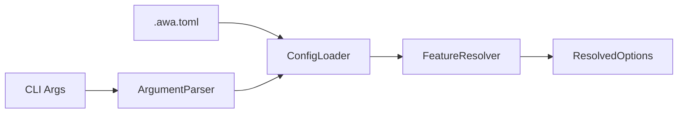
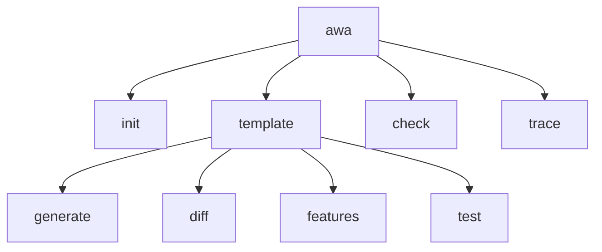

# Design Specification

## Overview

This design implements the CLI input layer: argument parsing, TOML configuration loading with merge semantics, feature preset resolution, and the command tree structure that groups template-related commands under `awa template` while keeping awa-specific commands at the top level.

## Architecture

AFFECTED LAYERS: CLI Layer, Core Engine

### High-Level Architecture

Input pipeline: parse CLI arguments, load config file, merge (CLI wins), resolve feature presets. Nested command tree: root program has `init` convenience command, `template` group, `check`, and `trace`. Template group contains `generate`, `diff`, `features`, `test`.


```mermaid
flowchart LR
    Args[CLI Args] --> Parser[ArgumentParser]
    Config[.awa.toml] --> Loader[ConfigLoader]
    Parser --> Loader
    Loader --> FR[FeatureResolver]
    FR --> Options[ResolvedOptions]
```


```mermaid
flowchart TB
    Root[awa] --> Init[init]
    Root --> Template[template]
    Root --> Check[check]
    Root --> Trace[trace]
    Template --> Generate[generate]
    Template --> Diff[diff]
    Template --> Features[features]
    Template --> Test[test]
```

### Module Organization

```
src/
├── cli/
│   └── index.ts              # Root program, template group, top-level commands
├── commands/
│   ├── generate.ts           # Generate command handler
│   ├── diff.ts               # Diff command handler
│   ├── features.ts           # Features command handler
│   ├── test.ts               # Test command handler
│   ├── check.ts              # Check command handler
│   └── trace.ts              # Trace command handler
└── core/
    ├── config.ts             # ConfigLoader (TOML parsing, merge)
    └── feature-resolver.ts   # FeatureResolver (presets, removals)
```

### Architectural Decisions

- COMMANDER OVER CITTY: Commander is mature, full-featured, supports positional args in help. Alternatives: citty (lighter but less positional support), yargs (verbose)
- CLI WINS MERGE: CLI arguments always override config file values for simplicity. Alternatives: deep merge (complex), per-key priority (confusing)
- NESTED COMMANDS OVER FLAT: Commander supports `addCommand()` for nesting. Groups related commands and improves discoverability. Alternatives: flat with prefixed names (e.g. `template-generate`), separate binaries
- CLEAN BREAK OVER ALIASES: No deprecated root-level aliases for old commands (except init convenience). Simpler and avoids ambiguity. Alternatives: keep old commands with deprecation warnings

## Components and Interfaces

### CLI-ArgumentParser

Parses CLI arguments using commander, validates inputs, and produces a raw options object for downstream processing. Supports both `generate` and `diff` subcommands with positional arguments displayed in help output.

IMPLEMENTS: CFG-5_AC-2, CLI_P-20, CLI_P-21, CLI_P-22, CLI-1_AC-1, CLI-1_AC-2, CLI-1_AC-3, CLI-1_AC-4, CLI-1_AC-5, CLI-2_AC-1, CLI-2_AC-2, CLI-2_AC-3, CLI-2_AC-5, CLI-2_AC-6, CLI-3_AC-1, CLI-4_AC-1, CLI-4_AC-2, CLI-5_AC-1, CLI-6_AC-1, CLI-6_AC-2, CLI-6_AC-3, CLI-7_AC-1, CLI-8_AC-1, CLI-9_AC-1, CLI-9_AC-2, CLI-9_AC-3, CLI-10_AC-1, CLI-10_AC-2, CLI-11_AC-1, CLI-11_AC-2, CLI-11_AC-3, CLI-12_AC-1, CLI-13_AC-1, CLI-13_AC-2, CLI-14_AC-1, CLI-14_AC-2, CLI-15_AC-1, CLI-15_AC-2, CLI-23_AC-1, CLI-24_AC-1, CLI-25_AC-1, CLI-41_AC-1, CLI-41_AC-2, CLI-41_AC-3, CLI-41_AC-4, CLI-41_AC-5, CLI-41_AC-6, CLI-41_AC-7, CLI-42_AC-1, CLI-42_AC-2, CLI-43_AC-1, CLI-43_AC-2, CLI-43_AC-3, CLI-43_AC-4, CLI-44_AC-1, CLI-44_AC-2, CLI-45_AC-1, CLI-45_AC-2, CLI-45_AC-3, CLI-45_AC-4, CFG-8_AC-1, CFG-8_AC-2, CFG-8_AC-4, CFG-10_AC-1, CFG-10_AC-2, CFG-10_AC-3, CFG-10_AC-5, DIFF-7_AC-1, DIFF-7_AC-2, DIFF-7_AC-3, DIFF-7_AC-4, DIFF-7_AC-5, DIFF-7_AC-6, DIFF-7_AC-7, DIFF-7_AC-8, DIFF-7_AC-9, DIFF-7_AC-10, DIFF-7_AC-11, DIFF-7_AC-12, DIFF-7_AC-13, DISC-4_AC-1, DISC-5_AC-1, GEN-10_AC-1, GEN-10_AC-2, GEN-13_AC-1, GEN-14_AC-1, GEN-15_AC-1, GEN-16_AC-1, JSON-1_AC-1, JSON-2_AC-1, JSON-5_AC-1, TRC-8_AC-1, TTST-5_AC-1, TTST-7_AC-1

```typescript
interface RawCliOptions {
  output?: string;
  template?: string;
  features?: string[];
  preset?: string[];
  removeFeatures?: string[];
  force?: boolean;
  dryRun?: boolean;
  delete?: boolean;
  config?: string;
  refresh?: boolean;
  listUnknown?: boolean;
}

interface ArgumentParser {
  parse(argv: string[]): RawCliOptions;
}
```

### CFG-ConfigLoader

Loads TOML configuration from file, merges with CLI arguments (CLI wins), and produces resolved options with defaults applied. Parses the `[presets]` table for named feature bundles.

IMPLEMENTS: CLI_P-1, CLI_P-2, CFG-1_AC-1, CFG-1_AC-2, CFG-1_AC-3, CFG-1_AC-4, CFG-2_AC-1, CFG-2_AC-2, CFG-2_AC-3, CFG-3_AC-1, CFG-3_AC-2, CFG-3_AC-3, CFG-3_AC-4, CFG-3_AC-5, CFG-3_AC-6, CFG-3_AC-7, CFG-3_AC-8, CFG-3_AC-9, CFG-3_AC-10, CFG-4_AC-1, CFG-4_AC-2, CFG-4_AC-3, CFG-4_AC-4, CFG-5_AC-1, CFG-5_AC-2, CFG-6_AC-1, CFG-6_AC-2, CFG-7_AC-1, CFG-7_AC-2, CFG-7_AC-3, CFG-7_AC-4, CFG-9_AC-1, CFG-9_AC-2, CFG-9_AC-3, CFG-11_AC-1, CFG-11_AC-2, CFG-11_AC-3, CLI-1_AC-4, CLI-2_AC-2, CLI-2_AC-3, CLI-2_AC-4, CLI-4_AC-3, CLI-7_AC-2, CLI-31_AC-1, MULTI-1_AC-1, MULTI-2_AC-1, MULTI-3_AC-1, MULTI-5_AC-2

```typescript
interface FileConfig {
  output?: string;
  template?: string;
  features?: string[];
  preset?: string[];
  'remove-features'?: string[];
  force?: boolean;
  'dry-run'?: boolean;
  delete?: boolean;
  refresh?: boolean;
  presets?: PresetDefinitions;
  'list-unknown'?: boolean;
}

interface ResolvedOptions {
  output: string;
  template: string | null;
  features: string[];
  preset: string[];
  removeFeatures: string[];
  force: boolean;
  dryRun: boolean;
  delete: boolean;
  refresh: boolean;
  presets: PresetDefinitions;
  listUnknown: boolean;
}

interface ConfigLoader {
  load(configPath: string | null): Promise<FileConfig | null>;
  merge(cli: RawCliOptions, file: FileConfig | null): ResolvedOptions;
}
```

### FP-FeatureResolver

Computes the final feature set from base features, activated presets, and removals. Validates that referenced preset names exist in the presets table.

IMPLEMENTS: CLI_P-3, CLI_P-4, CLI_P-5, CLI_P-6, CLI_P-7, CFG-7_AC-1, CFG-7_AC-2, CFG-7_AC-3, CFG-7_AC-4, CFG-8_AC-1, CFG-8_AC-2, CFG-8_AC-3, CFG-8_AC-4, CFG-9_AC-1, CFG-9_AC-2, CFG-9_AC-3, CFG-10_AC-1, CFG-10_AC-2, CFG-10_AC-3, CFG-10_AC-4, CFG-10_AC-5, CFG-11_AC-1, CFG-11_AC-2, CFG-11_AC-3, CFG-12_AC-1, CFG-12_AC-2, CFG-12_AC-3, CFG-12_AC-4, CFG-12_AC-5, CFG-13_AC-1, CFG-13_AC-2

```typescript
interface PresetDefinitions {
  [presetName: string]: string[];
}

interface FeatureResolutionInput {
  baseFeatures: string[];
  presetNames: string[];
  removeFeatures: string[];
  presetDefinitions: PresetDefinitions;
}

interface FeatureResolver {
  resolve(input: FeatureResolutionInput): string[];
  validatePresets(presetNames: string[], definitions: PresetDefinitions): void;
}
```

### CLI-TemplateGroup

A commander parent command that acts as a namespace for template-related subcommands. Does not have its own action handler — displays help when invoked without a subcommand.

IMPLEMENTS: CFG-5_AC-2, CLI-23_AC-1, CLI-24_AC-1, CLI-25_AC-1, CLI-1_AC-1, CLI-1_AC-2, CLI-1_AC-3, CLI-1_AC-4, CLI-1_AC-5, CLI-2_AC-1, CLI-2_AC-2, CLI-2_AC-3, CLI-2_AC-5, CLI-2_AC-6, CLI-3_AC-1, CLI-4_AC-1, CLI-4_AC-2, CLI-5_AC-1, CLI-6_AC-1, CLI-6_AC-2, CLI-7_AC-1, CLI-8_AC-1, CLI-9_AC-1, CLI-9_AC-2, CLI-9_AC-3, CLI-10_AC-1, CLI-10_AC-2, CLI-11_AC-1, CLI-11_AC-2, CLI-11_AC-3, CLI-12_AC-1, CLI-13_AC-1, CLI-13_AC-2, CLI-14_AC-1, CLI-14_AC-2, CLI-15_AC-1, CLI-15_AC-2, DIFF-7_AC-1, DIFF-7_AC-2, DIFF-7_AC-3, DIFF-7_AC-4, DIFF-7_AC-5, DIFF-7_AC-6, DIFF-7_AC-7, DIFF-7_AC-8, DIFF-7_AC-9, DIFF-7_AC-10, DIFF-7_AC-11, DIFF-7_AC-12, DIFF-7_AC-13, DISC-4_AC-1, DISC-5_AC-1, CFG-8_AC-1, CFG-8_AC-2, CFG-8_AC-4, CFG-10_AC-1, CFG-10_AC-2, CFG-10_AC-3, CFG-10_AC-5, GEN-10_AC-1, GEN-10_AC-2, GEN-13_AC-1, GEN-14_AC-1, GEN-15_AC-1, GEN-16_AC-1, JSON-1_AC-1, JSON-2_AC-1, JSON-5_AC-1, OVL-1_AC-1, OVL-7_AC-1, CLI-41_AC-1, CLI-41_AC-2, CLI-41_AC-3, CLI-41_AC-4, CLI-41_AC-5, CLI-41_AC-6, CLI-41_AC-7, CLI-42_AC-1, CLI-42_AC-2, CLI-43_AC-1, CLI-43_AC-2, CLI-43_AC-3, CLI-43_AC-4, CLI-44_AC-1, CLI-44_AC-2, CLI-45_AC-1, CLI-45_AC-2, CLI-45_AC-3, CLI-45_AC-4, TRC-8_AC-1, TTST-5_AC-1, TTST-7_AC-1

```typescript
interface TemplateGroup {
  /** Commander Command instance acting as parent for template subcommands */
  command: Command;
  /** Subcommands: generate, diff, features, test */
  subcommands: Command[];
}
```

### CLI-RootProgram

The root `awa` command that wires together the template group, top-level init convenience command, and top-level awa commands.

IMPLEMENTS: CFG-5_AC-2, CLI-23_AC-1, CLI-24_AC-1, CLI-25_AC-1, CLI-1_AC-1, CLI-1_AC-2, CLI-1_AC-3, CLI-1_AC-4, CLI-1_AC-5, CLI-2_AC-1, CLI-2_AC-2, CLI-2_AC-3, CLI-2_AC-5, CLI-2_AC-6, CLI-3_AC-1, CLI-4_AC-1, CLI-4_AC-2, CLI-5_AC-1, CLI-6_AC-1, CLI-6_AC-2, CLI-7_AC-1, CLI-8_AC-1, CLI-9_AC-1, CLI-9_AC-2, CLI-9_AC-3, CLI-10_AC-1, CLI-10_AC-2, CLI-11_AC-1, CLI-11_AC-2, CLI-11_AC-3, CLI-12_AC-1, CLI-13_AC-1, CLI-13_AC-2, CLI-14_AC-1, CLI-14_AC-2, CLI-15_AC-1, CLI-15_AC-2, DIFF-7_AC-1, DIFF-7_AC-2, DIFF-7_AC-3, DIFF-7_AC-4, DIFF-7_AC-5, DIFF-7_AC-6, DIFF-7_AC-7, DIFF-7_AC-8, DIFF-7_AC-9, DIFF-7_AC-10, DIFF-7_AC-11, DIFF-7_AC-12, DIFF-7_AC-13, DISC-4_AC-1, DISC-5_AC-1, CFG-8_AC-1, CFG-8_AC-2, CFG-8_AC-4, CFG-10_AC-1, CFG-10_AC-2, CFG-10_AC-3, CFG-10_AC-5, GEN-10_AC-1, GEN-10_AC-2, GEN-13_AC-1, GEN-14_AC-1, GEN-15_AC-1, GEN-16_AC-1, JSON-1_AC-1, JSON-2_AC-1, JSON-5_AC-1, OVL-1_AC-1, OVL-7_AC-1, CLI-41_AC-1, CLI-41_AC-2, CLI-41_AC-3, CLI-41_AC-4, CLI-41_AC-5, CLI-41_AC-6, CLI-41_AC-7, CLI-42_AC-1, CLI-42_AC-2, CLI-43_AC-1, CLI-43_AC-2, CLI-43_AC-3, CLI-43_AC-4, CLI-44_AC-1, CLI-44_AC-2, CLI-45_AC-1, CLI-45_AC-2, CLI-45_AC-3, CLI-45_AC-4, TRC-8_AC-1, TTST-5_AC-1, TTST-7_AC-1

```typescript
interface RootProgram {
  /** Commander root program */
  program: Command;
  /** Adds template group, init convenience command, and top-level commands */
  configure(): void;
}
```

## Data Models

### Input Types

- RAW_CLI_OPTIONS: Raw parsed CLI arguments before config merge
- FILE_CONFIG: TOML config file structure with kebab-case keys
- RESOLVED_OPTIONS: Fully resolved configuration with all defaults applied
- PRESET_DEFINITIONS: Map of preset names to feature arrays
- FEATURE_RESOLUTION_INPUT: Inputs for feature resolution (base, presets, removals)

### Command Types

- TEMPLATE_GROUP: Commander Command instance with no action, serving as namespace
- ROOT_PROGRAM: Top-level Commander program with version, help, and child commands

## Correctness Properties

- CLI_P-1 [CLI Override]: CLI arguments always override config file values for the same option
  VALIDATES: CFG-4_AC-1, CFG-4_AC-2

- CLI_P-2 [Features Replace]: Features from CLI completely replace config features (no merge)
  VALIDATES: CFG-4_AC-4

- CLI_P-3 [Preset Validation]: Referencing a non-existent preset name results in an error
  VALIDATES: CFG-8_AC-3

- CLI_P-4 [Feature Resolution Order]: Final features = (baseFeatures union presetFeatures) minus removeFeatures
  VALIDATES: CFG-12_AC-1, CFG-12_AC-2, CFG-12_AC-3, CFG-12_AC-4

- CLI_P-5 [Feature Deduplication]: Final feature set contains no duplicates
  VALIDATES: CFG-12_AC-5, CFG-13_AC-2

- CLI_P-6 [Preset Union]: Multiple presets are merged via set union
  VALIDATES: CFG-13_AC-1

- CLI_P-7 [Silent Removal]: Removing a non-existent feature does not cause an error
  VALIDATES: CFG-10_AC-4

- CLI_P-20 [Template Nesting]: All template commands are only accessible under the `template` parent and not at the root level
  VALIDATES: CLI-41_AC-2, CLI-45_AC-1, CLI-45_AC-2, CLI-45_AC-3, CLI-45_AC-4

- CLI_P-21 [Option Preservation]: Template subcommands accept the same options as their former top-level counterparts
  VALIDATES: CLI-41_AC-4, CLI-41_AC-5, CLI-41_AC-6, CLI-41_AC-7, CLI-42_AC-2

- CLI_P-22 [Top-Level Awa Commands]: check and trace remain accessible directly under `awa`
  VALIDATES: CLI-43_AC-1, CLI-43_AC-2

## Error Handling

### ConfigError

Configuration loading and parsing errors.

- FILE_NOT_FOUND: Specified config file does not exist (when --config provided)
- PARSE_ERROR: TOML syntax error with line number
- INVALID_TYPE: Config value has wrong type
- INVALID_PRESET: Preset value is not an array of strings
- UNKNOWN_PRESET: Referenced preset name does not exist in presets table

### Strategy

PRINCIPLES:

- Fail fast on first error
- Provide actionable error messages with file paths
- Write errors to stderr
- Exit with non-zero code on any error
- Include suggestions for common errors
- Commander's built-in unknown command error handling applies
- `awa template` without subcommand shows help (commander default)

## Testing Strategy

### Property-Based Testing

- FRAMEWORK: fast-check
- MINIMUM_ITERATIONS: 100
- TAG_FORMAT: @awa-test: {CODE}_P-{n}

### Unit Testing

- AREAS: CFG-ConfigLoader merge logic, FP-FeatureResolver preset validation, feature resolution order, command tree structure verification

### Integration Testing

- SCENARIOS: Config file loading, CLI override behavior, preset resolution flow, `awa template generate --help` shows options, `awa --help` shows command groups

## Requirements Traceability

### REQ-CFG-config.md

- CFG-1_AC-1 → CFG-ConfigLoader
- CFG-1_AC-2 → CFG-ConfigLoader
- CFG-1_AC-3 → CFG-ConfigLoader
- CFG-1_AC-4 → CFG-ConfigLoader
- CFG-2_AC-1 → CFG-ConfigLoader
- CFG-2_AC-2 → CFG-ConfigLoader
- CFG-2_AC-3 → CFG-ConfigLoader
- CFG-3_AC-1 → CFG-ConfigLoader
- CFG-3_AC-2 → CFG-ConfigLoader
- CFG-3_AC-3 → CFG-ConfigLoader
- CFG-3_AC-4 → CFG-ConfigLoader
- CFG-3_AC-5 → CFG-ConfigLoader
- CFG-3_AC-6 → CFG-ConfigLoader
- CFG-3_AC-7 → CFG-ConfigLoader
- CFG-3_AC-8 → CFG-ConfigLoader
- CFG-3_AC-9 → CFG-ConfigLoader
- CFG-3_AC-10 → CFG-ConfigLoader
- CFG-4_AC-1 → CFG-ConfigLoader (CLI_P-1)
- CFG-4_AC-2 → CFG-ConfigLoader (CLI_P-1)
- CFG-4_AC-3 → CFG-ConfigLoader
- CFG-4_AC-4 → CFG-ConfigLoader (CLI_P-2)
- CFG-5_AC-1 → CFG-ConfigLoader
- CFG-5_AC-2 → CLI-ArgumentParser
- CFG-5_AC-2 → CFG-ConfigLoader
- CFG-5_AC-2 → CLI-TemplateGroup
- CFG-5_AC-2 → CLI-RootProgram
- CFG-6_AC-1 → CFG-ConfigLoader
- CFG-6_AC-2 → CFG-ConfigLoader
- CFG-7_AC-1 → CFG-ConfigLoader
- CFG-7_AC-1 → FP-FeatureResolver
- CFG-7_AC-2 → CFG-ConfigLoader
- CFG-7_AC-2 → FP-FeatureResolver
- CFG-7_AC-3 → CFG-ConfigLoader
- CFG-7_AC-3 → FP-FeatureResolver
- CFG-7_AC-4 → CFG-ConfigLoader
- CFG-7_AC-4 → FP-FeatureResolver
- CFG-8_AC-1 → CLI-ArgumentParser
- CFG-8_AC-1 → FP-FeatureResolver
- CFG-8_AC-1 → CLI-TemplateGroup
- CFG-8_AC-1 → CLI-RootProgram
- CFG-8_AC-2 → CLI-ArgumentParser
- CFG-8_AC-2 → FP-FeatureResolver
- CFG-8_AC-2 → CLI-TemplateGroup
- CFG-8_AC-2 → CLI-RootProgram
- CFG-8_AC-3 → FP-FeatureResolver (CLI_P-3)
- CFG-8_AC-4 → CLI-ArgumentParser
- CFG-8_AC-4 → FP-FeatureResolver
- CFG-8_AC-4 → CLI-TemplateGroup
- CFG-8_AC-4 → CLI-RootProgram
- CFG-9_AC-1 → CFG-ConfigLoader
- CFG-9_AC-1 → FP-FeatureResolver
- CFG-9_AC-2 → CFG-ConfigLoader
- CFG-9_AC-2 → FP-FeatureResolver
- CFG-9_AC-3 → CFG-ConfigLoader
- CFG-9_AC-3 → FP-FeatureResolver
- CFG-10_AC-1 → CLI-ArgumentParser
- CFG-10_AC-1 → FP-FeatureResolver
- CFG-10_AC-1 → CLI-TemplateGroup
- CFG-10_AC-1 → CLI-RootProgram
- CFG-10_AC-2 → CLI-ArgumentParser
- CFG-10_AC-2 → FP-FeatureResolver
- CFG-10_AC-2 → CLI-TemplateGroup
- CFG-10_AC-2 → CLI-RootProgram
- CFG-10_AC-3 → CLI-ArgumentParser
- CFG-10_AC-3 → FP-FeatureResolver
- CFG-10_AC-3 → CLI-TemplateGroup
- CFG-10_AC-3 → CLI-RootProgram
- CFG-10_AC-4 → FP-FeatureResolver (CLI_P-7)
- CFG-10_AC-5 → CLI-ArgumentParser
- CFG-10_AC-5 → FP-FeatureResolver
- CFG-10_AC-5 → CLI-TemplateGroup
- CFG-10_AC-5 → CLI-RootProgram
- CFG-11_AC-1 → CFG-ConfigLoader
- CFG-11_AC-1 → FP-FeatureResolver
- CFG-11_AC-2 → CFG-ConfigLoader
- CFG-11_AC-2 → FP-FeatureResolver
- CFG-11_AC-3 → CFG-ConfigLoader
- CFG-11_AC-3 → FP-FeatureResolver
- CFG-12_AC-1 → FP-FeatureResolver (CLI_P-4)
- CFG-12_AC-2 → FP-FeatureResolver (CLI_P-4)
- CFG-12_AC-3 → FP-FeatureResolver (CLI_P-4)
- CFG-12_AC-4 → FP-FeatureResolver (CLI_P-4)
- CFG-12_AC-5 → FP-FeatureResolver (CLI_P-5)
- CFG-13_AC-1 → FP-FeatureResolver (CLI_P-6)
- CFG-13_AC-2 → FP-FeatureResolver (CLI_P-5)

### REQ-CLI-cli.md

- CLI_P-1 → CFG-ConfigLoader
- CLI_P-2 → CFG-ConfigLoader
- CLI_P-3 → FP-FeatureResolver
- CLI_P-4 → FP-FeatureResolver
- CLI_P-5 → FP-FeatureResolver
- CLI_P-6 → FP-FeatureResolver
- CLI_P-7 → FP-FeatureResolver
- CLI_P-20 → CLI-ArgumentParser
- CLI_P-21 → CLI-ArgumentParser
- CLI_P-22 → CLI-ArgumentParser
- CLI-1_AC-1 → CLI-ArgumentParser
- CLI-1_AC-1 → CLI-TemplateGroup
- CLI-1_AC-1 → CLI-RootProgram
- CLI-1_AC-2 → CLI-ArgumentParser
- CLI-1_AC-2 → CLI-TemplateGroup
- CLI-1_AC-2 → CLI-RootProgram
- CLI-1_AC-3 → CLI-ArgumentParser
- CLI-1_AC-3 → CLI-TemplateGroup
- CLI-1_AC-3 → CLI-RootProgram
- CLI-1_AC-4 → CLI-ArgumentParser
- CLI-1_AC-4 → CFG-ConfigLoader
- CLI-1_AC-4 → CLI-TemplateGroup
- CLI-1_AC-4 → CLI-RootProgram
- CLI-1_AC-5 → CLI-ArgumentParser
- CLI-1_AC-5 → CLI-TemplateGroup
- CLI-1_AC-5 → CLI-RootProgram
- CLI-2_AC-1 → CLI-ArgumentParser
- CLI-2_AC-1 → CLI-TemplateGroup
- CLI-2_AC-1 → CLI-RootProgram
- CLI-2_AC-2 → CLI-ArgumentParser
- CLI-2_AC-2 → CFG-ConfigLoader
- CLI-2_AC-2 → CLI-TemplateGroup
- CLI-2_AC-2 → CLI-RootProgram
- CLI-2_AC-3 → CLI-ArgumentParser
- CLI-2_AC-3 → CFG-ConfigLoader
- CLI-2_AC-3 → CLI-TemplateGroup
- CLI-2_AC-3 → CLI-RootProgram
- CLI-2_AC-4 → CFG-ConfigLoader
- CLI-2_AC-5 → CLI-ArgumentParser
- CLI-2_AC-5 → CLI-TemplateGroup
- CLI-2_AC-5 → CLI-RootProgram
- CLI-2_AC-6 → CLI-ArgumentParser
- CLI-2_AC-6 → CLI-TemplateGroup
- CLI-2_AC-6 → CLI-RootProgram
- CLI-3_AC-1 → CLI-ArgumentParser
- CLI-3_AC-1 → CLI-TemplateGroup
- CLI-3_AC-1 → CLI-RootProgram
- CLI-4_AC-1 → CLI-ArgumentParser
- CLI-4_AC-1 → CLI-TemplateGroup
- CLI-4_AC-1 → CLI-RootProgram
- CLI-4_AC-2 → CLI-ArgumentParser
- CLI-4_AC-2 → CLI-TemplateGroup
- CLI-4_AC-2 → CLI-RootProgram
- CLI-4_AC-3 → CFG-ConfigLoader
- CLI-5_AC-1 → CLI-ArgumentParser
- CLI-5_AC-1 → CLI-TemplateGroup
- CLI-5_AC-1 → CLI-RootProgram
- CLI-6_AC-1 → CLI-ArgumentParser
- CLI-6_AC-1 → CLI-TemplateGroup
- CLI-6_AC-1 → CLI-RootProgram
- CLI-6_AC-2 → CLI-ArgumentParser
- CLI-6_AC-2 → CLI-TemplateGroup
- CLI-6_AC-2 → CLI-RootProgram
- CLI-6_AC-3 → CLI-ArgumentParser
- CLI-7_AC-1 → CLI-ArgumentParser
- CLI-7_AC-1 → CLI-TemplateGroup
- CLI-7_AC-1 → CLI-RootProgram
- CLI-7_AC-2 → CFG-ConfigLoader
- CLI-8_AC-1 → CLI-ArgumentParser
- CLI-8_AC-1 → CLI-TemplateGroup
- CLI-8_AC-1 → CLI-RootProgram
- CLI-9_AC-1 → CLI-ArgumentParser
- CLI-9_AC-1 → CLI-TemplateGroup
- CLI-9_AC-1 → CLI-RootProgram
- CLI-9_AC-2 → CLI-ArgumentParser
- CLI-9_AC-2 → CLI-TemplateGroup
- CLI-9_AC-2 → CLI-RootProgram
- CLI-9_AC-3 → CLI-ArgumentParser
- CLI-9_AC-3 → CLI-TemplateGroup
- CLI-9_AC-3 → CLI-RootProgram
- CLI-10_AC-1 → CLI-ArgumentParser
- CLI-10_AC-1 → CLI-TemplateGroup
- CLI-10_AC-1 → CLI-RootProgram
- CLI-10_AC-2 → CLI-ArgumentParser
- CLI-10_AC-2 → CLI-TemplateGroup
- CLI-10_AC-2 → CLI-RootProgram
- CLI-11_AC-1 → CLI-ArgumentParser
- CLI-11_AC-1 → CLI-TemplateGroup
- CLI-11_AC-1 → CLI-RootProgram
- CLI-11_AC-2 → CLI-ArgumentParser
- CLI-11_AC-2 → CLI-TemplateGroup
- CLI-11_AC-2 → CLI-RootProgram
- CLI-11_AC-3 → CLI-ArgumentParser
- CLI-11_AC-3 → CLI-TemplateGroup
- CLI-11_AC-3 → CLI-RootProgram
- CLI-12_AC-1 → CLI-ArgumentParser
- CLI-12_AC-1 → CLI-TemplateGroup
- CLI-12_AC-1 → CLI-RootProgram
- CLI-13_AC-1 → CLI-ArgumentParser
- CLI-13_AC-1 → CLI-TemplateGroup
- CLI-13_AC-1 → CLI-RootProgram
- CLI-13_AC-2 → CLI-ArgumentParser
- CLI-13_AC-2 → CLI-TemplateGroup
- CLI-13_AC-2 → CLI-RootProgram
- CLI-14_AC-1 → CLI-ArgumentParser
- CLI-14_AC-1 → CLI-TemplateGroup
- CLI-14_AC-1 → CLI-RootProgram
- CLI-14_AC-2 → CLI-ArgumentParser
- CLI-14_AC-2 → CLI-TemplateGroup
- CLI-14_AC-2 → CLI-RootProgram
- CLI-15_AC-1 → CLI-ArgumentParser
- CLI-15_AC-1 → CLI-TemplateGroup
- CLI-15_AC-1 → CLI-RootProgram
- CLI-15_AC-2 → CLI-ArgumentParser
- CLI-15_AC-2 → CLI-TemplateGroup
- CLI-15_AC-2 → CLI-RootProgram
- CLI-23_AC-1 → CLI-ArgumentParser
- CLI-23_AC-1 → CLI-TemplateGroup
- CLI-23_AC-1 → CLI-RootProgram
- CLI-24_AC-1 → CLI-ArgumentParser
- CLI-24_AC-1 → CLI-TemplateGroup
- CLI-24_AC-1 → CLI-RootProgram
- CLI-25_AC-1 → CLI-ArgumentParser
- CLI-25_AC-1 → CLI-TemplateGroup
- CLI-25_AC-1 → CLI-RootProgram
- CLI-31_AC-1 → CFG-ConfigLoader
- CLI-41_AC-1 → CLI-ArgumentParser
- CLI-41_AC-1 → CLI-TemplateGroup
- CLI-41_AC-1 → CLI-RootProgram
- CLI-41_AC-2 → CLI-ArgumentParser (CLI_P-20)
- CLI-41_AC-2 → CLI-TemplateGroup (CLI_P-20)
- CLI-41_AC-2 → CLI-RootProgram (CLI_P-20)
- CLI-41_AC-3 → CLI-ArgumentParser
- CLI-41_AC-3 → CLI-TemplateGroup
- CLI-41_AC-3 → CLI-RootProgram
- CLI-41_AC-4 → CLI-ArgumentParser (CLI_P-21)
- CLI-41_AC-4 → CLI-TemplateGroup (CLI_P-21)
- CLI-41_AC-4 → CLI-RootProgram (CLI_P-21)
- CLI-41_AC-5 → CLI-ArgumentParser (CLI_P-21)
- CLI-41_AC-5 → CLI-TemplateGroup (CLI_P-21)
- CLI-41_AC-5 → CLI-RootProgram (CLI_P-21)
- CLI-41_AC-6 → CLI-ArgumentParser (CLI_P-21)
- CLI-41_AC-6 → CLI-TemplateGroup (CLI_P-21)
- CLI-41_AC-6 → CLI-RootProgram (CLI_P-21)
- CLI-41_AC-7 → CLI-ArgumentParser (CLI_P-21)
- CLI-41_AC-7 → CLI-TemplateGroup (CLI_P-21)
- CLI-41_AC-7 → CLI-RootProgram (CLI_P-21)
- CLI-42_AC-1 → CLI-ArgumentParser
- CLI-42_AC-1 → CLI-TemplateGroup
- CLI-42_AC-1 → CLI-RootProgram
- CLI-42_AC-2 → CLI-ArgumentParser (CLI_P-21)
- CLI-42_AC-2 → CLI-TemplateGroup (CLI_P-21)
- CLI-42_AC-2 → CLI-RootProgram (CLI_P-21)
- CLI-43_AC-1 → CLI-ArgumentParser (CLI_P-22)
- CLI-43_AC-1 → CLI-TemplateGroup (CLI_P-22)
- CLI-43_AC-1 → CLI-RootProgram (CLI_P-22)
- CLI-43_AC-2 → CLI-ArgumentParser (CLI_P-22)
- CLI-43_AC-2 → CLI-TemplateGroup (CLI_P-22)
- CLI-43_AC-2 → CLI-RootProgram (CLI_P-22)
- CLI-43_AC-3 → CLI-ArgumentParser
- CLI-43_AC-3 → CLI-TemplateGroup
- CLI-43_AC-3 → CLI-RootProgram
- CLI-43_AC-4 → CLI-ArgumentParser
- CLI-43_AC-4 → CLI-TemplateGroup
- CLI-43_AC-4 → CLI-RootProgram
- CLI-44_AC-1 → CLI-ArgumentParser
- CLI-44_AC-1 → CLI-TemplateGroup
- CLI-44_AC-1 → CLI-RootProgram
- CLI-44_AC-2 → CLI-ArgumentParser
- CLI-44_AC-2 → CLI-TemplateGroup
- CLI-44_AC-2 → CLI-RootProgram
- CLI-45_AC-1 → CLI-ArgumentParser (CLI_P-20)
- CLI-45_AC-1 → CLI-TemplateGroup (CLI_P-20)
- CLI-45_AC-1 → CLI-RootProgram (CLI_P-20)
- CLI-45_AC-2 → CLI-ArgumentParser (CLI_P-20)
- CLI-45_AC-2 → CLI-TemplateGroup (CLI_P-20)
- CLI-45_AC-2 → CLI-RootProgram (CLI_P-20)
- CLI-45_AC-3 → CLI-ArgumentParser (CLI_P-20)
- CLI-45_AC-3 → CLI-TemplateGroup (CLI_P-20)
- CLI-45_AC-3 → CLI-RootProgram (CLI_P-20)
- CLI-45_AC-4 → CLI-ArgumentParser (CLI_P-20)
- CLI-45_AC-4 → CLI-TemplateGroup (CLI_P-20)
- CLI-45_AC-4 → CLI-RootProgram (CLI_P-20)

### REQ-DIFF-diff.md

- DIFF-7_AC-1 → CLI-ArgumentParser
- DIFF-7_AC-1 → CLI-TemplateGroup
- DIFF-7_AC-1 → CLI-RootProgram
- DIFF-7_AC-2 → CLI-ArgumentParser
- DIFF-7_AC-2 → CLI-TemplateGroup
- DIFF-7_AC-2 → CLI-RootProgram
- DIFF-7_AC-3 → CLI-ArgumentParser
- DIFF-7_AC-3 → CLI-TemplateGroup
- DIFF-7_AC-3 → CLI-RootProgram
- DIFF-7_AC-4 → CLI-ArgumentParser
- DIFF-7_AC-4 → CLI-TemplateGroup
- DIFF-7_AC-4 → CLI-RootProgram
- DIFF-7_AC-5 → CLI-ArgumentParser
- DIFF-7_AC-5 → CLI-TemplateGroup
- DIFF-7_AC-5 → CLI-RootProgram
- DIFF-7_AC-6 → CLI-ArgumentParser
- DIFF-7_AC-6 → CLI-TemplateGroup
- DIFF-7_AC-6 → CLI-RootProgram
- DIFF-7_AC-7 → CLI-ArgumentParser
- DIFF-7_AC-7 → CLI-TemplateGroup
- DIFF-7_AC-7 → CLI-RootProgram
- DIFF-7_AC-8 → CLI-ArgumentParser
- DIFF-7_AC-8 → CLI-TemplateGroup
- DIFF-7_AC-8 → CLI-RootProgram
- DIFF-7_AC-9 → CLI-ArgumentParser
- DIFF-7_AC-9 → CLI-TemplateGroup
- DIFF-7_AC-9 → CLI-RootProgram
- DIFF-7_AC-10 → CLI-ArgumentParser
- DIFF-7_AC-10 → CLI-TemplateGroup
- DIFF-7_AC-10 → CLI-RootProgram
- DIFF-7_AC-11 → CLI-ArgumentParser
- DIFF-7_AC-11 → CLI-TemplateGroup
- DIFF-7_AC-11 → CLI-RootProgram
- DIFF-7_AC-12 → CLI-ArgumentParser
- DIFF-7_AC-12 → CLI-TemplateGroup
- DIFF-7_AC-12 → CLI-RootProgram
- DIFF-7_AC-13 → CLI-ArgumentParser
- DIFF-7_AC-13 → CLI-TemplateGroup
- DIFF-7_AC-13 → CLI-RootProgram

### REQ-DISC-feature-discovery.md

- DISC-4_AC-1 → CLI-ArgumentParser
- DISC-4_AC-1 → CLI-TemplateGroup
- DISC-4_AC-1 → CLI-RootProgram
- DISC-5_AC-1 → CLI-ArgumentParser
- DISC-5_AC-1 → CLI-TemplateGroup
- DISC-5_AC-1 → CLI-RootProgram

### REQ-GEN-generation.md

- GEN-10_AC-1 → CLI-ArgumentParser
- GEN-10_AC-1 → CLI-TemplateGroup
- GEN-10_AC-1 → CLI-RootProgram
- GEN-10_AC-2 → CLI-ArgumentParser
- GEN-10_AC-2 → CLI-TemplateGroup
- GEN-10_AC-2 → CLI-RootProgram
- GEN-13_AC-1 → CLI-ArgumentParser
- GEN-13_AC-1 → CLI-TemplateGroup
- GEN-13_AC-1 → CLI-RootProgram
- GEN-14_AC-1 → CLI-ArgumentParser
- GEN-14_AC-1 → CLI-TemplateGroup
- GEN-14_AC-1 → CLI-RootProgram
- GEN-15_AC-1 → CLI-ArgumentParser
- GEN-15_AC-1 → CLI-TemplateGroup
- GEN-15_AC-1 → CLI-RootProgram
- GEN-16_AC-1 → CLI-ArgumentParser
- GEN-16_AC-1 → CLI-TemplateGroup
- GEN-16_AC-1 → CLI-RootProgram

### REQ-JSON-json-output.md

- JSON-1_AC-1 → CLI-ArgumentParser
- JSON-1_AC-1 → CLI-TemplateGroup
- JSON-1_AC-1 → CLI-RootProgram
- JSON-2_AC-1 → CLI-ArgumentParser
- JSON-2_AC-1 → CLI-TemplateGroup
- JSON-2_AC-1 → CLI-RootProgram
- JSON-5_AC-1 → CLI-ArgumentParser
- JSON-5_AC-1 → CLI-TemplateGroup
- JSON-5_AC-1 → CLI-RootProgram

### REQ-MULTI-multi-target.md

- MULTI-1_AC-1 → CFG-ConfigLoader
- MULTI-2_AC-1 → CFG-ConfigLoader
- MULTI-3_AC-1 → CFG-ConfigLoader
- MULTI-5_AC-2 → CFG-ConfigLoader

### REQ-OVL-overlays.md

- OVL-1_AC-1 → CLI-TemplateGroup
- OVL-1_AC-1 → CLI-RootProgram
- OVL-7_AC-1 → CLI-TemplateGroup
- OVL-7_AC-1 → CLI-RootProgram

### REQ-TRC-trace.md

- TRC-8_AC-1 → CLI-ArgumentParser
- TRC-8_AC-1 → CLI-TemplateGroup
- TRC-8_AC-1 → CLI-RootProgram

### REQ-TTST-template-test.md

- TTST-5_AC-1 → CLI-ArgumentParser
- TTST-5_AC-1 → CLI-TemplateGroup
- TTST-5_AC-1 → CLI-RootProgram
- TTST-7_AC-1 → CLI-ArgumentParser
- TTST-7_AC-1 → CLI-TemplateGroup
- TTST-7_AC-1 → CLI-RootProgram

## Library Usage

### Framework Features

- COMMANDER: Command definition, argument parsing, help generation with positional args, version display, nested commands via `addCommand()`, alias support, automatic help for parent commands

### External Libraries

- commander (latest): CLI framework — argument parsing, help with positional args, nested command groups, subcommands
- smol-toml (1.x): TOML parser — lightweight, spec-compliant
