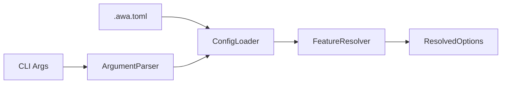

# Design Specification

## Overview

This design implements the CLI input layer: argument parsing, TOML configuration loading with merge semantics, and feature preset resolution. The pipeline flows from raw CLI arguments through config merging to produce resolved options consumed by downstream commands.

## Architecture

AFFECTED LAYERS: CLI Layer, Core Engine

### High-Level Architecture

Input pipeline: parse CLI arguments, load config file, merge (CLI wins), resolve feature presets.


```mermaid
flowchart LR
    Args[CLI Args] --> Parser[ArgumentParser]
    Config[.awa.toml] --> Loader[ConfigLoader]
    Parser --> Loader
    Loader --> FR[FeatureResolver]
    FR --> Options[ResolvedOptions]
```

### Module Organization

```
src/
├── cli/
│   └── index.ts              # CLI entry, command definitions (commander)
├── commands/
│   ├── generate.ts           # Generate command orchestration
│   └── diff.ts               # Diff command orchestration
└── core/
    ├── config.ts             # ConfigLoader (TOML parsing, merge)
    └── feature-resolver.ts   # FeatureResolver (presets, removals)
```

### Architectural Decisions

- COMMANDER OVER CITTY: Commander is mature, full-featured, supports positional args in help. Alternatives: citty (lighter but less positional support), yargs (verbose)
- CLI WINS MERGE: CLI arguments always override config file values for simplicity. Alternatives: deep merge (complex), per-key priority (confusing)

## Components and Interfaces

### CLI-ArgumentParser

Parses CLI arguments using commander, validates inputs, and produces a raw options object for downstream processing. Supports both `generate` and `diff` subcommands with positional arguments displayed in help output.

IMPLEMENTS: CFG-5_AC-2, CLI-23_AC-1, CLI-24_AC-1, CLI-25_AC-1, CLI-1_AC-1, CLI-1_AC-2, CLI-1_AC-3, CLI-1_AC-4, CLI-1_AC-5, CLI-2_AC-1, CLI-2_AC-2, CLI-2_AC-3, CLI-2_AC-5, CLI-2_AC-6, CLI-3_AC-1, CLI-4_AC-1, CLI-4_AC-2, CLI-5_AC-1, CLI-6_AC-1, CLI-6_AC-2, CLI-7_AC-1, CLI-8_AC-1, CLI-9_AC-1, CLI-9_AC-2, CLI-9_AC-3, CLI-10_AC-1, CLI-10_AC-2, CLI-11_AC-1, CLI-11_AC-2, CLI-11_AC-3, CLI-12_AC-1, CLI-13_AC-1, CLI-13_AC-2, CLI-14_AC-1, CLI-14_AC-2, CLI-15_AC-1, CLI-15_AC-2, DIFF-7_AC-1, DIFF-7_AC-2, DIFF-7_AC-3, DIFF-7_AC-4, DIFF-7_AC-5, DIFF-7_AC-6, DIFF-7_AC-7, DIFF-7_AC-8, DIFF-7_AC-9, DIFF-7_AC-10, DIFF-7_AC-11, DIFF-7_AC-12, DIFF-7_AC-13, DISC-4_AC-1, DISC-5_AC-1, FP-2_AC-1, FP-2_AC-2, FP-2_AC-4, FP-4_AC-1, FP-4_AC-2, FP-4_AC-3, FP-4_AC-5, GEN-10_AC-1, GEN-10_AC-2, INIT-1_AC-1, INIT-2_AC-1, INIT-3_AC-1, INIT-4_AC-1, JSON-1_AC-1, JSON-2_AC-1, JSON-5_AC-1, TCLI-1_AC-1, TCLI-1_AC-2, TCLI-1_AC-3, TCLI-1_AC-4, TCLI-1_AC-5, TCLI-1_AC-6, TCLI-1_AC-7, TCLI-2_AC-1, TCLI-2_AC-2, TCLI-3_AC-1, TCLI-3_AC-2, TCLI-3_AC-3, TCLI-3_AC-4, TCLI-4_AC-1, TCLI-4_AC-2, TCLI-5_AC-1, TCLI-5_AC-2, TCLI-5_AC-3, TCLI-5_AC-4, TRC-8_AC-1, TTST-5_AC-1, TTST-7_AC-1

```typescript
interface RawCliOptions {
  output?: string;
  template?: string;
  features?: string[];
  preset?: string[];
  removeFeatures?: string[];
  force?: boolean;
  dryRun?: boolean;
  delete?: boolean;
  config?: string;
  refresh?: boolean;
  listUnknown?: boolean;
}

interface ArgumentParser {
  parse(argv: string[]): RawCliOptions;
}
```

### CFG-ConfigLoader

Loads TOML configuration from file, merges with CLI arguments (CLI wins), and produces resolved options with defaults applied. Parses the `[presets]` table for named feature bundles.

IMPLEMENTS: CFG-1_AC-1, CFG-1_AC-2, CFG-1_AC-3, CFG-1_AC-4, CFG-2_AC-1, CFG-2_AC-2, CFG-2_AC-3, CFG-3_AC-1, CFG-3_AC-2, CFG-3_AC-3, CFG-3_AC-4, CFG-3_AC-5, CFG-3_AC-6, CFG-3_AC-7, CFG-3_AC-8, CFG-3_AC-9, CFG-3_AC-10, CFG-4_AC-1, CFG-4_AC-2, CFG-4_AC-3, CFG-4_AC-4, CFG-5_AC-1, CFG-6_AC-1, CFG-6_AC-2, CLI-31_AC-1, CLI-1_AC-4, CLI-2_AC-2, CLI-2_AC-3, CLI-2_AC-4, CLI-4_AC-3, CLI-7_AC-2, FP-1_AC-1, FP-1_AC-2, FP-1_AC-3, FP-1_AC-4, FP-3_AC-1, FP-3_AC-2, FP-3_AC-3, FP-5_AC-1, FP-5_AC-2, FP-5_AC-3, MULTI-1_AC-1, MULTI-2_AC-1, MULTI-3_AC-1, MULTI-5_AC-2

```typescript
interface FileConfig {
  output?: string;
  template?: string;
  features?: string[];
  preset?: string[];
  'remove-features'?: string[];
  force?: boolean;
  'dry-run'?: boolean;
  delete?: boolean;
  refresh?: boolean;
  presets?: PresetDefinitions;
  'list-unknown'?: boolean;
}

interface ResolvedOptions {
  output: string;
  template: string | null;
  features: string[];
  preset: string[];
  removeFeatures: string[];
  force: boolean;
  dryRun: boolean;
  delete: boolean;
  refresh: boolean;
  presets: PresetDefinitions;
  listUnknown: boolean;
}

interface ConfigLoader {
  load(configPath: string | null): Promise<FileConfig | null>;
  merge(cli: RawCliOptions, file: FileConfig | null): ResolvedOptions;
}
```

### FP-FeatureResolver

Computes the final feature set from base features, activated presets, and removals. Validates that referenced preset names exist in the presets table.

IMPLEMENTS: FP-2_AC-3, FP-6_AC-1, FP-6_AC-2, FP-6_AC-3, FP-6_AC-4, FP-6_AC-5, FP-7_AC-1, FP-7_AC-2, FP-4_AC-4

```typescript
interface PresetDefinitions {
  [presetName: string]: string[];
}

interface FeatureResolutionInput {
  baseFeatures: string[];
  presetNames: string[];
  removeFeatures: string[];
  presetDefinitions: PresetDefinitions;
}

interface FeatureResolver {
  resolve(input: FeatureResolutionInput): string[];
  validatePresets(presetNames: string[], definitions: PresetDefinitions): void;
}
```

## Data Models

### Input Types

- RAW_CLI_OPTIONS: Raw parsed CLI arguments before config merge
- FILE_CONFIG: TOML config file structure with kebab-case keys
- RESOLVED_OPTIONS: Fully resolved configuration with all defaults applied
- PRESET_DEFINITIONS: Map of preset names to feature arrays
- FEATURE_RESOLUTION_INPUT: Inputs for feature resolution (base, presets, removals)

## Correctness Properties

- CLI_P-1 [CLI Override]: CLI arguments always override config file values for the same option
  VALIDATES: CFG-4_AC-1, CFG-4_AC-2

- CLI_P-2 [Features Replace]: Features from CLI completely replace config features (no merge)
  VALIDATES: CFG-4_AC-4

- CLI_P-3 [Preset Validation]: Referencing a non-existent preset name results in an error
  VALIDATES: FP-2_AC-3

- CLI_P-4 [Feature Resolution Order]: Final features = (baseFeatures union presetFeatures) minus removeFeatures
  VALIDATES: FP-6_AC-1, FP-6_AC-2, FP-6_AC-3, FP-6_AC-4

- CLI_P-5 [Feature Deduplication]: Final feature set contains no duplicates
  VALIDATES: FP-6_AC-5, FP-7_AC-2

- CLI_P-6 [Preset Union]: Multiple presets are merged via set union
  VALIDATES: FP-7_AC-1

- CLI_P-7 [Silent Removal]: Removing a non-existent feature does not cause an error
  VALIDATES: FP-4_AC-4

## Error Handling

### ConfigError

Configuration loading and parsing errors.

- FILE_NOT_FOUND: Specified config file does not exist (when --config provided)
- PARSE_ERROR: TOML syntax error with line number
- INVALID_TYPE: Config value has wrong type
- INVALID_PRESET: Preset value is not an array of strings
- UNKNOWN_PRESET: Referenced preset name does not exist in presets table

### Strategy

PRINCIPLES:

- Fail fast on first error
- Provide actionable error messages with file paths
- Write errors to stderr
- Exit with non-zero code on any error
- Include suggestions for common errors

## Testing Strategy

### Property-Based Testing

- FRAMEWORK: fast-check
- MINIMUM_ITERATIONS: 100
- TAG_FORMAT: @awa-test: {CODE}_P-{n}

### Unit Testing

- AREAS: CFG-ConfigLoader merge logic, FP-FeatureResolver preset validation, feature resolution order

### Integration Testing

- SCENARIOS: Config file loading, CLI override behavior, preset resolution flow

## Requirements Traceability

### REQ-CFG-config.md

- CFG-1_AC-1 → CFG-ConfigLoader
- CFG-1_AC-2 → CFG-ConfigLoader
- CFG-1_AC-3 → CFG-ConfigLoader
- CFG-1_AC-4 → CFG-ConfigLoader
- CFG-2_AC-1 → CFG-ConfigLoader
- CFG-2_AC-2 → CFG-ConfigLoader
- CFG-2_AC-3 → CFG-ConfigLoader
- CFG-3_AC-1 → CFG-ConfigLoader
- CFG-3_AC-2 → CFG-ConfigLoader
- CFG-3_AC-3 → CFG-ConfigLoader
- CFG-3_AC-4 → CFG-ConfigLoader
- CFG-3_AC-5 → CFG-ConfigLoader
- CFG-3_AC-6 → CFG-ConfigLoader
- CFG-3_AC-7 → CFG-ConfigLoader
- CFG-3_AC-8 → CFG-ConfigLoader
- CFG-3_AC-9 → CFG-ConfigLoader
- CFG-3_AC-10 → CFG-ConfigLoader
- CFG-4_AC-1 → CFG-ConfigLoader (CLI_P-1)
- CFG-4_AC-2 → CFG-ConfigLoader (CLI_P-1)
- CFG-4_AC-3 → CFG-ConfigLoader
- CFG-4_AC-4 → CFG-ConfigLoader (CLI_P-2)
- CFG-5_AC-1 → CFG-ConfigLoader
- CFG-5_AC-2 → CLI-ArgumentParser
- CFG-6_AC-1 → CFG-ConfigLoader
- CFG-6_AC-2 → CFG-ConfigLoader

### REQ-CLI-cli.md

- CLI-1_AC-1 → CLI-ArgumentParser
- CLI-1_AC-2 → CLI-ArgumentParser
- CLI-1_AC-3 → CLI-ArgumentParser
- CLI-1_AC-4 → CLI-ArgumentParser
- CLI-1_AC-4 → CFG-ConfigLoader
- CLI-1_AC-5 → CLI-ArgumentParser
- CLI-2_AC-1 → CLI-ArgumentParser
- CLI-2_AC-2 → CLI-ArgumentParser
- CLI-2_AC-2 → CFG-ConfigLoader
- CLI-2_AC-3 → CLI-ArgumentParser
- CLI-2_AC-3 → CFG-ConfigLoader
- CLI-2_AC-4 → CFG-ConfigLoader
- CLI-2_AC-5 → CLI-ArgumentParser
- CLI-2_AC-6 → CLI-ArgumentParser
- CLI-3_AC-1 → CLI-ArgumentParser
- CLI-4_AC-1 → CLI-ArgumentParser
- CLI-4_AC-2 → CLI-ArgumentParser
- CLI-4_AC-3 → CFG-ConfigLoader
- CLI-5_AC-1 → CLI-ArgumentParser
- CLI-6_AC-1 → CLI-ArgumentParser
- CLI-6_AC-2 → CLI-ArgumentParser
- CLI-7_AC-1 → CLI-ArgumentParser
- CLI-7_AC-2 → CFG-ConfigLoader
- CLI-8_AC-1 → CLI-ArgumentParser
- CLI-9_AC-1 → CLI-ArgumentParser
- CLI-9_AC-2 → CLI-ArgumentParser
- CLI-9_AC-3 → CLI-ArgumentParser
- CLI-10_AC-1 → CLI-ArgumentParser
- CLI-10_AC-2 → CLI-ArgumentParser
- CLI-11_AC-1 → CLI-ArgumentParser
- CLI-11_AC-2 → CLI-ArgumentParser
- CLI-11_AC-3 → CLI-ArgumentParser
- CLI-12_AC-1 → CLI-ArgumentParser
- CLI-13_AC-1 → CLI-ArgumentParser
- CLI-13_AC-2 → CLI-ArgumentParser
- CLI-14_AC-1 → CLI-ArgumentParser
- CLI-14_AC-2 → CLI-ArgumentParser
- CLI-15_AC-1 → CLI-ArgumentParser
- CLI-15_AC-2 → CLI-ArgumentParser
- CLI-23_AC-1 → CLI-ArgumentParser
- CLI-24_AC-1 → CLI-ArgumentParser
- CLI-25_AC-1 → CLI-ArgumentParser
- CLI-31_AC-1 → CFG-ConfigLoader

### REQ-DIFF-diff.md

- DIFF-7_AC-1 → CLI-ArgumentParser
- DIFF-7_AC-2 → CLI-ArgumentParser
- DIFF-7_AC-3 → CLI-ArgumentParser
- DIFF-7_AC-4 → CLI-ArgumentParser
- DIFF-7_AC-5 → CLI-ArgumentParser
- DIFF-7_AC-6 → CLI-ArgumentParser
- DIFF-7_AC-7 → CLI-ArgumentParser
- DIFF-7_AC-8 → CLI-ArgumentParser
- DIFF-7_AC-9 → CLI-ArgumentParser
- DIFF-7_AC-10 → CLI-ArgumentParser
- DIFF-7_AC-11 → CLI-ArgumentParser
- DIFF-7_AC-12 → CLI-ArgumentParser
- DIFF-7_AC-13 → CLI-ArgumentParser

### REQ-DISC-feature-discovery.md

- DISC-4_AC-1 → CLI-ArgumentParser
- DISC-5_AC-1 → CLI-ArgumentParser

### REQ-FP-feature-presets.md

- FP-1_AC-1 → CFG-ConfigLoader
- FP-1_AC-2 → CFG-ConfigLoader
- FP-1_AC-3 → CFG-ConfigLoader
- FP-1_AC-4 → CFG-ConfigLoader
- FP-2_AC-1 → CLI-ArgumentParser
- FP-2_AC-2 → CLI-ArgumentParser
- FP-2_AC-3 → FP-FeatureResolver (CLI_P-3)
- FP-2_AC-4 → CLI-ArgumentParser
- FP-3_AC-1 → CFG-ConfigLoader
- FP-3_AC-2 → CFG-ConfigLoader
- FP-3_AC-3 → CFG-ConfigLoader
- FP-4_AC-1 → CLI-ArgumentParser
- FP-4_AC-2 → CLI-ArgumentParser
- FP-4_AC-3 → CLI-ArgumentParser
- FP-4_AC-4 → FP-FeatureResolver (CLI_P-7)
- FP-4_AC-5 → CLI-ArgumentParser
- FP-5_AC-1 → CFG-ConfigLoader
- FP-5_AC-2 → CFG-ConfigLoader
- FP-5_AC-3 → CFG-ConfigLoader
- FP-6_AC-1 → FP-FeatureResolver (CLI_P-4)
- FP-6_AC-2 → FP-FeatureResolver (CLI_P-4)
- FP-6_AC-3 → FP-FeatureResolver (CLI_P-4)
- FP-6_AC-4 → FP-FeatureResolver (CLI_P-4)
- FP-6_AC-5 → FP-FeatureResolver (CLI_P-5)
- FP-7_AC-1 → FP-FeatureResolver (CLI_P-6)
- FP-7_AC-2 → FP-FeatureResolver (CLI_P-5)

### REQ-GEN-generation.md

- GEN-10_AC-1 → CLI-ArgumentParser
- GEN-10_AC-2 → CLI-ArgumentParser

### REQ-INIT-init-alias.md

- INIT-1_AC-1 → CLI-ArgumentParser
- INIT-2_AC-1 → CLI-ArgumentParser
- INIT-3_AC-1 → CLI-ArgumentParser
- INIT-4_AC-1 → CLI-ArgumentParser

### REQ-JSON-json-output.md

- JSON-1_AC-1 → CLI-ArgumentParser
- JSON-2_AC-1 → CLI-ArgumentParser
- JSON-5_AC-1 → CLI-ArgumentParser

### REQ-MULTI-multi-target.md

- MULTI-1_AC-1 → CFG-ConfigLoader
- MULTI-2_AC-1 → CFG-ConfigLoader
- MULTI-3_AC-1 → CFG-ConfigLoader
- MULTI-5_AC-2 → CFG-ConfigLoader

### REQ-TCLI-template-cli.md

- TCLI-1_AC-1 → CLI-ArgumentParser
- TCLI-1_AC-2 → CLI-ArgumentParser
- TCLI-1_AC-3 → CLI-ArgumentParser
- TCLI-1_AC-4 → CLI-ArgumentParser
- TCLI-1_AC-5 → CLI-ArgumentParser
- TCLI-1_AC-6 → CLI-ArgumentParser
- TCLI-1_AC-7 → CLI-ArgumentParser
- TCLI-2_AC-1 → CLI-ArgumentParser
- TCLI-2_AC-2 → CLI-ArgumentParser
- TCLI-3_AC-1 → CLI-ArgumentParser
- TCLI-3_AC-2 → CLI-ArgumentParser
- TCLI-3_AC-3 → CLI-ArgumentParser
- TCLI-3_AC-4 → CLI-ArgumentParser
- TCLI-4_AC-1 → CLI-ArgumentParser
- TCLI-4_AC-2 → CLI-ArgumentParser
- TCLI-5_AC-1 → CLI-ArgumentParser
- TCLI-5_AC-2 → CLI-ArgumentParser
- TCLI-5_AC-3 → CLI-ArgumentParser
- TCLI-5_AC-4 → CLI-ArgumentParser

### REQ-TRC-trace.md

- TRC-8_AC-1 → CLI-ArgumentParser

### REQ-TTST-template-test.md

- TTST-5_AC-1 → CLI-ArgumentParser
- TTST-7_AC-1 → CLI-ArgumentParser

## Library Usage

### Framework Features

- COMMANDER: Command definition, argument parsing, help generation with positional args, version display

### External Libraries

- commander (latest): CLI framework — argument parsing, help with positional args, subcommands
- smol-toml (1.x): TOML parser — lightweight, spec-compliant
