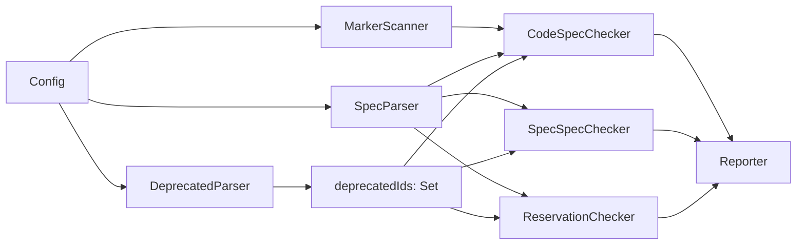

# Design Specification

## Overview

This design implements requirement deprecation as an extension to the existing `awa check` pipeline. A new DeprecatedParser stage reads the tombstone file and produces a set of deprecated IDs. The existing checkers (CodeSpecChecker, SpecSpecChecker) are extended to consult this set: suppressing coverage findings for deprecated IDs, silencing orphan/cross-ref errors by default, and optionally surfacing `deprecated-ref` warnings when `--deprecated` is active. A new ReservationChecker detects ID conflicts between active specs and the deprecated set.

## Architecture

AFFECTED LAYERS: Core Engine

### High-Level Architecture

The deprecated feature inserts into the existing check pipeline between parsing and checking. The DeprecatedParser runs alongside SpecParser, producing a deprecated ID set consumed by all downstream checkers.



### Module Organization

```
src/core/check/
├── deprecated-parser.ts          # New: parses DEPRECATED.md
├── reservation-checker.ts        # New: detects ID reuse conflicts
├── code-spec-checker.ts          # Modified: consult deprecatedIds
├── spec-spec-checker.ts          # Modified: consult deprecatedIds
├── types.ts                      # Modified: add deprecatedIds, deprecated flag
└── __tests__/
    ├── deprecated-parser.test.ts
    ├── reservation-checker.test.ts
    ├── code-spec-checker.test.ts  # Extended
    └── spec-spec-checker.test.ts  # Extended
```

### Architectural Decisions

- EXTEND OVER REWRITE: Modify existing checkers to accept a deprecated set rather than creating a filter layer. Alternatives: pre-filter findings, post-filter findings
- SINGLE FILE OVER PER-CODE: One DEPRECATED.md file for all feature codes keeps the schema simple and avoids file proliferation. Alternatives: DEP-{CODE}.md per feature
- SEPARATE RESERVATION CHECKER: ID conflict detection is a distinct concern from orphan/coverage checks. Alternatives: embed in SpecParser, embed in SpecSpecChecker

## Components and Interfaces

### DEP-DeprecatedParser

Parses `.awa/specs/deprecated/DEPRECATED.md` to extract all deprecated IDs. Reads the file, splits by H1 headings (feature code groups), and extracts comma-separated IDs from each line. Returns an empty set if the file does not exist.

IMPLEMENTS: DEP_P-5, DEP-1_AC-1, DEP-1_AC-2, DEP-1_AC-3, DEP-2_AC-1, DEP-2_AC-2, DEP-2_AC-3

```typescript
interface DeprecatedResult {
  readonly deprecatedIds: ReadonlySet<string>;
}

function parseDeprecated(specDir: string): Promise<DeprecatedResult>;
```

### DEP-ReservationChecker

Compares active spec IDs against the deprecated set. Reports an error for any ID that appears in both.

IMPLEMENTS: DEP_P-3, DEP-4_AC-1, DEP-4_AC-2

```typescript
interface CheckResult {
  readonly findings: readonly Finding[];
}

function checkReservations(
  specs: SpecParseResult,
  deprecatedIds: ReadonlySet<string>,
): CheckResult;
```

### DEP-SchemaValidation

Leverages the existing CLI-SchemaChecker infrastructure. The DEPRECATED.schema.yaml file is added to the schema directory; the existing rule loader discovers and applies it automatically.

IMPLEMENTS: DEP-7_AC-1, DEP-7_AC-2

```typescript
// No new code — existing SchemaChecker handles this via rule discovery
```

## Data Models

### Core Types

- DEPRECATED_RESULT: Output of the deprecated file parser

```typescript
interface DeprecatedResult {
  readonly deprecatedIds: ReadonlySet<string>;
}
```

- FINDING_CODE (extended): New finding code for deprecated references

```typescript
type FindingCode =
  | /* ...existing codes... */
  | 'deprecated-ref'
  | 'deprecated-id-conflict';
```

### Configuration Types

- CHECK_CONFIG (extended): Adds deprecated flag

```typescript
interface CheckConfig {
  // ... existing fields
  readonly deprecated: boolean;
}
```

## Correctness Properties

- DEP_P-1 [Coverage Suppression Completeness]: No coverage finding (uncovered-ac, unimplemented-ac, unlinked-ac, uncovered-property, uncovered-component) is emitted for any ID in the deprecated set
  VALIDATES: DEP-3_AC-1, DEP-3_AC-2, DEP-3_AC-3, DEP-3_AC-4

- DEP_P-2 [Silent Default]: Without `--deprecated`, no orphaned-marker or broken-cross-ref finding is emitted for any ID in the deprecated set
  VALIDATES: DEP-5_AC-1, DEP-5_AC-2, DEP-5_AC-3

- DEP_P-3 [Reservation Enforcement]: Every ID that appears in both active specs and the deprecated set produces a deprecated-id-conflict error
  VALIDATES: DEP-4_AC-1, DEP-4_AC-2

- DEP_P-4 [Deprecated Flag Activation]: With `--deprecated`, every code marker or cross-reference targeting a deprecated ID produces a deprecated-ref warning
  VALIDATES: DEP-6_AC-2, DEP-6_AC-3

- DEP_P-5 [Empty File Tolerance]: When DEPRECATED.md does not exist, the deprecated set is empty and all checks behave as before
  VALIDATES: DEP-1_AC-3

## Error Handling

### DeprecatedParseError

Errors during deprecated file parsing

- FILE_READ_ERROR: Cannot read deprecated file (permissions, encoding)
- MALFORMED_LINE: A line contains text that is not a valid comma-separated ID list

### Strategy

PRINCIPLES:

- Missing deprecated file is not an error (empty set)
- Malformed lines are warnings (skip line, continue parsing)
- ID conflict errors are always reported regardless of `--deprecated` flag

## Testing Strategy

### Property-Based Testing

- FRAMEWORK: fast-check
- MINIMUM_ITERATIONS: 100
- TAG_FORMAT: `@awa-test: DEP_P-{n}`

### Unit Testing

- AREAS: deprecated parser, reservation checker, code-spec-checker deprecated filtering, spec-spec-checker deprecated filtering

### Integration Testing

- SCENARIOS: check with deprecated file present, check without deprecated file, check with `--deprecated` flag, check with ID conflict

## Requirements Traceability

### REQ-DEP-deprecated.md

- DEP_P-3 → DEP-ReservationChecker
- DEP_P-5 → DEP-DeprecatedParser
- DEP-1_AC-1 → DEP-DeprecatedParser
- DEP-1_AC-2 → DEP-DeprecatedParser
- DEP-1_AC-3 → DEP-DeprecatedParser (DEP_P-5)
- DEP-2_AC-1 → DEP-DeprecatedParser
- DEP-2_AC-2 → DEP-DeprecatedParser
- DEP-2_AC-3 → DEP-DeprecatedParser
- DEP-4_AC-1 → DEP-ReservationChecker (DEP_P-3)
- DEP-4_AC-2 → DEP-ReservationChecker (DEP_P-3)
- DEP-7_AC-1 → DEP-SchemaValidation
- DEP-7_AC-2 → DEP-SchemaValidation
