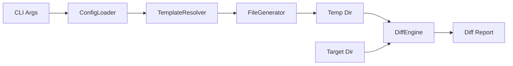

# Design Specification

## Overview

This design implements the diff pipeline for comparing generated template output against existing target files. The diff command generates to a temp directory, performs comparisons, and reports differences — including binary files, target-only files, and delete-listed files.

## Architecture

AFFECTED LAYERS: CLI Layer, Core Engine, I/O Layer

### High-Level Architecture

Pipeline: resolve config and template, generate to temp dir, compare against target, report, clean up.



### Module Organization

```
src/
├── commands/
│   └── diff.ts            # Diff command orchestration
└── core/
    └── differ.ts          # DiffEngine comparison logic
```

### Architectural Decisions

- TEMP DIR GENERATION: Generate to temp dir rather than diffing in-memory for reuse of existing generator. Alternatives: in-memory diff (complex), direct comparison (no generation)
- BINARY DETECTION BEFORE DIFF: Use `isbinaryfile` npm package for null-byte detection. Alternatives: manual null-byte scan, file extension heuristic (incomplete)

## Components and Interfaces

### DIFF-DiffEngine

Compares generated template output against existing target files. Generates to a temp directory, performs byte-for-byte comparison, produces unified diff output, reports delete-listed files from `_delete.txt`, and only includes target-only files when explicitly requested.

IMPLEMENTS: DIFF-1_AC-1, DIFF-1_AC-2, DIFF-1_AC-3, DIFF-2_AC-1, DIFF-2_AC-2, DIFF-2_AC-3, DIFF-2_AC-4, DIFF-2_AC-5, DIFF-3_AC-1, DIFF-3_AC-2, DIFF-3_AC-3, DIFF-3_AC-4, DIFF-4_AC-1, DIFF-4_AC-2, DIFF-4_AC-3, DIFF-4_AC-4, DIFF-4_AC-5, DIFF-5_AC-1, DIFF-5_AC-2, DIFF-5_AC-3, DIFF-6_AC-1, DIFF-6_AC-2, DIFF-6_AC-3, DIFF-7_AC-11, DIFF-8_AC-1, DIFF-8_AC-2, DIFF-8_AC-3, DIFF-8_AC-4

```typescript
interface DiffOptions {
  templatePath: string;
  targetPath: string;
  features: string[];
  listUnknown: boolean;
}

type FileDiffStatus = 'identical' | 'modified' | 'new' | 'extra' | 'binary-differs' | 'delete-listed';

interface FileDiff {
  relativePath: string;
  status: FileDiffStatus;
  unifiedDiff?: string;
}

interface DiffResult {
  files: FileDiff[];
  identical: number;
  modified: number;
  newFiles: number;
  extraFiles: number;
  binaryDiffers: number;
  deleteListed: number;
  hasDifferences: boolean;
}

interface DiffEngine {
  diff(options: DiffOptions): Promise<DiffResult>;
  createTempDir(): Promise<string>;
  cleanupTempDir(tempPath: string): Promise<void>;
  compareFiles(generatedPath: string, targetPath: string, relativePath: string): Promise<FileDiff>;
  isBinaryFile(filePath: string): Promise<boolean>;
}
```

### DIFF-DiffCommand

Orchestrates the diff pipeline: resolve config, resolve template, run DiffEngine, display results, set exit code.

IMPLEMENTS: DIFF-5_AC-1, DIFF-5_AC-2, DIFF-5_AC-3, DIFF-7_AC-1, DIFF-7_AC-2, DIFF-7_AC-3, DIFF-7_AC-4, DIFF-7_AC-5, DIFF-7_AC-6, DIFF-7_AC-7, DIFF-7_AC-8, DIFF-7_AC-9, DIFF-7_AC-10

```typescript
interface DiffCommand {
  execute(target: string | undefined, options: RawCliOptions): Promise<number>;
}
```

## Data Models

### Diff Types

- FILE_DIFF: Comparison result for a single file with status and optional unified diff
- DIFF_RESULT: Aggregated diff outcome with file list and summary counts
- DIFF_OPTIONS: Input options for the diff engine

## Correctness Properties

- DIFF_P-1 [Diff Read-Only]: Diff command never modifies the target directory
  VALIDATES: DIFF-1_AC-3

- DIFF_P-2 [Temp Cleanup Guaranteed]: Temp directory is always deleted, even on error
  VALIDATES: DIFF-6_AC-1, DIFF-6_AC-2, DIFF-6_AC-3

- DIFF_P-3 [Exact Comparison]: File comparison is byte-for-byte exact (whitespace-sensitive)
  VALIDATES: DIFF-2_AC-1

- DIFF_P-4 [Exit Code Semantics]: Exit 0 means identical, exit 1 means differences, exit 2 means error
  VALIDATES: DIFF-5_AC-1, DIFF-5_AC-2, DIFF-5_AC-3

- DIFF_P-5 [Unknown Opt-In]: Target-only files are excluded unless `listUnknown` is true; when true, they are reported as extras without altering generation scope
  VALIDATES: DIFF-3_AC-2, DIFF-3_AC-3, DIFF-3_AC-4, DIFF-7_AC-11

- DIFF_P-6 [Delete-Listed Priority]: Files appearing in both the delete list and the extra list are reported only as `delete-listed`, never duplicated as `extra`
  VALIDATES: DIFF-8_AC-1, DIFF-8_AC-2, DIFF-8_AC-3

## Error Handling

### DiffError

Diff operation errors.

- TARGET_NOT_FOUND: Target directory does not exist
- TARGET_NOT_READABLE: Cannot read target directory or files
- TEMP_DIR_FAILED: Failed to create or write to temp directory

### Strategy

PRINCIPLES:

- Fail fast on first error
- Always clean up temp directory (even on error)
- Exit with non-zero code on any error

## Testing Strategy

### Property-Based Testing

- FRAMEWORK: fast-check
- MINIMUM_ITERATIONS: 100
- TAG_FORMAT: @awa-test: DIFF_P-{n}

### Unit Testing

- AREAS: DiffEngine comparison logic, binary detection, delete-listed reporting, target-only filtering

### Integration Testing

- SCENARIOS: Diff with identical files, diff with modifications, diff with delete-listed files

## Requirements Traceability

### REQ-DIFF-diff.md

- DIFF-1_AC-1 → DIFF-DiffEngine
- DIFF-1_AC-2 → DIFF-DiffEngine
- DIFF-1_AC-3 → DIFF-DiffEngine (DIFF_P-1)
- DIFF-2_AC-1 → DIFF-DiffEngine (DIFF_P-3)
- DIFF-2_AC-2 → DIFF-DiffEngine
- DIFF-2_AC-3 → DIFF-DiffEngine
- DIFF-2_AC-4 → DIFF-DiffEngine
- DIFF-2_AC-5 → DIFF-DiffEngine
- DIFF-3_AC-1 → DIFF-DiffEngine
- DIFF-3_AC-2 → DIFF-DiffEngine (DIFF_P-5)
- DIFF-3_AC-3 → DIFF-DiffEngine (DIFF_P-5)
- DIFF-3_AC-4 → DIFF-DiffEngine (DIFF_P-5)
- DIFF-4_AC-1 → DIFF-DiffEngine
- DIFF-4_AC-2 → DIFF-DiffEngine
- DIFF-4_AC-3 → GEN-Logger
- DIFF-4_AC-4 → GEN-Logger
- DIFF-4_AC-5 → GEN-Logger
- DIFF-5_AC-1 → DIFF-DiffEngine (DIFF_P-4)
- DIFF-5_AC-2 → DIFF-DiffEngine (DIFF_P-4)
- DIFF-5_AC-3 → DIFF-DiffEngine (DIFF_P-4)
- DIFF-6_AC-1 → DIFF-DiffEngine (DIFF_P-2)
- DIFF-6_AC-2 → DIFF-DiffEngine (DIFF_P-2)
- DIFF-6_AC-3 → DIFF-DiffEngine (DIFF_P-2)
- DIFF-7_AC-1 → CLI-ArgumentParser
- DIFF-7_AC-2 → CLI-ArgumentParser
- DIFF-7_AC-3 → CLI-ArgumentParser
- DIFF-7_AC-4 → CLI-ArgumentParser
- DIFF-7_AC-5 → CLI-ArgumentParser
- DIFF-7_AC-6 → CLI-ArgumentParser
- DIFF-7_AC-11 → CLI-ArgumentParser
- DIFF-7_AC-12 → CLI-ArgumentParser
- DIFF-7_AC-13 → CLI-ArgumentParser
- DIFF-8_AC-1 → DIFF-DiffEngine (DIFF_P-6)
- DIFF-8_AC-2 → DIFF-DiffEngine (DIFF_P-6)
- DIFF-8_AC-3 → DIFF-DiffEngine (DIFF_P-6)
- DIFF-8_AC-4 → DIFF-DiffEngine

## Library Usage

### External Libraries

- diff (latest): Unified diff generation — cross-platform text comparison
- isbinaryfile (latest): Binary file detection — null-byte heuristic

## Change Log

- 1.0.0 (2026-02-28): Split from DESIGN-AWA-cli.md
