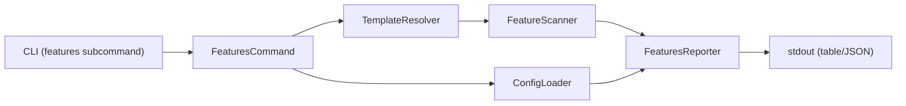

# Design Specification

## Overview

This design implements the `awa features` command as a simple pipeline: resolve template → scan files → report results. It reuses the existing template resolver and config loader, adding a new FeatureScanner for flag extraction and a FeaturesReporter for output formatting.

## Architecture

AFFECTED LAYERS: CLI Layer, Core Engine

### High-Level Architecture

Pipeline architecture: resolve template source, scan all files for feature flag patterns, format and report results.



### Module Organization

```
src/
├── cli/
│   └── index.ts           (features subcommand registration)
├── commands/
│   └── features.ts        (FeaturesCommand orchestration)
└── core/
    └── features/
        ├── scanner.ts      (FeatureScanner)
        ├── reporter.ts     (FeaturesReporter)
        └── __tests__/
            ├── scanner.test.ts
            └── reporter.test.ts
```

### Architectural Decisions

- REUSE TEMPLATE RESOLVER: Same resolution logic as generate/diff avoids duplication. Alternatives: separate resolution for features
- REGEX EXTRACTION: Simple regex matches `it.features.includes(...)` and `it.features.indexOf(...)` patterns; sufficient for Eta templates. Alternatives: Eta AST parsing (over-engineered)
- WALKER SCANS ALL FILES: Includes files starting with underscore (partials) since they may reference feature flags. Alternatives: filter to known template extensions only

## Components and Interfaces

### DISC-FeatureScanner

Recursively walks template directory files, extracts feature flag names from `it.features.includes(...)` and `it.features.indexOf(...)` patterns using regex, aggregates flags by name with referencing files, and returns a sorted result.

IMPLEMENTS: DISC-1_AC-1, DISC-2_AC-1, DISC-3_AC-1

```typescript
interface DiscoveredFeature {
  name: string;
  files: string[];
}

interface ScanResult {
  features: DiscoveredFeature[];
  filesScanned: number;
}

class FeatureScanner {
  extractFlags(content: string): string[];
  scan(templatePath: string): Promise<ScanResult>;
}
```

### DISC-FeaturesCommand

Orchestrates the features workflow: loads config, resolves template source via the shared template resolver, invokes scanner, and passes results to the reporter.

IMPLEMENTS: DISC-4_AC-1, DISC-5_AC-1

```typescript
interface FeaturesCommandOptions {
  template?: string;
  config?: string;
  refresh?: boolean;
  json?: boolean;
}

function featuresCommand(options: FeaturesCommandOptions): Promise<number>;
```

### DISC-Reporter

Formats and outputs scan results. In JSON mode, outputs a structured JSON object. In table mode, renders a human-readable list with chalk formatting. Includes preset definitions from config when available.

IMPLEMENTS: DISC-6_AC-1, DISC-7_AC-1

```typescript
interface ReportOptions {
  scanResult: ScanResult;
  json: boolean;
  presets?: Record<string, string[]>;
}

interface FeaturesJsonOutput {
  features: Array<{ name: string; files: string[] }>;
  presets?: Record<string, string[]>;
  filesScanned: number;
}

class FeaturesReporter {
  report(options: ReportOptions): void;
  buildJsonOutput(scanResult: ScanResult, presets?: Record<string, string[]>): FeaturesJsonOutput;
}
```

## Data Models

### Core Types

- DISCOVERED_FEATURE: A feature flag name with the list of template files referencing it
- SCAN_RESULT: Aggregation of all discovered features plus total files scanned count
- FEATURES_JSON_OUTPUT: JSON output structure containing features array, optional presets, and files scanned count
- FEATURES_COMMAND_OPTIONS: CLI options for the features command (template, config, refresh, json)

## Correctness Properties

- DISC_P-1 [Extraction Completeness]: Every `it.features.includes('x')` or `it.features.indexOf('x')` pattern in any scanned file yields flag name `x` in the scan result
  VALIDATES: DISC-1_AC-1, DISC-2_AC-1

- DISC_P-2 [Aggregation Correctness]: Each discovered flag lists exactly the set of files that reference it, with no duplicates and sorted alphabetically
  VALIDATES: DISC-3_AC-1

- DISC_P-3 [JSON Output Validity]: When json mode is active, the output is valid JSON matching the FeaturesJsonOutput schema
  VALIDATES: DISC-6_AC-1, DISC-7_AC-1

- DISC_P-4 [Template Resolution Reuse]: The features command resolves templates via the shared template resolver, identical to generate and diff
  VALIDATES: DISC-4_AC-1, DISC-5_AC-1

## Error Handling

### FeatureDiscoveryError

Feature discovery operation errors

- FILE_READ_ERROR: Cannot read a template file as UTF-8 (silently skipped)
- TEMPLATE_RESOLUTION_ERROR: Template source cannot be resolved
- CONFIG_LOAD_ERROR: Configuration file cannot be loaded

### Strategy

PRINCIPLES:

- Fail fast on template resolution or config errors (before scanning)
- Continue on individual file read errors (skip binary files silently)
- Return exit code 0 on success, 1 on fatal errors

## Testing Strategy

### Property-Based Testing

- FRAMEWORK: vitest
- MINIMUM_ITERATIONS: 100
- TAG_FORMAT: `@awa-test: DISC_P-{n}`

### Unit Testing

- AREAS: feature scanner extraction, feature scanner aggregation, reporter JSON output, reporter table output

### Integration Testing

- SCENARIOS: features command with local template, features command with config defaults, features command with --json flag

## Requirements Traceability

### REQ-DISC-feature-discovery.md

- DISC-1_AC-1 → DISC-FeatureScanner (DISC_P-1)
- DISC-2_AC-1 → DISC-FeatureScanner (DISC_P-1)
- DISC-3_AC-1 → DISC-FeatureScanner (DISC_P-2)
- DISC-4_AC-1 → DISC-FeaturesCommand (DISC_P-4)
- DISC-5_AC-1 → DISC-FeaturesCommand (DISC_P-4)
- DISC-6_AC-1 → DISC-Reporter (DISC_P-3)
- DISC-7_AC-1 → DISC-Reporter (DISC_P-3)

## Change Log

- 1.0.0 (2026-02-28): Initial design
