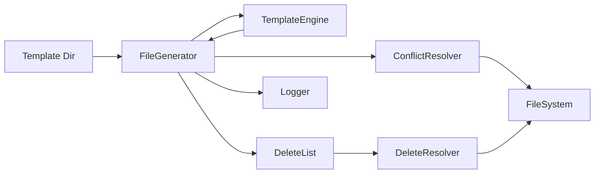

# Design Specification

## Overview

This design implements the file generation pipeline: walking template directories, invoking the template engine, managing output structure, handling file conflicts interactively, processing delete lists with feature-gated sections, and providing styled console output. It also includes the generate command orchestration and shared utility components.

## Architecture

AFFECTED LAYERS: Core Engine, I/O Layer

### High-Level Architecture

Generation pipeline: walk templates, render, resolve conflicts, write output, process deletes.



### Module Organization

```
src/
├── commands/
│   └── generate.ts        # Generate command orchestration
├── core/
│   ├── delete-list.ts     # DeleteList parser (feature-gated)
│   ├── generator.ts       # FileGenerator
│   └── resolver.ts        # ConflictResolver, DeleteResolver
├── utils/
│   ├── fs.ts              # File system helpers
│   └── logger.ts          # Console output (chalk)
└── types/
    └── index.ts           # Shared type definitions
```

### Architectural Decisions

- BATCH CONFLICT RESOLUTION: Show all conflicts in single multiselect prompt. Alternatives: per-file prompts (tedious for many files)
- DESTRUCTIVE DELETE STYLE: Red-styled delete multiselect for visual safety distinction. Alternatives: same style as overwrite (confusing)

## Components and Interfaces

### GEN-FileGenerator

Orchestrates the generation process: walks template directory, invokes template engine, manages output structure, coordinates conflict resolution, and processes the delete list. When `dryRun` is true, it computes and reports actions without creating directories or writing files.

IMPLEMENTS: GEN-1_AC-1, GEN-1_AC-2, GEN-1_AC-3, GEN-2_AC-1, GEN-2_AC-2, GEN-2_AC-3, GEN-3_AC-1, GEN-3_AC-2, GEN-3_AC-3, GEN-8_AC-1, GEN-8_AC-2, GEN-8_AC-3, GEN-11_AC-3, GEN-12_AC-1, GEN-12_AC-2, GEN-12_AC-3, GEN-12_AC-4, GEN-12_AC-5, GEN-12_AC-6, GEN-12_AC-7, GEN-12_AC-8, TPL-9_AC-1, TPL-9_AC-2, CLI-6_AC-2

```typescript
interface GenerateOptions {
  templatePath: string;
  outputPath: string;
  features: string[];
  force: boolean;
  dryRun: boolean;
  delete: boolean;
}

type FileAction =
  | { type: 'create'; sourcePath: string; outputPath: string }
  | { type: 'overwrite'; sourcePath: string; outputPath: string }
  | { type: 'skip-user'; sourcePath: string; outputPath: string }
  | { type: 'skip-empty'; sourcePath: string; outputPath: string }
  | { type: 'skip-equal'; sourcePath: string; outputPath: string }
  | { type: 'delete'; outputPath: string };

interface GenerationResult {
  actions: FileAction[];
  created: number;
  overwritten: number;
  deleted: number;
  skipped: number;
  skippedEmpty: number;
  skippedUser: number;
  skippedEqual: number;
}

interface FileGenerator {
  generate(options: GenerateOptions): Promise<GenerationResult>;
  walkTemplates(dir: string): AsyncIterable<string>;
  computeOutputPath(templatePath: string, templateRoot: string, outputRoot: string): string;
}
```

### GEN-ConflictResolver

Handles file conflicts by comparing existing file content with new content, skipping identical files without prompting. For actual conflicts, prompts user with multi-select interface (all files checked by default).

IMPLEMENTS: CLI-5_AC-2, CLI-5_AC-3, GEN-4_AC-1, GEN-4_AC-2, GEN-4_AC-3, GEN-5_AC-1, GEN-5_AC-2, GEN-5_AC-3, GEN-5_AC-4, GEN-5_AC-5, GEN-5_AC-6, GEN-5_AC-7, GEN-6_AC-3, GEN-10_AC-3

```typescript
interface ConflictItem {
  outputPath: string;
  sourcePath: string;
  newContent: string;
  existingContent: string;
}

interface BatchConflictResolution {
  overwrite: string[];
  skip: string[];
  equal: string[];
}

interface ConflictResolver {
  resolveBatch(conflicts: ConflictItem[], force: boolean, dryRun: boolean): Promise<BatchConflictResolution>;
}
```

### GEN-DeleteList

Parses `_delete.txt` from template root directory. Supports feature-gated sections (`# @feature <name>`) where paths are deleted only when none of the listed features are active.

IMPLEMENTS: GEN-12_AC-1, GEN-12_AC-8

```typescript
interface DeleteEntry {
  path: string;
  features?: string[];
}

function parseDeleteList(content: string): DeleteEntry[];
function resolveDeleteList(entries: DeleteEntry[], activeFeatures: string[]): string[];
function loadDeleteList(templatePath: string): Promise<DeleteEntry[]>;
```

### GEN-DeleteResolver

Prompts user to confirm which files to delete from the delete list. Uses a destructive-styled multiselect with red checkboxes.

IMPLEMENTS: GEN-12_AC-3, GEN-12_AC-4, GEN-12_AC-5

```typescript
interface DeleteResolver {
  resolveDeletes(candidates: string[], force: boolean, dryRun: boolean): Promise<string[]>;
}
```

### GEN-Logger

Provides styled console output using chalk. Handles info, success, warning, error messages and generation summary display.

IMPLEMENTS: CLI-6_AC-3, GEN-6_AC-4, GEN-7_AC-1, GEN-7_AC-2, GEN-7_AC-3, GEN-7_AC-4, GEN-9_AC-1, GEN-9_AC-2, GEN-9_AC-3, GEN-9_AC-4, GEN-9_AC-5, GEN-9_AC-6, GEN-9_AC-7, GEN-9_AC-8, GEN-11_AC-1, GEN-11_AC-2, GEN-11_AC-4, TPL-7_AC-3, DIFF-4_AC-3, DIFF-4_AC-4, DIFF-4_AC-5

```typescript
interface Logger {
  info(message: string): void;
  success(message: string): void;
  warn(message: string): void;
  error(message: string): void;
  fileAction(action: FileAction): void;
  summary(result: GenerationResult): void;
  diffLine(line: string, type: 'add' | 'remove' | 'context'): void;
  diffSummary(result: DiffResult): void;
}
```

### GEN-GenerateCommand

Orchestrates the generation pipeline: resolve config, resolve template, generate files, handle conflicts, set exit code.

IMPLEMENTS: CLI-1_AC-1, CLI-1_AC-2, CLI-1_AC-3

```typescript
interface GenerateCommand {
  execute(target: string, options: RawCliOptions): Promise<number>;
}
```

### GEN-FileSystem

Provides file system utilities: path existence, directory creation, file reading/writing.

IMPLEMENTS: GEN-1_AC-1, GEN-1_AC-2

```typescript
interface FileSystem {
  exists(path: string): Promise<boolean>;
  readFile(path: string): Promise<string>;
  writeFile(path: string, content: string): Promise<void>;
  mkdir(path: string): Promise<void>;
}
```

### GEN-CoreTypes

Defines shared type definitions and error classes used across all command modules.

IMPLEMENTS: CLI-1_AC-1

```typescript
interface CoreTypes {
  RawCliOptions: Record<string, unknown>;
  ResolvedOptions: Record<string, unknown>;
}
```

## Data Models

### Generation Types

- FILE_ACTION: Tagged union for file operations (create, overwrite, skip-user, skip-empty, skip-equal, delete)
- GENERATION_RESULT: Aggregated results with counts by action type
- GENERATE_OPTIONS: Input options for the generation pipeline
- CONFLICT_ITEM: Individual file conflict with paths and content
- BATCH_CONFLICT_RESOLUTION: Result with overwrite, skip, and equal lists
- DELETE_ENTRY: Delete list entry with optional feature gate

## Correctness Properties

- GEN_P-1 [Underscore Exclusion]: Files/directories starting with `_` are never written to output
  VALIDATES: GEN-8_AC-1, GEN-8_AC-2, TPL-9_AC-1, TPL-9_AC-2

- GEN_P-2 [Directory Mirror]: Output directory structure exactly mirrors template structure (excluding underscore paths)
  VALIDATES: GEN-1_AC-1, GEN-1_AC-2

- GEN_P-3 [Dry Run Immutable]: Dry-run mode never modifies the file system
  VALIDATES: GEN-6_AC-1, GEN-6_AC-2

- GEN_P-4 [Force No Prompt]: Force mode never prompts for conflict resolution
  VALIDATES: GEN-4_AC-3, CLI-5_AC-2

- GEN_P-5 [Content Identity Skip]: When existing file content exactly matches new content, file is skipped without prompting
  VALIDATES: GEN-5_AC-7

- GEN_P-6 [Delete Feature Gating]: Delete list entries under a `# @feature <name>` section are deleted only when NONE of the listed features are active
  VALIDATES: GEN-12_AC-8

## Error Handling

### GenerationError

File generation errors.

- PERMISSION_DENIED: Cannot create directory or write file
- DISK_FULL: Insufficient disk space

### Strategy

PRINCIPLES:

- Fail fast on first error
- Provide actionable error messages with file paths
- Write errors to stderr
- Exit with non-zero code on any error

## Testing Strategy

### Property-Based Testing

- FRAMEWORK: fast-check
- MINIMUM_ITERATIONS: 100
- TAG_FORMAT: @awa-test: GEN_P-{n}

### Unit Testing

- AREAS: GEN-ConflictResolver prompt logic, GEN-DeleteList parsing, GEN-DeleteResolver confirmation flow, GEN-FileGenerator output structure

### Integration Testing

- SCENARIOS: Local template generation, conflict resolution flow, dry-run output verification, delete list processing with feature gating

## Requirements Traceability

### REQ-GEN-generation.md

- GEN-1_AC-1 → GEN-FileGenerator (GEN_P-2)
- GEN-1_AC-2 → GEN-FileGenerator (GEN_P-2)
- GEN-1_AC-3 → GEN-FileGenerator
- GEN-2_AC-1 → GEN-FileGenerator
- GEN-2_AC-2 → GEN-FileGenerator
- GEN-2_AC-3 → GEN-FileGenerator
- GEN-3_AC-1 → GEN-FileGenerator
- GEN-3_AC-2 → GEN-FileGenerator
- GEN-3_AC-3 → GEN-FileGenerator
- GEN-4_AC-1 → GEN-ConflictResolver
- GEN-4_AC-2 → GEN-ConflictResolver
- GEN-4_AC-3 → GEN-ConflictResolver (GEN_P-4)
- GEN-5_AC-1 → GEN-ConflictResolver
- GEN-5_AC-2 → GEN-ConflictResolver
- GEN-5_AC-3 → GEN-ConflictResolver
- GEN-5_AC-4 → GEN-ConflictResolver
- GEN-5_AC-5 → GEN-ConflictResolver
- GEN-5_AC-6 → GEN-ConflictResolver
- GEN-5_AC-7 → GEN-ConflictResolver (GEN_P-5)
- GEN-6_AC-1 → GEN-FileGenerator (GEN_P-3)
- GEN-6_AC-2 → GEN-FileGenerator (GEN_P-3)
- GEN-6_AC-3 → GEN-ConflictResolver
- GEN-6_AC-4 → GEN-Logger
- GEN-7_AC-1 → GEN-Logger
- GEN-7_AC-2 → GEN-Logger
- GEN-7_AC-3 → GEN-Logger
- GEN-7_AC-4 → GEN-Logger
- GEN-8_AC-1 → GEN-FileGenerator (GEN_P-1)
- GEN-8_AC-2 → GEN-FileGenerator (GEN_P-1)
- GEN-8_AC-3 → GEN-FileGenerator (GEN_P-1)
- GEN-9_AC-1 → GEN-Logger
- GEN-9_AC-2 → GEN-Logger
- GEN-9_AC-3 → GEN-Logger
- GEN-9_AC-4 → GEN-Logger
- GEN-9_AC-5 → GEN-Logger
- GEN-9_AC-6 → GEN-Logger
- GEN-9_AC-7 → GEN-Logger
- GEN-9_AC-8 → GEN-Logger
- GEN-10_AC-1 → CLI-ArgumentParser
- GEN-10_AC-2 → CLI-ArgumentParser
- GEN-10_AC-3 → GEN-ConflictResolver
- GEN-11_AC-1 → GEN-Logger
- GEN-11_AC-2 → GEN-Logger
- GEN-11_AC-3 → GEN-FileGenerator
- GEN-11_AC-4 → GEN-Logger
- GEN-12_AC-1 → GEN-FileGenerator
- GEN-12_AC-2 → GEN-FileGenerator
- GEN-12_AC-3 → GEN-DeleteResolver
- GEN-12_AC-4 → GEN-FileGenerator
- GEN-12_AC-5 → GEN-FileGenerator
- GEN-12_AC-6 → GEN-FileGenerator
- GEN-12_AC-7 → GEN-FileGenerator
- GEN-12_AC-8 → GEN-DeleteList (GEN_P-6)

## Library Usage

### Framework Features

- CLACK_PROMPTS: Interactive select prompts for conflict resolution
- CLACK_CORE: Custom multiselect prompts for destructive-styled delete confirmation (red checkboxes)
- CHALK: Styled terminal output (colors, bold, dim)

### External Libraries

- @clack/prompts (latest): Interactive prompts — styled, accessible
- @clack/core (latest): Custom prompt primitives — destructive-styled delete multiselect
- chalk (5.x): Terminal colors — ESM-native, no dependencies
- fast-check (3.x): Property-based testing — generators, shrinking

## Change Log

- 1.0.0 (2026-02-28): Split from DESIGN-AWA-cli.md
