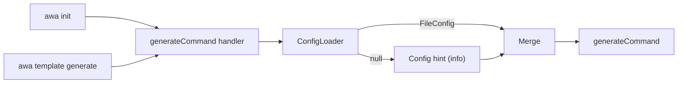

# Design Specification

## Overview

This design implements the `init` top-level convenience command that delegates to the same handler as `template generate`. The change is purely additive: a separate `init` command on the root program configured with the same options via a shared helper, plus a non-blocking config hint in the generate command handler.

## Architecture

AFFECTED LAYERS: CLI Layer

### High-Level Architecture

`init` is registered as a top-level command on the root program, sharing the same handler as `template generate`. No new handler, no new pipeline.



### Module Organization

```
src/
├── cli/
│   └── index.ts         # configureGenerateCommand helper applied to both template generate and top-level init
└── commands/
    └── generate.ts      # Add config-not-found hint after config load
```

### Architectural Decisions

- SHARED HELPER OVER ALIAS: A `configureGenerateCommand` helper applies the same options and action to both `template generate` and top-level `init`. This avoids commander alias nesting limitations and keeps init at the root level. Alternatives: commander `.alias()` (only works within same parent), separate command definition (duplication risk), shell wrapper (fragile)
- HINT IN HANDLER NOT LOADER: The config hint belongs in `generateCommand`, not the config loader. The loader's responsibility is loading; surfacing UX hints is the handler's concern. Alternatives: loader emits hint (mixed concerns)

## Components and Interfaces

### INIT-AliasRegistration

Registers `init` as a top-level command on the root program, configured with the same options and handler as `template generate` via the `configureGenerateCommand` helper.

IMPLEMENTS: INIT-1_AC-1, INIT-2_AC-1, INIT-3_AC-1, INIT-4_AC-1

```typescript
function configureGenerateCommand(cmd: Command): Command {
  return cmd
    .description('Generate AI agent configuration files from templates')
    // ... shared options and action
}

configureGenerateCommand(template.command('generate'));
configureGenerateCommand(program.command('init'));
```

### INIT-ConfigHint

After config loading in `generateCommand`, if no config file was found (loader returned `null`) and no `--config` path was provided, logs a non-blocking info-level hint.

IMPLEMENTS: INIT-5_AC-1

```typescript
if (!cliOptions.config && fileConfig === null) {
  logger.info('Tip: create .awa.toml to save your options for next time.');
}
```

## Data Models

### Core Types

No new types. Uses existing types from `src/types/index.ts`.

- RAW_CLI_OPTIONS: Existing type — `config?: string` field used to detect explicit `--config` flag
- FILE_CONFIG: Existing type — `null` return from `configLoader.load()` signals no config file found

## Correctness Properties

- INIT_P-1 [Alias Transparency]: `awa init <args>` and `awa template generate <args>` invoke the same handler with identical resolved options
  VALIDATES: INIT-3_AC-1

- INIT_P-2 [Hint Non-Blocking]: Config hint is logged at info level only; it never throws or calls `process.exit`
  VALIDATES: INIT-5_AC-1

## Error Handling

### Strategy

No new error cases introduced. Alias registration and hint logging are non-throwing operations.

PRINCIPLES:

- Alias registration uses a shared helper function — no custom error paths needed
- Hint is fire-and-forget info log — any logger failure is silent and non-blocking

## Testing Strategy

### Property-Based Testing

- FRAMEWORK: vitest (no fast-check; alias identity is deterministic, not property-based)
- MINIMUM_ITERATIONS: N/A
- TAG_FORMAT: @awa-test: INIT_P-{n}

### Unit Testing

Tests cover: alias invokes the same handler as generate; hint appears when config is null and `--config` absent; hint absent when `--config` provided; hint absent when config file found.

- AREAS: INIT-AliasRegistration handler invocation, INIT-ConfigHint conditional logging

## Requirements Traceability

### REQ-INIT-init-alias.md

- INIT-1_AC-1 → INIT-AliasRegistration (INIT_P-1)
- INIT-2_AC-1 → INIT-AliasRegistration (INIT_P-1)
- INIT-3_AC-1 → INIT-AliasRegistration (INIT_P-1)
- INIT-4_AC-1 → INIT-AliasRegistration
- INIT-5_AC-1 → INIT-ConfigHint (INIT_P-2)

## Change Log

- 1.0.0 (2026-02-28): Initial design for PLAN-001
