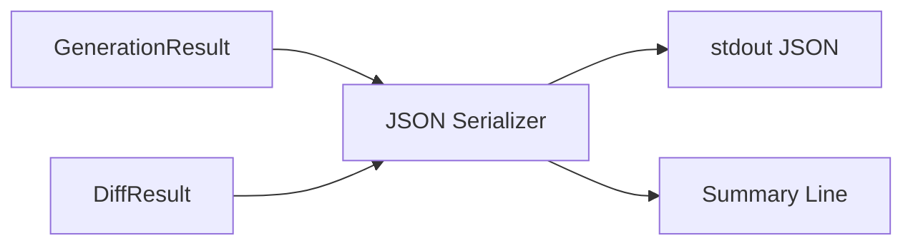

# Design Specification

## Overview

This design adds JSON and summary output modes to the existing generate and diff commands. The approach serializes existing GenerationResult and DiffResult types into structured JSON, suppresses interactive output when JSON mode is active, and enforces dry-run for generate in JSON mode. No new dependencies are required.

## Architecture

AFFECTED LAYERS: CLI Layer, Core Engine

### High-Level Architecture

JSON serialization sits between the existing result types and the output layer.



### Module Organization

```
src/
├── cli/
│   └── index.ts            # --json and --summary flag definitions
├── commands/
│   ├── generate.ts          # JSON/summary output control
│   └── diff.ts              # JSON/summary output control
├── core/
│   └── json-output.ts       # Serializers and formatters
└── types/
    └── index.ts             # JSON output type definitions
```

### Architectural Decisions

- SERIALIZE EXISTING TYPES: Reuse GenerationResult and DiffResult rather than creating parallel result types. Alternatives: new result types (duplication), decorator pattern (over-engineered)
- JSON IMPLIES DRY-RUN: Writing files while producing JSON is confusing for CI. Alternatives: require explicit --dry-run (error-prone), allow both (unclear semantics)

## Components and Interfaces

### JSON-JsonSerializer

Converts GenerationResult and DiffResult into structured JSON objects and writes them to stdout. Provides summary formatters for compact one-line output.

IMPLEMENTS: JSON-1_AC-1, JSON-2_AC-1, JSON-3_AC-1, JSON-4_AC-1, JSON-5_AC-1, JSON-8_AC-1

```typescript
interface GenerationActionJSON {
  type: string;
  path: string;
}

interface GenerationJSON {
  actions: GenerationActionJSON[];
  counts: {
    created: number;
    overwritten: number;
    skipped: number;
    deleted: number;
  };
}

interface DiffFileJSON {
  path: string;
  status: string;
  diff?: string;
}

interface DiffJSON {
  diffs: DiffFileJSON[];
  counts: {
    changed: number;
    new: number;
    matching: number;
    deleted: number;
  };
}

function serializeGenerationResult(result: GenerationResult): GenerationJSON;
function serializeDiffResult(result: DiffResult): DiffJSON;
function formatGenerationSummary(result: GenerationResult): string;
function formatDiffSummary(result: DiffResult): string;
function writeJsonOutput(data: GenerationJSON | DiffJSON): void;
```

### JSON-GenerateCommand

Orchestrates JSON and summary output in the generate command. Suppresses interactive output and enforces dry-run when --json is active.

IMPLEMENTS: JSON-6_AC-1, JSON-7_AC-1

```typescript
// Modified generateCommand behavior:
// if (options.json) → suppress intro/outro, enforce dryRun, serialize result, write JSON
// if (options.summary) → suppress intro/outro, output summary line
```

### JSON-DiffCommand

Orchestrates JSON and summary output in the diff command. Suppresses interactive output when --json is active.

IMPLEMENTS: JSON-6_AC-1

```typescript
// Modified diffCommand behavior:
// if (options.json) → suppress intro/outro, serialize result, write JSON
// if (options.summary) → suppress intro/outro, output summary line
```

## Data Models

### JSON Output Types

- GENERATION_ACTION_JSON: Single file action with type and path fields
- GENERATION_JSON: Actions array and counts object for generate output
- DIFF_FILE_JSON: Single file diff with path, status, and optional diff string
- DIFF_JSON: Diffs array and counts object for diff output

## Correctness Properties

- JSON_P-1 [Valid JSON]: JSON output is always valid parseable JSON
  VALIDATES: JSON-1_AC-1, JSON-2_AC-1

- JSON_P-2 [Counts Consistency]: Counts match the number of corresponding entries in the actions/diffs arrays
  VALIDATES: JSON-3_AC-1, JSON-4_AC-1

- JSON_P-3 [Dry-Run Enforced]: When --json is provided to generate, dry-run is always true
  VALIDATES: JSON-7_AC-1

- JSON_P-4 [Silent Mode]: When --json is active, no non-JSON output appears on stdout
  VALIDATES: JSON-6_AC-1, JSON-8_AC-1

## Error Handling

### JsonOutputError

Errors during JSON serialization or output.

- SERIALIZATION_FAILED: Result object cannot be serialized to JSON
- WRITE_FAILED: Cannot write to stdout

### Strategy

PRINCIPLES:

- Errors go to stderr, never stdout
- No partial JSON output on error
- Exit with non-zero code on any error

## Testing Strategy

### Property-Based Testing

- FRAMEWORK: fast-check
- MINIMUM_ITERATIONS: 100
- TAG_FORMAT: @awa-test: JSON_P-{n}

### Unit Testing

- AREAS: JSON serializers, summary formatters, output routing

### Integration Testing

- SCENARIOS: Generate with --json, diff with --json, --summary output

## Requirements Traceability

### REQ-JSON-json-output.md

- JSON-1_AC-1 → JSON-JsonSerializer (JSON_P-1)
- JSON-2_AC-1 → JSON-JsonSerializer (JSON_P-1)
- JSON-3_AC-1 → JSON-JsonSerializer (JSON_P-2)
- JSON-4_AC-1 → JSON-JsonSerializer (JSON_P-2)
- JSON-5_AC-1 → JSON-JsonSerializer
- JSON-6_AC-1 → JSON-GenerateCommand, JSON-DiffCommand (JSON_P-4)
- JSON-7_AC-1 → JSON-GenerateCommand (JSON_P-3)
- JSON-8_AC-1 → JSON-JsonSerializer (JSON_P-4)

## Change Log

- 1.0.0 (2026-02-28): Initial design for JSON output
