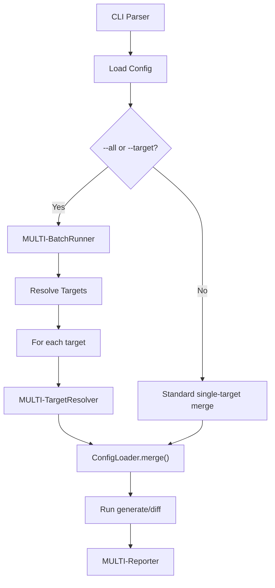

# Design Specification

## Overview

This design implements the multi-target configuration system specified in REQ-MULTI-multi-target.md.
The approach adds `[targets.<name>]` TOML sections parsed by ConfigLoader, a BatchRunner that
iterates targets and delegates to existing generate/diff pipelines, and `--all`/`--target` CLI
flags that trigger batch mode. Target configs inherit from root via nullish coalescing, keeping
per-target sections minimal. The design reuses ConfigLoader.merge() for final resolution,
ensuring CLI→file precedence semantics remain consistent.

## Architecture

AFFECTED LAYERS: CLI Layer, Configuration Loader, Commands

### High-Level Architecture

BatchRunner sits between CLI and command pipelines, resolving targets then delegating.



### Module Organization

```
src/
├── types/
│   └── index.ts            # TargetConfig type, FileConfig.targets
├── core/
│   ├── config.ts           # [targets.*] parsing, resolveTarget(), getTargetNames()
│   └── batch-runner.ts     # BatchRunner: target resolution, per-target reporting
├── commands/
│   ├── generate.ts         # Batch mode integration, prompt suppression
│   └── diff.ts             # Batch mode integration, exit code aggregation
└── cli/
    └── index.ts            # --all and --target CLI options
```

### Architectural Decisions

- TARGET REPLACES ROOT: target `features` replaces root `features` entirely (no merge), consistent with existing CLI→file override semantics. Alternatives: deep merge, append
- BOOLEAN FLAGS GLOBAL ONLY: `force`, `dry-run`, `delete`, `refresh` are not per-target — they apply globally from root/CLI. Alternatives: per-target booleans
- BATCH VIA LOOP: iterate targets sequentially with existing pipeline. Alternatives: parallel execution, separate batch engine

## Components and Interfaces

### MULTI-TargetResolver

Resolves a named target from file config by merging target fields over root via
nullish coalescing. Validates target exists and targets are defined.

IMPLEMENTS: MULTI-1_AC-1, MULTI-2_AC-1, MULTI-3_AC-1, MULTI-5_AC-2

```typescript
interface ConfigLoader {
  resolveTarget(targetName: string, fileConfig: FileConfig): FileConfig;
  getTargetNames(fileConfig: FileConfig | null): string[];
}
```

### MULTI-BatchRunner

Orchestrates multi-target processing. Resolves all or single targets, builds
per-target CLI options, and delegates to ConfigLoader.merge() for final resolution.

IMPLEMENTS: MULTI-4_AC-1, MULTI-4_AC-2, MULTI-5_AC-1, MULTI-9_AC-1, MULTI-11_AC-1

```typescript
interface BatchRunner {
  resolveTargets(
    cli: RawCliOptions,
    fileConfig: FileConfig | null,
    mode: 'all' | 'single',
    targetName?: string,
  ): BatchTargetResult[];
}
```

### MULTI-Reporter

Per-target log prefixing for batch mode output. Implemented as methods on BatchRunner.

IMPLEMENTS: MULTI-8_AC-1

```typescript
interface BatchRunner {
  logForTarget(name: string, msg: string): void;
  warnForTarget(name: string, msg: string): void;
  errorForTarget(name: string, msg: string): void;
}
```

### MULTI-GenerateCommand

Extended generate command with batch mode. When `--all` or `--target` is set,
delegates to BatchRunner then runs runGenerate per target with `batchMode=true`
to suppress interactive prompts.

IMPLEMENTS: MULTI-4_AC-1, MULTI-6_AC-1, MULTI-10_AC-1

```typescript
async function generateCommand(cliOptions: RawCliOptions): Promise<void>;
```

### MULTI-DiffCommand

Extended diff command with batch mode and exit code aggregation. Returns 0 if all
targets match, 1 if any differ, 2 on error.

IMPLEMENTS: MULTI-6_AC-1, MULTI-7_AC-1, MULTI-12_AC-1

```typescript
async function diffCommand(cliOptions: RawCliOptions): Promise<number>;
```

## Data Models

### Core Types

- TARGET_CONFIG: Per-target configuration (generation-related fields only, no boolean flags)
- BATCH_TARGET_RESULT: Resolved target name with fully merged options

```typescript
interface TargetConfig {
  output?: string;
  template?: string;
  features?: string[];
  preset?: string[];
  'remove-features'?: string[];
}

interface BatchTargetResult {
  targetName: string;
  options: ResolvedOptions;
}
```

## Correctness Properties

- MULTI_P-1 [TargetInheritance]: target fields override root via nullish coalescing; undefined target fields inherit root values unchanged
  VALIDATES: MULTI-3_AC-1

- MULTI_P-2 [BatchAllProcesses]: `--all` mode processes every target defined in `[targets.*]` exactly once
  VALIDATES: MULTI-4_AC-1

- MULTI_P-3 [ExitCodeAggregation]: `diff --all` returns 1 if any target has differences, 0 if all identical
  VALIDATES: MULTI-12_AC-1

## Error Handling

### ConfigError

Configuration errors for multi-target operations.

- NO_TARGETS: `--all` or `--target` used but no `[targets.*]` sections defined
- UNKNOWN_TARGET: `--target <name>` references a target name not in config
- MISSING_OUTPUT: target has no output and root has no output; error message names the target

### Strategy

PRINCIPLES:

- Fail fast on first configuration error (no partial batch execution on config issues)
- Error messages name the specific target for multi-target operations
- Reuse existing ConfigError type with new error codes rather than new error classes

## Testing Strategy

### Property-Based Testing

- FRAMEWORK: vitest (direct assertions, deterministic tests)
- MINIMUM_ITERATIONS: 1 per scenario
- TAG_FORMAT: @awa-test: MULTI_P-{n}

```typescript
// @awa-test: MULTI_P-1
it('target fields override root, undefined inherits', () => { ... });
```

### Unit Testing

Test BatchRunner and ConfigLoader target methods in isolation.

- AREAS: resolveTargets all mode, resolveTargets single mode, target inheritance, error cases (NO_TARGETS, UNKNOWN_TARGET, MISSING_OUTPUT), CLI output override semantics

### Integration Testing

Test generate and diff commands with mocked BatchRunner.

- SCENARIOS: generate --all processes all targets, diff --all aggregates exit codes, backward compatibility without --all/--target

## Requirements Traceability

### REQ-MULTI-multi-target.md

- MULTI-1_AC-1 → MULTI-TargetResolver (MULTI_P-1)
- MULTI-2_AC-1 → MULTI-TargetResolver
- MULTI-3_AC-1 → MULTI-TargetResolver (MULTI_P-1)
- MULTI-4_AC-1 → MULTI-BatchRunner (MULTI_P-2)
- MULTI-4_AC-2 → MULTI-BatchRunner
- MULTI-5_AC-1 → MULTI-BatchRunner
- MULTI-5_AC-2 → MULTI-TargetResolver
- MULTI-6_AC-1 → MULTI-GenerateCommand, MULTI-DiffCommand
- MULTI-7_AC-1 → MULTI-DiffCommand
- MULTI-8_AC-1 → MULTI-Reporter
- MULTI-9_AC-1 → MULTI-BatchRunner
- MULTI-10_AC-1 → MULTI-GenerateCommand
- MULTI-11_AC-1 → MULTI-BatchRunner
- MULTI-12_AC-1 → MULTI-DiffCommand (MULTI_P-3)

## Change Log

- 1.0.0 (2026-02-28): Initial design specification
