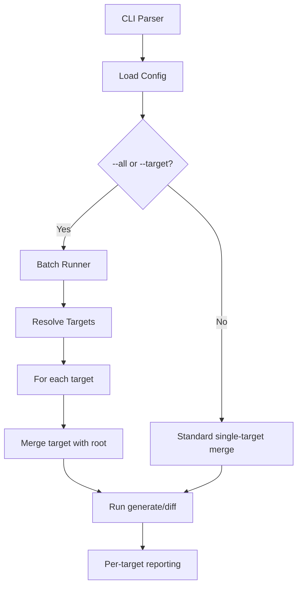

# Design Specification

## Overview

<!-- AFFECTED LAYERS: CLI Layer, Configuration Loader, Commands -->

This design describes the multi-target configuration system enabling per-agent target sections in `.awa.toml` with batch generation via `--all` and `--target` flags.

## Architecture

### High-Level Flow



### Module Organization

- `src/types/index.ts` — `TargetConfig` type, updated `FileConfig` with `targets` map, new `ConfigError` codes
- `src/core/config.ts` — `[targets.*]` parsing, `resolveTarget()` method, `getTargetNames()` method
- `src/core/batch-runner.ts` — `BatchRunner` class: target resolution, per-target reporting, CLI output override logic
- `src/commands/generate.ts` — Batch mode integration, `nonInteractive` prompt suppression
- `src/commands/diff.ts` — Batch mode integration, exit code aggregation
- `src/cli/index.ts` — `--all` and `--target` CLI options

## Component Details

### MULTI-TargetResolver

Implemented in `ConfigLoader.resolveTarget()`:

- Accepts a target name and the parsed `FileConfig`
- Validates the target exists (throws `UNKNOWN_TARGET` if not)
- Validates targets are defined (throws `NO_TARGETS` if empty)
- Returns a new `FileConfig` with target fields overriding root via nullish coalescing
- Strips `targets` from the resolved config to prevent nested propagation

Key decision: Target `features` replaces root `features` (consistent with existing CLI override semantics in `ConfigLoader.merge()`).

### MULTI-BatchRunner

Implemented in `BatchRunner.resolveTargets()`:

- Accepts CLI options, file config, mode (`all`/`single`), and optional target name
- For `--all`: iterates all target names from config
- For `--target`: processes only the named target
- For each target: calls `resolveTarget()` then `merge()` with adjusted CLI options
- CLI positional `[output]` handling: ignored when `--all`, passed through when `--target`
- Catches `MISSING_OUTPUT` from `merge()` and re-throws with target-specific message

### MULTI-Reporter

Implemented as methods on `BatchRunner`:

- `logForTarget(name, msg)` — prefixes with `[name]`
- `warnForTarget(name, msg)` — prefixes with `[name]`
- `errorForTarget(name, msg)` — prefixes with `[name]`

### CLI `|| []` Bug Fix (Prerequisite)

Fixed in `src/cli/index.ts`: removed `|| []` from `features`, `preset`, `removeFeatures` in both generate and diff command handlers. This ensures `undefined` flows through to `ConfigLoader.merge()`'s nullish coalescing, allowing `.awa.toml` values to be used when CLI flags aren't passed.

## Config Example

```toml
template = "./templates/awa"
features = ["architect", "code"]

[targets.claude]
output = "."
features = ["claude", "architect", "code"]

[targets.copilot]
output = "."
features = ["copilot", "code", "vibe"]
```

## Key Decisions

- Target `features` replaces root `features` (no merge) — consistent with existing CLI→file merge semantics
- `[targets.*]` sections only include generation-related fields: `output`, `features`, `preset`, `remove-features`, `template`
- Boolean flags (`force`, `dry-run`, `delete`, `refresh`) are NOT per-target — they apply globally from root/CLI
- `diff --all` exit code: `0` all match, `1` any differ, `2` on error

## Change Log

- 1.0.0 (2026-02-28): Initial design specification
