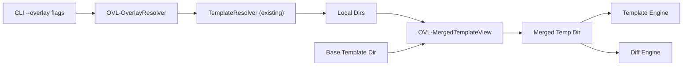

# Design Specification

## Overview

This design implements the template overlays feature specified in REQ-OVL-overlays.md.
The approach resolves each overlay source to a local directory using the existing
TemplateResolver, then copies the base template and each overlay into a temporary
directory (last overlay wins). The template engine receives the merged temp directory
unchanged — no modifications to Eta rendering are needed. The temp directory is
cleaned up in a finally block regardless of success or failure.

This reuses the same temp-dir pattern established by DiffEngine and the same source
resolution logic in TemplateResolver, keeping the added surface area small.

## Architecture

AFFECTED LAYERS: CLI Layer, Core Engine, I/O Layer

### High-Level Architecture

OverlayResolver resolves sources; MergedTemplateView builds the merged directory.
Both generate and diff commands call these before invoking their respective engines.



### Module Organization

```
src/
├── core/
│   └── overlay.ts          # OVL-OverlayResolver + OVL-MergedTemplateView
├── commands/
│   ├── generate.ts         # extended: uses overlay before generation
│   └── diff.ts             # extended: uses overlay before diff
├── cli/
│   └── index.ts            # extended: --overlay option on generate + diff
├── core/
│   └── config.ts           # extended: overlay array in TOML
└── types/
    └── index.ts            # extended: overlay field in types
```

### Architectural Decisions

- TEMP DIR MERGE: copy base then each overlay sequentially using Node.js fs.cp (recursive, force=true). Alternatives: virtual filesystem, symlink farm
- REUSE RESOLVER: pass each overlay source through TemplateResolver.resolve() so local and git handling is unified. Alternatives: dedicated overlay resolver
- FINALLY CLEANUP: temp dir cleaned in finally block so cleanup happens on both success and error. Alternatives: process exit hook

## Components and Interfaces

### OVL-OverlayResolver

Resolves each overlay source string to a local directory path by delegating to
the existing TemplateResolver. Local paths are resolved relative to cwd; Git
sources are fetched and cached via degit.

IMPLEMENTS: OVL-1_AC-1, OVL-6_AC-1

```typescript
async function resolveOverlays(
  overlays: string[],
  refresh: boolean
): Promise<string[]>;
```

### OVL-MergedTemplateView

Creates a temporary directory, copies all base files into it, then copies each
overlay directory on top in order. Because `fs.cp` defaults to `force: true`,
overlay files replace any base (or earlier-overlay) file at the same relative
path. Files only in the base or an earlier overlay are left intact.

IMPLEMENTS: OVL-2_AC-1, OVL-3_AC-1, OVL-4_AC-1, OVL-5_AC-1

```typescript
async function buildMergedDir(
  baseDir: string,
  overlayDirs: string[]
): Promise<string>;
```

### CLI-ArgumentParser

Extended with a repeatable `--overlay <path>` option on both the generate and
diff subcommands. The parsed value is forwarded as `overlay: string[]` in
RawCliOptions.

IMPLEMENTS: OVL-1_AC-1, OVL-7_AC-1

```typescript
.option('--overlay <path...>', 'Overlay directory paths (repeatable)')
```

### CFG-ConfigLoader

Extended to parse an `overlay` array of strings from `.awa.toml` and include
it in FileConfig and ResolvedOptions. CLI --overlay overrides config overlay.

IMPLEMENTS: OVL-8_AC-1

```typescript
interface FileConfig {
  overlay?: string[];
}
interface ResolvedOptions {
  readonly overlay: readonly string[];
}
```

## Data Models

### Core Types

- OVERLAY_SOURCES: string array of overlay source specifiers (local paths or git refs)

```typescript
// Added to existing interfaces in src/types/index.ts
interface RawCliOptions {
  overlay?: string[];
}
interface FileConfig {
  overlay?: string[];
}
interface ResolvedOptions {
  readonly overlay: readonly string[];
}
```

## Correctness Properties

- OVL_P-1 [OverlayReplaces]: when an overlay contains a file at path P, the merged
  directory contains the overlay version of P, not the base version
  VALIDATES: OVL-2_AC-1

- OVL_P-2 [BasePassthrough]: when no overlay contains a file at path P, the merged
  directory contains the base version of P unchanged
  VALIDATES: OVL-3_AC-1

- OVL_P-3 [LastOverlayWins]: when two overlays contain a file at path P, the merged
  directory contains the version from the later overlay
  VALIDATES: OVL-5_AC-1

## Error Handling

### OverlayError

Overlay errors surface as TemplateError (existing type) from TemplateResolver
when a source cannot be resolved, or as standard Node.js errors from fs.cp
when a local overlay path does not exist.

- SOURCE_NOT_FOUND: overlay local path does not exist
- FETCH_FAILED: git overlay repository cannot be cloned

### Strategy

PRINCIPLES:

- Propagate TemplateError from TemplateResolver as-is (existing error handling in commands)
- Clean up temp merged dir in finally block even when resolution or generation fails
- Do not swallow errors from fs.cp during merge; let them propagate to caller

## Testing Strategy

### Property-Based Testing

- FRAMEWORK: vitest (direct property assertions, no fast-check dependency)
- MINIMUM_ITERATIONS: 1 per scenario (deterministic filesystem tests)
- TAG_FORMAT: @awa-test: OVL_P-{n}

```typescript
// @awa-test: OVL_P-1
it('overlay file replaces base file at same path', async () => { ... });
```

### Unit Testing

Test overlay.ts functions in isolation with real temp directories.

- AREAS: resolveOverlays local paths, resolveOverlays git (mocked), buildMergedDir file replacement, buildMergedDir base passthrough, buildMergedDir overlay-only addition, multiple overlay ordering

### Integration Testing

Test generate and diff commands with mocked overlay module.

- SCENARIOS: generate with overlay uses merged dir, diff with overlay uses merged dir

## Requirements Traceability

### REQ-OVL-overlays.md

- OVL-1_AC-1 → OVL-OverlayResolver, CLI-ArgumentParser
- OVL-2_AC-1 → OVL-MergedTemplateView (OVL_P-1)
- OVL-3_AC-1 → OVL-MergedTemplateView (OVL_P-2)
- OVL-4_AC-1 → OVL-MergedTemplateView
- OVL-5_AC-1 → OVL-MergedTemplateView (OVL_P-3)
- OVL-6_AC-1 → OVL-OverlayResolver
- OVL-7_AC-1 → CLI-ArgumentParser
- OVL-8_AC-1 → CFG-ConfigLoader

## Change Log

- 1.0.0 (2025-01-01): Initial design
