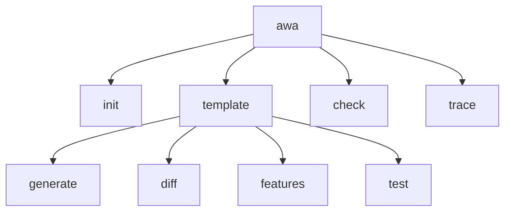

# Design Specification

## Overview

This design implements the CLI restructure to group template-related commands (`generate`, `diff`, `features`, `test`) under an `awa template` parent command, while keeping awa-specific commands (`check`, `trace`) and the `init` convenience command at the top level. The restructure uses commander's nested command support via `addCommand()`.

This design references but does not restate the existing CLI-ArgumentParser component from DESIGN-CLI-cli.md. The change is structural — command definitions move under a parent, but option parsing and action handlers remain unchanged.

## Architecture

AFFECTED LAYERS: CLI Layer

### High-Level Architecture

Nested command tree: root program has `init` convenience command, `template` group, `check`, and `trace`. Template group contains `generate`, `diff`, `features`, `test`.



### Module Organization

```
src/
├── cli/
│   └── index.ts              # Root program, template group, top-level commands
├── commands/
│   ├── generate.ts           # Generate command handler (unchanged)
│   ├── diff.ts               # Diff command handler (unchanged)
│   ├── features.ts           # Features command handler (unchanged)
│   ├── test.ts               # Test command handler (unchanged)
│   ├── check.ts              # Check command handler (unchanged)
│   └── trace.ts              # Trace command handler (unchanged)
```

### Architectural Decisions

- NESTED COMMANDS OVER FLAT: Commander supports `addCommand()` for nesting. Groups related commands and improves discoverability. Alternatives: flat with prefixed names (e.g. `template-generate`), separate binaries
- CLEAN BREAK OVER ALIASES: No deprecated root-level aliases for old commands (except init convenience). Simpler and avoids ambiguity. Alternatives: keep old commands with deprecation warnings

## Components and Interfaces

### TCLI-TemplateGroup

A commander parent command that acts as a namespace for template-related subcommands. Does not have its own action handler — displays help when invoked without a subcommand.

IMPLEMENTS: TCLI-1_AC-1, TCLI-1_AC-2, TCLI-1_AC-3, TCLI-1_AC-4, TCLI-1_AC-5, TCLI-1_AC-6, TCLI-1_AC-7, TCLI-5_AC-1, TCLI-5_AC-2, TCLI-5_AC-3, TCLI-5_AC-4

```typescript
interface TemplateGroup {
  /** Commander Command instance acting as parent for template subcommands */
  command: Command;
  /** Subcommands: generate, diff, features, test */
  subcommands: Command[];
}
```

### TCLI-RootProgram

The root `awa` command that wires together the template group, top-level init convenience command, and top-level awa commands.

IMPLEMENTS: TCLI-2_AC-1, TCLI-2_AC-2, TCLI-3_AC-1, TCLI-3_AC-2, TCLI-3_AC-3, TCLI-3_AC-4, TCLI-4_AC-1, TCLI-4_AC-2

```typescript
interface RootProgram {
  /** Commander root program */
  program: Command;
  /** Adds template group, init convenience command, and top-level commands */
  configure(): void;
}
```

## Data Models

### Command Types

- TEMPLATE_GROUP: Commander Command instance with no action, serving as namespace
- ROOT_PROGRAM: Top-level Commander program with version, help, and child commands

## Correctness Properties

- TCLI_P-1 [Template Nesting]: All template commands are only accessible under the `template` parent and not at the root level
  VALIDATES: TCLI-1_AC-2, TCLI-5_AC-1, TCLI-5_AC-2, TCLI-5_AC-3, TCLI-5_AC-4

- TCLI_P-2 [Option Preservation]: Template subcommands accept the same options as their former top-level counterparts
  VALIDATES: TCLI-1_AC-4, TCLI-1_AC-5, TCLI-1_AC-6, TCLI-1_AC-7, TCLI-2_AC-2

- TCLI_P-3 [Top-Level Awa Commands]: check and trace remain accessible directly under `awa`
  VALIDATES: TCLI-3_AC-1, TCLI-3_AC-2

## Error Handling

### CommandError

Errors from the restructured command tree.

- UNKNOWN_COMMAND: User invokes an old top-level command name (commander's default behavior)
- MISSING_SUBCOMMAND: User invokes `awa template` without a subcommand

### Strategy

PRINCIPLES:

- Commander's built-in unknown command error handling applies
- `awa template` without subcommand shows help (commander default)
- No custom error handling needed beyond existing patterns

## Testing Strategy

### Property-Based Testing

- FRAMEWORK: fast-check
- MINIMUM_ITERATIONS: 100
- TAG_FORMAT: @awa-test: TCLI_P-{n}

### Unit Testing

Verify command tree structure by inspecting commander Command instances.

- AREAS: Template group contains expected subcommands, root program contains init/template/check/trace, old top-level commands absent

### Integration Testing

- SCENARIOS: `awa template generate --help` shows options, `awa template diff --help` shows options, `awa --help` shows command groups, `awa init --help` shows generate options

## Requirements Traceability

### REQ-TCLI-template-cli.md

- TCLI-1_AC-1 → TCLI-TemplateGroup
- TCLI-1_AC-2 → TCLI-TemplateGroup (TCLI_P-1)
- TCLI-1_AC-3 → TCLI-TemplateGroup
- TCLI-1_AC-4 → TCLI-TemplateGroup (TCLI_P-2)
- TCLI-1_AC-5 → TCLI-TemplateGroup (TCLI_P-2)
- TCLI-1_AC-6 → TCLI-TemplateGroup (TCLI_P-2)
- TCLI-1_AC-7 → TCLI-TemplateGroup (TCLI_P-2)
- TCLI-2_AC-1 → TCLI-RootProgram
- TCLI-2_AC-2 → TCLI-RootProgram (TCLI_P-2)
- TCLI-3_AC-1 → TCLI-RootProgram (TCLI_P-3)
- TCLI-3_AC-2 → TCLI-RootProgram (TCLI_P-3)
- TCLI-3_AC-3 → TCLI-RootProgram
- TCLI-3_AC-4 → TCLI-RootProgram
- TCLI-4_AC-1 → TCLI-RootProgram
- TCLI-4_AC-2 → TCLI-RootProgram
- TCLI-5_AC-1 → TCLI-TemplateGroup (TCLI_P-1)
- TCLI-5_AC-2 → TCLI-TemplateGroup (TCLI_P-1)
- TCLI-5_AC-3 → TCLI-TemplateGroup (TCLI_P-1)
- TCLI-5_AC-4 → TCLI-TemplateGroup (TCLI_P-1)

## Library Usage

### Framework Features

- COMMANDER: Nested commands via `addCommand()`, alias support, automatic help for parent commands

### External Libraries

- commander (latest): CLI framework — nested command groups, help generation

## Change Log

- 1.0.0 (2026-03-01): Initial design for CLI restructure
- 1.1.0 (2026-03-01): Moved init from template alias to top-level convenience command

