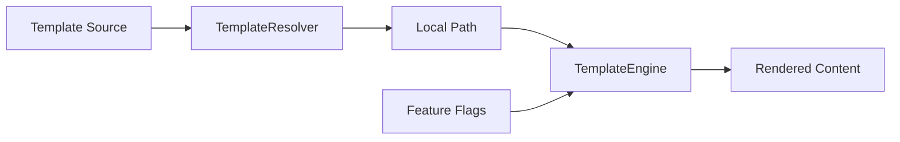

# Design Specification

## Overview

This design implements the template resolution and rendering pipeline. Template sources are resolved from local paths or Git repositories, then rendered with Eta using feature flag context. Empty output detection controls file creation.

## Architecture

AFFECTED LAYERS: Core Engine

### High-Level Architecture

Two-stage pipeline: resolve template source to local path, then render with feature flags.



### Module Organization

```
src/
└── core/
    ├── template-resolver.ts  # Template source resolution (local/Git)
    └── template.ts           # Eta template rendering
```

### Architectural Decisions

- ETA OVER HANDLEBARS: Eta is TypeScript-native, fast, and supports partials natively. Alternatives: Handlebars (heavier), EJS (less maintained)
- SHALLOW GIT FETCH: Use degit for fast, minimal fetches without .git history. Alternatives: full clone (slow), sparse checkout (complex)

## Components and Interfaces

### TPL-TemplateResolver

Detects template source type (local vs Git), fetches remote templates to cache, and returns a resolved local path.

IMPLEMENTS: CLI-3_AC-2, CLI-3_AC-3, CLI-8_AC-2, TPL-1_AC-1, TPL-1_AC-2, TPL-1_AC-3, TPL-1_AC-4, TPL-2_AC-1, TPL-2_AC-2, TPL-2_AC-3, TPL-2_AC-4, TPL-2_AC-5, TPL-2_AC-6, TPL-3_AC-1, TPL-3_AC-2, TPL-3_AC-3, TPL-3_AC-4, TPL-10_AC-1, TPL-10_AC-2, TPL-10_AC-3

```typescript
type TemplateSourceType = 'local' | 'git' | 'bundled';

interface ResolvedTemplate {
  type: TemplateSourceType;
  localPath: string;
  source: string;
}

interface TemplateResolver {
  resolve(source: string | null, refresh: boolean): Promise<ResolvedTemplate>;
  detectType(source: string): TemplateSourceType;
  getCachePath(source: string): string;
}
```

### TPL-TemplateEngine

Wraps Eta for template rendering. Loads templates, provides feature flag context, handles empty output detection, and supports partials.

IMPLEMENTS: TPL-4_AC-1, TPL-4_AC-2, TPL-4_AC-3, TPL-4_AC-4, TPL-5_AC-1, TPL-5_AC-2, TPL-5_AC-3, TPL-6_AC-1, TPL-6_AC-2, TPL-7_AC-1, TPL-7_AC-2, TPL-8_AC-1, TPL-8_AC-2, TPL-8_AC-3, TPL-8_AC-4, TPL-11_AC-1, TPL-11_AC-2

```typescript
interface TemplateContext {
  features: string[];
}

interface RenderResult {
  content: string;
  isEmpty: boolean;
  isEmptyFileMarker: boolean;
}

interface TemplateEngine {
  configure(templateDir: string): void;
  render(templatePath: string, context: TemplateContext): Promise<RenderResult>;
}
```

## Data Models

### Template Types

- RESOLVED_TEMPLATE: Template source resolved to a local path with type information
- RENDER_RESULT: Rendered template content with empty/marker detection flags
- TEMPLATE_FILE: A template file discovered during directory traversal (PATH, ABSOLUTE_PATH, IS_PARTIAL)
- CACHED_TEMPLATE: A cached Git template (SOURCE, LOCAL_PATH, FETCHED_AT, REF)

## Correctness Properties

- TPL_P-1 [Empty Skip]: Empty or whitespace-only template output results in no file creation
  VALIDATES: TPL-7_AC-1

- TPL_P-2 [Empty Marker]: Template containing only `<!-- AWA:EMPTY_FILE -->` creates an empty file
  VALIDATES: TPL-7_AC-2

- TPL_P-3 [Local No Cache]: Local template paths are used directly without caching
  VALIDATES: TPL-1_AC-4

- TPL_P-4 [Git Cache Reuse]: Git templates use cached version unless --refresh is specified
  VALIDATES: TPL-3_AC-2

## Error Handling

### TemplateError

Template resolution and rendering errors.

- SOURCE_NOT_FOUND: Local template path does not exist
- FETCH_FAILED: Git fetch failed (network, auth, repo not found)
- RENDER_ERROR: Eta template syntax error with location

### Strategy

PRINCIPLES:

- Fail fast on first error
- Provide actionable error messages with file paths
- Include suggestions for common errors (e.g., check network for fetch failures)

## Testing Strategy

### Property-Based Testing

- FRAMEWORK: fast-check
- MINIMUM_ITERATIONS: 100
- TAG_FORMAT: @awa-test: TPL_P-{n}

### Unit Testing

- AREAS: TPL-TemplateResolver type detection, TPL-TemplateEngine empty detection, partial rendering

### Integration Testing

- SCENARIOS: Local template generation, Git template caching, --refresh re-fetch

## Requirements Traceability

### REQ-TPL-templates.md

- TPL-1_AC-1 → TPL-TemplateResolver
- TPL-1_AC-2 → TPL-TemplateResolver
- TPL-1_AC-3 → TPL-TemplateResolver
- TPL-1_AC-4 → TPL-TemplateResolver (TPL_P-3)
- TPL-2_AC-1 → TPL-TemplateResolver
- TPL-2_AC-2 → TPL-TemplateResolver
- TPL-2_AC-3 → TPL-TemplateResolver
- TPL-2_AC-4 → TPL-TemplateResolver
- TPL-2_AC-5 → TPL-TemplateResolver
- TPL-2_AC-6 → TPL-TemplateResolver
- TPL-3_AC-1 → TPL-TemplateResolver
- TPL-3_AC-2 → TPL-TemplateResolver (TPL_P-4)
- TPL-3_AC-3 → TPL-TemplateResolver
- TPL-3_AC-4 → TPL-TemplateResolver
- TPL-4_AC-1 → TPL-TemplateEngine
- TPL-4_AC-2 → TPL-TemplateEngine
- TPL-4_AC-3 → TPL-TemplateEngine
- TPL-4_AC-4 → TPL-TemplateEngine
- TPL-5_AC-1 → TPL-TemplateEngine
- TPL-5_AC-2 → TPL-TemplateEngine
- TPL-5_AC-3 → TPL-TemplateEngine
- TPL-6_AC-1 → TPL-TemplateEngine
- TPL-6_AC-2 → TPL-TemplateEngine
- TPL-7_AC-1 → TPL-TemplateEngine (TPL_P-1)
- TPL-7_AC-2 → TPL-TemplateEngine (TPL_P-2)
- TPL-7_AC-3 → GEN-Logger
- TPL-8_AC-1 → TPL-TemplateEngine
- TPL-8_AC-2 → TPL-TemplateEngine
- TPL-8_AC-3 → TPL-TemplateEngine
- TPL-8_AC-4 → TPL-TemplateEngine
- TPL-9_AC-1 → GEN-FileGenerator (GEN_P-1)
- TPL-9_AC-2 → GEN-FileGenerator (GEN_P-1)
- TPL-10_AC-1 → TPL-TemplateResolver
- TPL-10_AC-2 → TPL-TemplateResolver
- TPL-10_AC-3 → TPL-TemplateResolver
- TPL-11_AC-1 → TPL-TemplateEngine
- TPL-11_AC-2 → TPL-TemplateEngine

## Library Usage

### External Libraries

- eta (3.x): Template engine — fast, TypeScript-native, partials
- degit (2.x): Git fetcher — shallow clones without .git

## Change Log

- 1.0.0 (2026-02-28): Split from DESIGN-AWA-cli.md
