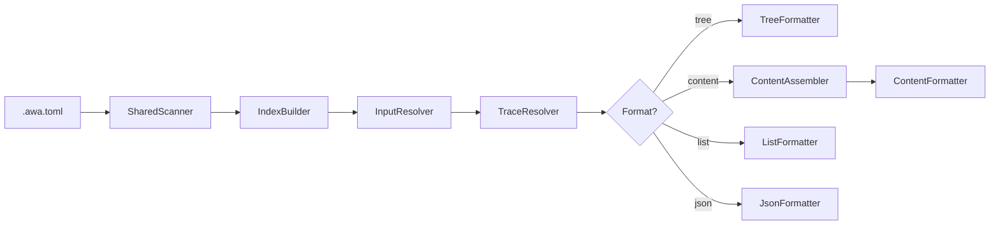

# Design Specification

## Overview

This design implements `awa trace` as a pipeline reusing the check engine's scanner and parser. It builds an in-memory TraceIndex (shared by future coverage/impact/graph commands), resolves input to IDs, walks the chain, and formats output. Content assembly extracts actual file sections with configurable context windows around code markers. No new dependencies are required.

## Architecture

AFFECTED LAYERS: CLI Layer, Core Engine

### High-Level Architecture

Pipeline architecture: scan and parse (reused from check), build index, resolve input, walk chain, format output.



### Module Organization

```
src/
├── cli/
│   └── index.ts                # trace command registration
├── commands/
│   └── trace.ts                # trace command orchestration
└── core/
    └── trace/
        ├── types.ts            # TraceIndex, TraceChain, TraceResult, options
        ├── scanner.ts          # shared scanning (reuses check engine)
        ├── index-builder.ts    # builds TraceIndex from scan results
        ├── input-resolver.ts   # ID, task, file, --all resolution
        ├── resolver.ts         # chain walking (forward/reverse/both)
        ├── formatter.ts        # tree, list, JSON location formatters
        ├── content-assembler.ts # file section extraction with context lines
        ├── content-formatter.ts # Markdown and JSON content formatters
        ├── token-estimator.ts  # chars/4 estimation and budget enforcement
        └── __tests__/
```

### Architectural Decisions

- REUSE CHECK ENGINE: Scanner and parser are imported directly from check module rather than duplicated. Alternatives: copy code (duplication), abstract interface (premature)
- INDEX AS VALUE OBJECT: TraceIndex is a read-only data structure built once per invocation. Alternatives: mutable graph (error-prone), lazy building (complex)
- CONTENT CONTEXT WINDOW: Code sections default to 5 lines before and 20 lines after markers, configurable via -A/-B/-C. Alternatives: fixed window (inflexible), full-file extraction (too large)

## Components and Interfaces

### TRC-SharedScanner

Builds a CheckConfig from file config, then runs marker scanning and spec parsing in parallel. Shared entry point for trace and future commands.

IMPLEMENTS: TRC-1_AC-1

```typescript
interface ScanResults {
  readonly markers: MarkerScanResult;
  readonly specs: SpecParseResult;
  readonly config: CheckConfig;
}

function buildScanConfig(fileConfig: FileConfig | null, overrides?: Partial<CheckConfig>): CheckConfig;
async function scan(configPath?: string): Promise<ScanResults>;
```

### TRC-IndexBuilder

Transforms scan results into a TraceIndex with forward and reverse maps.

IMPLEMENTS: TRC-1_AC-1

```typescript
function buildTraceIndex(specs: SpecParseResult, markers: MarkerScanResult): TraceIndex;
```

### TRC-InputResolver

Resolves various input modes (direct IDs, task file, source file) into a list of trace IDs.

IMPLEMENTS: TRC-2_AC-1, TRC-2_AC-2, TRC-2_AC-3

```typescript
interface InputResolution {
  readonly ids: readonly string[];
  readonly warnings: readonly string[];
}

function resolveIds(ids: readonly string[], index: TraceIndex): InputResolution;
async function resolveTaskFile(taskPath: string, index: TraceIndex): Promise<InputResolution>;
async function resolveSourceFile(filePath: string, index: TraceIndex): Promise<InputResolution>;
```

### TRC-TraceResolver

Walks the traceability chain from resolved IDs with direction, depth, and scope controls.

IMPLEMENTS: TRC-3_AC-1, TRC-3_AC-2, TRC-3_AC-3, TRC-3_AC-4, TRC-3_AC-5, TRC-11_AC-1, TRC-11_AC-2

```typescript
function resolveTrace(index: TraceIndex, ids: readonly string[], options: TraceOptions): TraceResult;
```

### TRC-Formatter

Formats TraceResult as a text tree, file path list, or JSON structure (location mode).

IMPLEMENTS: TRC-4_AC-1, TRC-9_AC-1, TRC-10_AC-1

```typescript
function formatTree(result: TraceResult): string;
function formatList(result: TraceResult): string;
function formatJson(result: TraceResult): string;
```

### TRC-ContentAssembler

Extracts actual file sections from the trace chain. For specs, extracts H3 sections. For code, finds the enclosing function/block or falls back to a configurable context window controlled by -A/-B/-C flags.

IMPLEMENTS: TRC-5_AC-1, TRC-5_AC-2, TRC-5_AC-3, TRC-5_AC-4, TRC-5_AC-5

```typescript
interface ContextLineOptions {
  readonly beforeContext?: number;
  readonly afterContext?: number;
}

async function assembleContent(
  result: TraceResult,
  taskPath?: string,
  contextOptions?: ContextLineOptions
): Promise<ContentSection[]>;
```

### TRC-ContentFormatter

Formats assembled content sections as Markdown or JSON with provenance and code blocks.

IMPLEMENTS: TRC-7_AC-1

```typescript
function formatContentMarkdown(sections: ContentSection[], queryLabel: string, footer: string | null): string;
function formatContentJson(sections: ContentSection[], queryLabel: string, footer: string | null): string;
```

### TRC-TokenEstimator

Estimates token count (chars/4) and enforces a token budget by priority-based truncation.

IMPLEMENTS: TRC-6_AC-1

```typescript
function estimateTokens(text: string): number;
function applyTokenBudget(sections: ContentSection[], maxTokens: number): {
  sections: ContentSection[];
  truncated: boolean;
  footer: string | null;
};
```

### TRC-TraceCommand

Orchestrates the trace pipeline: config, scan, build index, resolve input, resolve chain, format, output.

IMPLEMENTS: TRC-8_AC-1, TRC-8_AC-2, TRC-2_AC-4

```typescript
async function traceCommand(options: TraceCommandOptions): Promise<number>;
```

## Data Models

### Core Types

- TRACE_INDEX: Read-only in-memory graph with forward maps, reverse maps, and metadata

```typescript
interface TraceIndex {
  readonly reqToACs: ReadonlyMap<string, readonly string[]>;
  readonly acToDesignComponents: ReadonlyMap<string, readonly string[]>;
  readonly acToCodeLocations: ReadonlyMap<string, readonly CodeLocation[]>;
  readonly acToTestLocations: ReadonlyMap<string, readonly CodeLocation[]>;
  readonly propertyToTestLocations: ReadonlyMap<string, readonly CodeLocation[]>;
  readonly componentToCodeLocations: ReadonlyMap<string, readonly CodeLocation[]>;
  readonly acToReq: ReadonlyMap<string, string>;
  readonly componentToACs: ReadonlyMap<string, readonly string[]>;
  readonly propertyToACs: ReadonlyMap<string, readonly string[]>;
  readonly idLocations: ReadonlyMap<string, CodeLocation>;
  readonly allIds: ReadonlySet<string>;
}
```

- TRACE_CHAIN: Resolved chain for one queried ID

```typescript
interface TraceChain {
  readonly queryId: string;
  readonly requirement?: TraceNode;
  readonly acs: readonly TraceNode[];
  readonly designComponents: readonly TraceNode[];
  readonly implementations: readonly TraceNode[];
  readonly tests: readonly TraceNode[];
  readonly properties: readonly TraceNode[];
}
```

### Command Types

- TRACE_COMMAND_OPTIONS: CLI options for the trace command

```typescript
interface TraceCommandOptions {
  readonly ids: readonly string[];
  readonly all?: boolean;
  readonly task?: string;
  readonly file?: string;
  readonly content: boolean;
  readonly list: boolean;
  readonly json: boolean;
  readonly maxTokens?: number;
  readonly depth?: number;
  readonly scope?: string;
  readonly direction: 'both' | 'forward' | 'reverse';
  readonly beforeContext?: number;
  readonly afterContext?: number;
  readonly noCode?: boolean;
  readonly noTests?: boolean;
  readonly config?: string;
}
```

## Correctness Properties

- TRC_P-1 [Index Completeness]: Every spec ID and code marker present in scan results appears in the TraceIndex
  VALIDATES: TRC-1_AC-1

- TRC_P-2 [Chain Connectivity]: For any AC with both a requirement parent and implementation markers, the resolved chain contains all three levels
  VALIDATES: TRC-3_AC-1

- TRC_P-3 [Content Fidelity]: Assembled content sections contain text that exists verbatim in the source files at the reported line ranges
  VALIDATES: TRC-5_AC-1

- TRC_P-4 [Token Budget Enforcement]: When a token budget is set, the total estimated tokens of included sections does not exceed the budget (except for the guaranteed first section)
  VALIDATES: TRC-6_AC-1

- TRC_P-5 [Exit Code Correctness]: Exit code is 0 when chains are found, 1 when no IDs resolve, 2 on internal error
  VALIDATES: TRC-8_AC-2

## Error Handling

### TraceError

Errors during trace execution.

- ID_NOT_FOUND: No matching ID in the index
- FILE_NOT_FOUND: Task or source file does not exist
- SCAN_FAILED: Marker scanning or spec parsing failed

### Strategy

PRINCIPLES:

- Partial results are acceptable (resolve what exists, warn for the rest)
- Errors go to stderr, structured output to stdout
- Exit code distinguishes "no results" (1) from "internal error" (2)

## Testing Strategy

### Property-Based Testing

- FRAMEWORK: fast-check
- MINIMUM_ITERATIONS: 100
- TAG_FORMAT: @awa-test: TRC_P-{n}

### Unit Testing

- AREAS: index builder, input resolver, chain resolver, formatters, content assembler, token estimator

### Integration Testing

- SCENARIOS: trace by ID, trace by task, trace by file, trace --all, --content with -A/-B/-C, --json output

## Requirements Traceability

### REQ-TRC-trace.md

- TRC-1_AC-1 → TRC-SharedScanner, TRC-IndexBuilder (TRC_P-1)
- TRC-2_AC-1 → TRC-InputResolver
- TRC-2_AC-2 → TRC-InputResolver
- TRC-2_AC-3 → TRC-InputResolver
- TRC-2_AC-4 → TRC-TraceCommand
- TRC-3_AC-1 → TRC-TraceResolver (TRC_P-2)
- TRC-3_AC-2 → TRC-TraceResolver
- TRC-3_AC-3 → TRC-TraceResolver
- TRC-3_AC-4 → TRC-TraceResolver
- TRC-3_AC-5 → TRC-TraceResolver
- TRC-4_AC-1 → TRC-Formatter
- TRC-5_AC-1 → TRC-ContentAssembler (TRC_P-3)
- TRC-5_AC-2 → TRC-ContentAssembler
- TRC-5_AC-3 → TRC-ContentAssembler
- TRC-5_AC-4 → TRC-ContentAssembler
- TRC-5_AC-5 → TRC-ContentAssembler
- TRC-6_AC-1 → TRC-TokenEstimator (TRC_P-4)
- TRC-7_AC-1 → TRC-ContentFormatter
- TRC-8_AC-1 → TRC-TraceCommand
- TRC-8_AC-2 → TRC-TraceCommand (TRC_P-5)
- TRC-9_AC-1 → TRC-Formatter
- TRC-10_AC-1 → TRC-Formatter
- TRC-11_AC-1 → TRC-TraceResolver
- TRC-11_AC-2 → TRC-TraceResolver

## Change Log

- 1.0.0 (2026-03-01): Initial design
