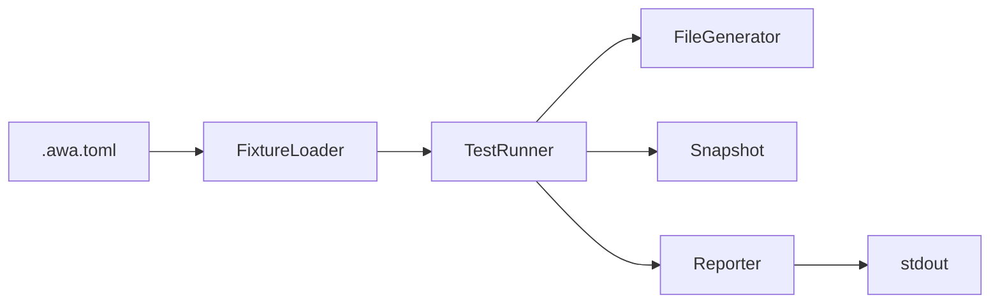

# Design Specification

## Overview

This design implements `awa template test` as a pipeline: config → fixture discovery → template rendering per fixture → assertions → reporting. It reuses the existing generator and feature-resolver pipeline. Fixtures are TOML files in the template's `_tests/` directory.

## Architecture

AFFECTED LAYERS: CLI Layer, Core Engine

### High-Level Architecture

Pipeline architecture: load config, discover fixtures, render templates per fixture, run assertions, report.



### Module Organization

```
src/
├── commands/
│   └── test.ts
└── core/
    └── template-test/
        ├── types.ts
        ├── fixture-loader.ts
        ├── runner.ts
        ├── reporter.ts
        ├── snapshot.ts
        └── __tests__/
            ├── fixture-loader.test.ts
            ├── runner.test.ts
            ├── reporter.test.ts
            └── snapshot.test.ts
```

### Architectural Decisions

- REUSE GENERATOR: Render via existing generator pipeline rather than duplicating template logic. Alternatives: standalone renderer
- TOML FIXTURES: TOML format matches config style, consistent with `.awa.toml`. Alternatives: JSON, YAML
- SNAPSHOT DIRECTORIES: Store snapshots as file trees alongside fixtures for easy diffing. Alternatives: single archive, inline content

## Components and Interfaces

### TTST-Types

Defines shared type interfaces for fixtures, results, and options used across all template-test modules.

IMPLEMENTS: TTST-2_AC-1

```typescript
interface TestFixture {
  name: string;
  features: string[];
  preset: string[];
  removeFeatures: string[];
  expectedFiles: string[];
  filePath: string;
}

interface TestRunOptions { updateSnapshots: boolean; }
interface FixtureResult { name: string; passed: boolean; fileResults: FileAssertionResult[]; snapshotResults: SnapshotFileResult[]; error?: string; }
interface TestSuiteResult { results: FixtureResult[]; total: number; passed: number; failed: number; }
interface RawTestOptions { template?: string; config?: string; updateSnapshots: boolean; }
```

### TTST-FixtureLoader

Discovers and parses `_tests/*.toml` fixture files from a template directory.

IMPLEMENTS: TTST-1_AC-1, TTST-2_AC-1

```typescript
function discoverFixtures(templatePath: string): Promise<TestFixture[]>;
```

### TTST-TestRunner

Renders templates per fixture to a temporary directory and runs assertions (file existence, snapshot comparison).

IMPLEMENTS: TTST-3_AC-1, TTST-4_AC-1, TTST-5_AC-1

```typescript
function runFixture(fixture: TestFixture, templatePath: string, options: TestRunOptions): Promise<FixtureResult>;
function runAll(fixtures: TestFixture[], templatePath: string, options: TestRunOptions): Promise<TestSuiteResult>;
```

### TTST-Reporter

Displays pass/fail summary per fixture with failure details.

IMPLEMENTS: TTST-6_AC-1

```typescript
function report(result: TestSuiteResult): void;
```

### TTST-TestCommand

CLI command handler that orchestrates fixture loading, test execution, and reporting.

IMPLEMENTS: TTST-7_AC-1

```typescript
function testCommand(options: RawTestOptions): Promise<number>;
```

## Data Models

### Core Types

- TEST_FIXTURE: Raw fixture data parsed from TOML

```typescript
interface TestFixture {
  name: string;
  features: string[];
  preset: string[];
  removeFeatures: string[];
  expectedFiles: string[];
  filePath: string;
}
```

- FIXTURE_RESULT: Result for a single fixture execution

```typescript
interface FixtureResult {
  name: string;
  passed: boolean;
  fileResults: FileAssertionResult[];
  snapshotResults: SnapshotFileResult[];
  error?: string;
}
```

- TEST_SUITE_RESULT: Aggregated result for all fixtures

```typescript
interface TestSuiteResult {
  results: FixtureResult[];
  total: number;
  passed: number;
  failed: number;
}
```

## Correctness Properties

- TTST_P-1 [Fixture Discovery]: All `.toml` files in `_tests/` are discovered
  VALIDATES: TTST-1_AC-1, TTST-2_AC-1

- TTST_P-2 [Test Execution]: Templates render correctly per fixture and file existence is verified
  VALIDATES: TTST-3_AC-1, TTST-4_AC-1, TTST-8_AC-1

- TTST_P-3 [Exit Code]: Exit code reflects pass/fail results
  VALIDATES: TTST-6_AC-1, TTST-7_AC-1

- TTST_P-4 [Snapshot Comparison]: Snapshots are compared and updated correctly
  VALIDATES: TTST-5_AC-1

## Error Handling

### FixtureError

Fixture loading and parsing errors

- TOML_PARSE_ERROR: Fixture TOML file has invalid syntax
- MISSING_TESTS_DIR: No `_tests/` directory found in template

### SnapshotError

Snapshot comparison errors

- SNAPSHOT_MISMATCH: Rendered output differs from stored snapshot
- MISSING_SNAPSHOT: No snapshot directory exists for fixture

### Strategy

PRINCIPLES:

- Continue on individual fixture errors (report and skip)
- Fail fast on missing template path (before discovery)
- Distinguish fixture failures (exit 1) from internal errors (exit 2)

## Testing Strategy

### Property-Based Testing

- FRAMEWORK: fast-check
- MINIMUM_ITERATIONS: 100
- TAG_FORMAT: @awa-test: TTST_P-{n}

### Unit Testing

- AREAS: fixture-loader parsing, runner assertions, reporter output, snapshot comparison

### Integration Testing

- SCENARIOS: test command with fixtures, test with missing snapshots, test with --update-snapshots

## Requirements Traceability

### REQ-TTST-template-test.md

- TTST-1_AC-1 → TTST-FixtureLoader (TTST_P-1)
- TTST-2_AC-1 → TTST-FixtureLoader, TTST-Types (TTST_P-1)
- TTST-3_AC-1 → TTST-TestRunner (TTST_P-2)
- TTST-4_AC-1 → TTST-TestRunner (TTST_P-2)
- TTST-5_AC-1 → TTST-TestRunner (TTST_P-4)
- TTST-6_AC-1 → TTST-Reporter (TTST_P-3)
- TTST-7_AC-1 → TTST-TestCommand (TTST_P-3)
- TTST-8_AC-1 → TTST-TestRunner (TTST_P-2)

## Change Log

- 1.0.0 (2026-02-28): Initial design
- 2.0.0 (2026-02-28): Schema upgrade — restructured to match DESIGN schema
