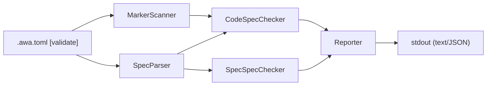

# Design Specification

## Overview

This design implements the `awa validate` command as a pipeline: config → scanner/parser → checkers → reporter. It reuses the existing config loader (extended with a `[validate]` section) and follows the same command pattern as `diff` and `generate`.

## Architecture

AFFECTED LAYERS: CLI Layer, Core Engine

### High-Level Architecture

Pipeline architecture: load config, scan code and parse specs in parallel, run checkers, report findings.



### Module Organization

```
src/
├── commands/
│   └── validate.ts
└── core/
    └── validate/
        ├── types.ts
        ├── errors.ts
        ├── spec-parser.ts
        ├── marker-scanner.ts
        ├── code-spec-checker.ts
        ├── spec-spec-checker.ts
        ├── reporter.ts
        └── __tests__/
            ├── spec-parser.test.ts
            ├── marker-scanner.test.ts
            ├── code-spec-checker.test.ts
            ├── spec-spec-checker.test.ts
            └── reporter.test.ts
```

### Architectural Decisions

- PIPELINE OVER VISITOR: Linear pipeline keeps each stage independently testable. Alternatives: visitor pattern, event-driven
- REGEX OVER AST: Spec files are Markdown with predictable patterns; regex is simpler and sufficient. Alternatives: Markdown AST parsing
- SEPARATE CHECKERS: Code-to-spec and spec-to-spec are independent concerns with different inputs. Alternatives: single monolithic checker

## Components and Interfaces

### VAL-MarkerScanner

Scans code files matching configured globs for traceability markers. Extracts marker type, referenced ID, file path, and line number.

IMPLEMENTS: VAL-1_AC-1, VAL-11_AC-1, VAL-13_AC-1

```typescript
interface MarkerScanResult {
  markers: CodeMarker[];
}

interface CodeMarker {
  type: 'impl' | 'test' | 'component';
  id: string;
  filePath: string;
  line: number;
}

function scanMarkers(config: ValidateConfig): Promise<MarkerScanResult>;
```

### VAL-SpecParser

Parses spec files matching configured globs to extract requirement IDs, AC IDs, property IDs, and component names.

IMPLEMENTS: VAL-2_AC-1, VAL-12_AC-1

```typescript
interface SpecParseResult {
  requirementIds: Set<string>;
  acIds: Set<string>;
  propertyIds: Set<string>;
  componentNames: Set<string>;
  allIds: Set<string>;
  specFiles: SpecFile[];
}

interface SpecFile {
  filePath: string;
  code: string;
  requirementIds: string[];
  acIds: string[];
  propertyIds: string[];
  componentNames: string[];
  crossRefs: CrossReference[];
}

interface CrossReference {
  type: 'implements' | 'validates';
  ids: string[];
  filePath: string;
  line: number;
}

function parseSpecs(config: ValidateConfig): Promise<SpecParseResult>;
```

### VAL-CodeSpecChecker

Matches code markers against spec IDs. Reports orphaned markers (code references non-existent spec ID) and uncovered ACs (spec AC with no test marker).

IMPLEMENTS: VAL-3_AC-1, VAL-4_AC-1, VAL-6_AC-1, VAL-14_AC-1

```typescript
interface CheckResult {
  findings: Finding[];
}

function checkCodeAgainstSpec(
  markers: MarkerScanResult,
  specs: SpecParseResult,
  config: ValidateConfig
): CheckResult;
```

### VAL-SpecSpecChecker

Validates cross-references between spec files. Reports broken IMPLEMENTS/VALIDATES references and orphaned spec files.

IMPLEMENTS: VAL-5_AC-1, VAL-7_AC-1, VAL-15_AC-1

```typescript
function checkSpecAgainstSpec(
  specs: SpecParseResult,
  markers: MarkerScanResult,
  config: ValidateConfig
): CheckResult;
```

### VAL-Reporter

Formats and outputs validation findings in text or JSON format.

IMPLEMENTS: VAL-9_AC-1

```typescript
function report(findings: Finding[], format: 'text' | 'json'): void;
```

### VAL-ValidateCommand

Orchestrates the validation pipeline: load config, scan/parse, check, report, set exit code.

IMPLEMENTS: VAL-8_AC-1, VAL-10_AC-1

```typescript
function validateCommand(cliOptions: RawValidateOptions): Promise<number>;
```

## Data Models

### Core Types

- VALIDATE_CONFIG: Configuration for the validate command

```typescript
interface ValidateConfig {
  specGlobs: string[];
  codeGlobs: string[];
  ignore: string[];
  markers: string[];
  idPattern: string;
  crossRefPatterns: string[];
  format: 'text' | 'json';
}
```

- FINDING: A single validation finding (error or warning)

```typescript
interface Finding {
  severity: 'error' | 'warning';
  code: string;
  message: string;
  filePath?: string;
  line?: number;
  id?: string;
}
```

- RAW_VALIDATE_OPTIONS: CLI argument parser output for validate

```typescript
interface RawValidateOptions {
  ignore?: string[];
  format?: string;
  config?: string;
}
```

## Correctness Properties

- VAL_P-1 [Orphan Detection Completeness]: Every code marker referencing a non-existent spec ID is reported as an error
  VALIDATES: VAL-3_AC-1

- VAL_P-2 [Coverage Detection Completeness]: Every spec AC without a corresponding `@awa-test` marker is reported as a warning
  VALIDATES: VAL-4_AC-1

- VAL_P-3 [Cross-Reference Integrity]: Every DESIGN cross-reference pointing to a non-existent REQ ID is reported as an error
  VALIDATES: VAL-5_AC-1

- VAL_P-4 [ID Format Enforcement]: Every marker ID not matching the configured pattern is reported as an error
  VALIDATES: VAL-6_AC-1

- VAL_P-5 [Exit Code Correctness]: Exit code is 0 when no errors exist, 1 when errors exist (warnings alone do not affect exit code)
  VALIDATES: VAL-8_AC-1

## Error Handling

### ValidateError

Validation operation errors

- FILE_READ_ERROR: Cannot read a spec or code file
- INVALID_CONFIG: Validate config has invalid values
- GLOB_ERROR: Glob pattern matching failed

### Strategy

PRINCIPLES:

- Fail fast on config errors (before scanning)
- Continue on individual file errors (report and skip)
- Distinguish errors (exit 1) from warnings (informational only)

## Testing Strategy

### Property-Based Testing

- FRAMEWORK: fast-check
- MINIMUM_ITERATIONS: 100
- TAG_FORMAT: `@awa-test: VAL_P-{n}`

### Unit Testing

- AREAS: marker scanner, spec parser, code-spec checker, spec-spec checker, reporter

### Integration Testing

- SCENARIOS: validate command with default config, validate with custom markers, validate with broken references

## Requirements Traceability

SOURCE: REQ-VAL-validate.md

- VAL-1_AC-1 → VAL-MarkerScanner
- VAL-2_AC-1 → VAL-SpecParser
- VAL-3_AC-1 → VAL-CodeSpecChecker (VAL_P-1)
- VAL-4_AC-1 → VAL-CodeSpecChecker (VAL_P-2)
- VAL-5_AC-1 → VAL-SpecSpecChecker (VAL_P-3)
- VAL-6_AC-1 → VAL-CodeSpecChecker (VAL_P-4)
- VAL-7_AC-1 → VAL-SpecSpecChecker
- VAL-8_AC-1 → VAL-ValidateCommand (VAL_P-5)
- VAL-9_AC-1 → VAL-Reporter
- VAL-10_AC-1 → VAL-ValidateCommand
- VAL-11_AC-1 → VAL-MarkerScanner
- VAL-12_AC-1 → VAL-SpecParser
- VAL-13_AC-1 → VAL-MarkerScanner
- VAL-14_AC-1 → VAL-CodeSpecChecker
- VAL-15_AC-1 → VAL-SpecSpecChecker
- VAL-16_AC-1 → VAL-ValidateCommand

## Change Log

- 1.0.0 (2026-02-27): Initial design
