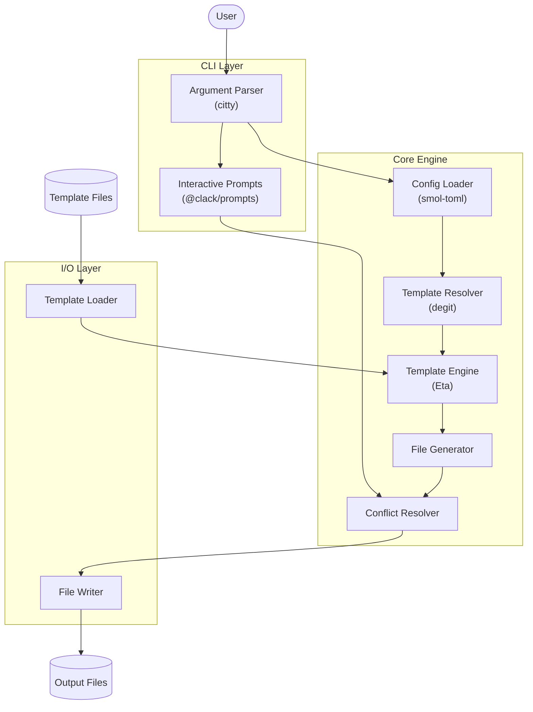
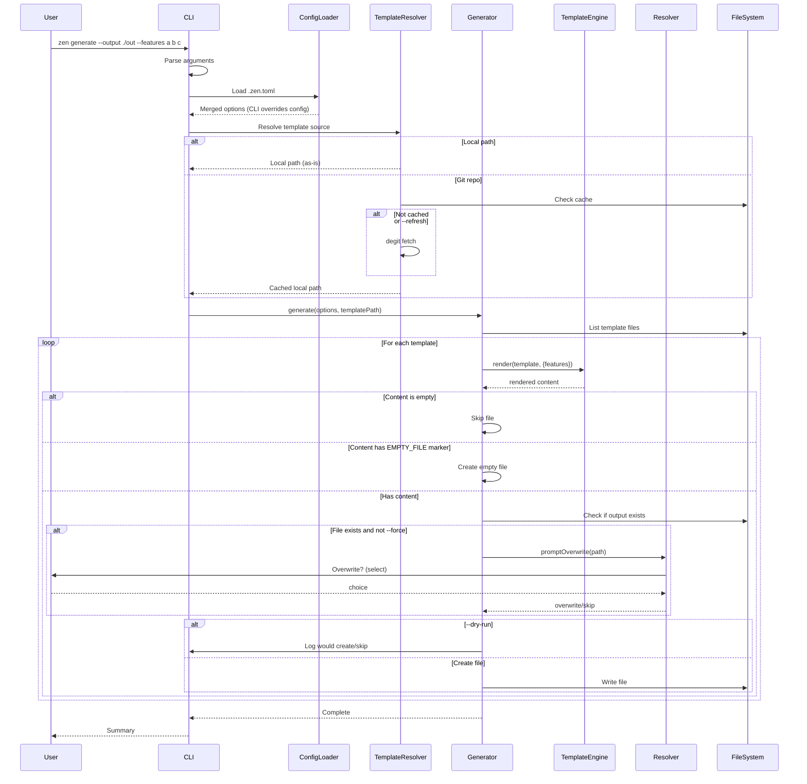

# Zen CLI Architecture

## Table of Contents
- [Project Purpose](#project-purpose)
- [System Overview](#system-overview)
- [Technology Stack](#technology-stack)
- [High-Level Architecture](#high-level-architecture)
- [Directory Structure](#directory-structure)
- [Component Details](#component-details)
- [Component Interactions](#component-interactions)
- [Architectural Rules](#architectural-rules)
- [Developer Commands](#developer-commands)

## Project Purpose

Zen CLI is a TypeScript-based command-line tool that generates AI coding agent configuration files via templating. It produces the Zen agent system prompt files (`.github/agents/*.agent.md`) from customizable templates with conditional output support based on user-specified feature flags.

## System Overview

- **CLI Layer**: Command parsing, argument validation, user prompts
- **Configuration Loader**: TOML config file parsing, CLI override merging
- **Template Resolver**: Resolve template source (local path or Git repo)
- **Template Engine**: Template loading, rendering with conditional logic
- **File Generator**: Output file creation, directory management, conflict resolution

## Technology Stack

| Technology | Purpose |
|------------|---------|
| Node.js 24 | Runtime environment |
| TypeScript 5.x | Type-safe implementation |
| tsup | Build/bundling (ESM output) |
| Vitest | Testing framework |
| Biome | Linting and formatting |
| citty | CLI framework (lightweight, modern) |
| @clack/prompts | Interactive CLI prompts (overwrite confirmations) |
| Eta | Template engine (lightweight, fast, TypeScript-native) |
| chalk 5.x | Terminal output coloring |
| smol-toml | TOML parser (lightweight, spec-compliant) |
| degit | Git repository template fetching (no full clone) |

## High-Level Architecture



## Directory Structure

```
zen/
├── src/
│   ├── cli/               # CLI entry point and command definitions
│   │   └── index.ts       # Main CLI entry
│   ├── commands/          # Command implementations
│   │   └── generate.ts    # Generate command
│   ├── core/              # Core business logic
│   │   ├── config.ts      # Configuration loader
│   │   ├── template-resolver.ts  # Template source resolver
│   │   ├── template.ts    # Template engine wrapper
│   │   ├── generator.ts   # File generation logic
│   │   └── resolver.ts    # Conflict resolution
│   ├── utils/             # Utility functions
│   │   ├── fs.ts          # File system helpers
│   │   └── logger.ts      # Console output helpers (uses chalk)
│   └── types/             # TypeScript type definitions
│       └── index.ts
├── templates/             # Default template files (bundled)
│   ├── _partials/         # Shared content blocks (not output directly)
│   │   ├── header.md      # Common header content
│   │   ├── core-principles.md
│   │   └── ...
│   └── .github/
│       └── agents/
│           └── *.agent.md
├── test/                  # Test files
├── .zen.toml              # Example configuration file
├── bin/                   # CLI executable entry
│   └── zen.ts
├── package.json
├── tsconfig.json
├── tsup.config.ts
├── vitest.config.ts
└── biome.json
```

## Component Details

### CLI Layer

Entry point and argument parsing.

**Responsibilities:**
- Parse command-line arguments (`--output`, `--template`, `--force`, `--dry-run`, `--config`, `--refresh`, `--features`)
- Validate inputs
- Invoke configuration loader then core commands
- Display help and version info

**Architectural Constraints:**
- Uses citty for command definition
- `--features` accepts variadic string values
- `--config` specifies alternate config file path

### Configuration Loader

Loads and merges configuration from file and CLI.

**Responsibilities:**
- Load `.zen.toml` from current directory (default) or `--config` path
- Parse TOML configuration
- Merge CLI arguments over config file values (CLI wins)
- Provide unified options object to commands

**Architectural Constraints:**
- Uses smol-toml for parsing
- Missing config file is not an error (all options have defaults or are CLI-provided)
- CLI arguments always override config file values
- Arrays (features) are replaced, not merged

### Template Resolver

Resolves template source to a local directory.

**Responsibilities:**
- Detect template source type (local path vs Git repo)
- Fetch Git repositories to local cache
- Support branch/tag/commit references
- Return resolved local path for template engine

**Architectural Constraints:**
- Uses degit for shallow Git fetches (no .git folder, fast)
- Git URL formats supported:
  - `owner/repo` (GitHub shorthand)
  - `github:owner/repo`
  - `gitlab:owner/repo`
  - `bitbucket:owner/repo`
  - `https://github.com/owner/repo`
  - `git@github.com:owner/repo`
- Subdirectory support: `owner/repo/path/to/templates`
- Ref support: `owner/repo#branch`, `owner/repo#v1.0.0`, `owner/repo#commit`
- Cache location: `~/.cache/zen/templates/`
- Local paths used directly (no caching)
- `--refresh` re-fetches cached Git templates

### Template Engine

Wrapper around Eta for template rendering.

**Responsibilities:**
- Load templates from specified directory
- Render templates with context (feature flags as `features` array)
- Support conditional output via template logic
- Handle empty template output (skip file creation)
- Support partials (shared content blocks) for composition

**Architectural Constraints:**
- Templates use Eta syntax (`<%= %>`, `<% %>`, `<%~ %>`)
- Feature flags accessible as `it.features` array in templates
- Empty string output = skip file creation
- Special marker `<!-- ZEN:EMPTY_FILE -->` = create empty file
- Partials stored in `_partials/` directory (prefixed with `_` = not output directly)
- Include partials via `<%~ include('_partials/header', it) %>`

### File Generator

Orchestrates file creation from rendered templates.

**Responsibilities:**
- Walk template directory structure
- Invoke template engine for each file
- Create output directory structure
- Delegate conflict resolution to resolver

**Architectural Constraints:**
- Mirrors template directory structure in output
- Creates missing directories automatically
- Template filename = output filename (no `.eta` extension in template names)
- Files/directories starting with `_` are excluded from output (partials, helpers)

### Conflict Resolver

Handles existing file conflicts.

**Responsibilities:**
- Detect existing files
- Prompt user for action (overwrite/skip) unless `--force`
- Skip prompts in `--dry-run` mode

**Architectural Constraints:**
- Uses @clack/prompts select for user choice
- Prompt offers "overwrite" and "skip" options
- Respects `--force` flag to auto-overwrite
- Respects `--dry-run` to simulate without changes

## Component Interactions



## Architectural Rules

### Performance
- Template compilation cached per session
- Parallel file operations where possible

### Maintainability
- Single responsibility per module
- Maximum 200 lines per source file
- Comprehensive JSDoc on public APIs

### Security
- No eval or dynamic code execution outside template engine
- Template sandbox prevents file system access from templates

### Testing
- Unit tests for core logic
- Integration tests for CLI commands
- Test coverage target: 80%

### Code Quality
- Biome for linting and formatting
- Strict TypeScript (`strict: true`)
- ESM-only output

### Template Design
- Empty output (after trim) = file not created
- `<!-- ZEN:EMPTY_FILE -->` marker = create empty file intentionally
- Feature flags available as `it.features: string[]`
- Conditional: `<% if (it.features.includes('x')) { %> ... <% } %>`
- Partials in `_partials/` directory are shared content, not output as files
- Include partial: `<%~ include('_partials/header', it) %>`
- Partials receive same context (`it.features`) for conditional composition

### Configuration File
- Default location: `.zen.toml` in current directory
- Override with `--config <path>`
- TOML format with same option names as CLI (kebab-case)
- CLI arguments override config file values
- Example `.zen.toml`:
  ```toml
  output = "."
  template = "./my-templates"
  features = ["architect", "code", "vibe"]
  force = false
  dry-run = false
  refresh = false
  ```

### Template Sources
- Local path: `--template ./my-templates` or `--template /absolute/path`
- GitHub shorthand: `--template owner/repo`
- GitHub with subdirectory: `--template owner/repo/templates`
- With branch/tag: `--template owner/repo#main` or `owner/repo#v1.0.0`
- Full Git URL: `--template https://github.com/owner/repo`
- GitLab/Bitbucket: `--template gitlab:owner/repo`
- SSH: `--template git@github.com:owner/repo`
- Cached templates stored in `~/.cache/zen/templates/`
- Use `--refresh` to re-fetch cached remote templates

## Developer Commands

| Command | Description |
|---------|-------------|
| `npm install` | Install dependencies |
| `npm run dev` | Run in development mode (tsx watch) |
| `npm run build` | Build for production |
| `npm test` | Run tests |
| `npm run test:watch` | Run tests in watch mode |
| `npm run lint` | Run Biome linter |
| `npm run format` | Format code with Biome |
| `npm run typecheck` | TypeScript type checking |
