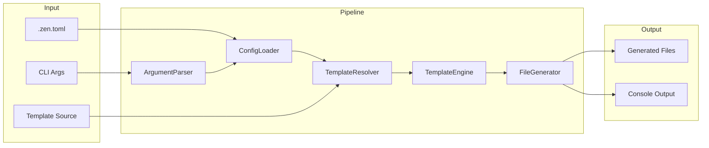

# Zen CLI Design

> VERSION: 2.1.0 | STATUS: draft | UPDATED: 2025-12-17

## Overview

This document defines the technical design for Zen CLI, a TypeScript command-line tool that generates AI coding agent configuration files from templates. The design implements a pipeline architecture: CLI parses arguments, loads configuration, resolves template sources, renders templates with feature flags, and writes output files with conflict resolution.

RELATED DOCUMENTS:
- [DESIGN-ZEN-cli-properties.md](DESIGN-ZEN-cli-properties.md) - Correctness properties, error handling, testing strategy
- [DESIGN-ZEN-cli-traceability.md](DESIGN-ZEN-cli-traceability.md) - Requirements traceability, library usage, change log

## Architecture

### Affected Layers

CLI Layer, Core Engine, I/O Layer

### High-Level Architecture



### Module Organization

```
src/
├── cli/
│   └── index.ts           # CLI entry, command definitions
├── commands/
│   ├── generate.ts        # Generate command orchestration
│   └── diff.ts            # Diff command orchestration
├── core/
│   ├── config.ts          # ConfigLoader
│   ├── feature-resolver.ts # FeatureResolver
│   ├── template-resolver.ts # TemplateResolver
│   ├── template.ts        # TemplateEngine
│   ├── generator.ts       # FileGenerator
│   ├── resolver.ts        # ConflictResolver
│   └── differ.ts          # DiffEngine
├── utils/
│   ├── fs.ts              # File system helpers
│   └── logger.ts          # Console output (chalk)
└── types/
    └── index.ts           # Shared type definitions
```

### Architectural Decisions

- PIPELINE OVER EVENT: Sequential pipeline for predictable flow and error handling. Alternatives: event-driven (complexity), middleware chain (over-engineering)
- FAIL-FAST: Stop on first error to prevent partial/inconsistent output. Alternatives: continue-on-error (complex recovery), collect-all-errors (confusing UX)
- SHALLOW GIT FETCH: Use degit for fast, minimal fetches without .git history. Alternatives: full clone (slow, wasteful), sparse checkout (complex)
- BINARY DETECTION BEFORE DIFF: The `diff` library is text-only; binary files must be detected before diffing. Use `isbinaryfile` npm package (well-maintained, popular) for null-byte detection. Alternatives: manual null-byte scan (reinventing wheel), file extension heuristic (incomplete)

## Components and Interfaces

### CLI-ArgumentParser

Parses CLI arguments using commander, validates inputs, and produces a raw options object for downstream processing. Supports both `generate` and `diff` subcommands with positional arguments displayed in help output.

IMPLEMENTS: CLI-1_AC-1, CLI-1_AC-2, CLI-1_AC-3, CLI-1_AC-4, CLI-1_AC-5, CLI-2_AC-1, CLI-2_AC-2, CLI-2_AC-5, CLI-2_AC-6, CLI-3_AC-1, CLI-4_AC-1, CLI-4_AC-2, CLI-5_AC-1, CLI-6_AC-1, CLI-7_AC-1, CLI-8_AC-1, CLI-9_AC-1, CLI-9_AC-2, CLI-9_AC-3, CLI-10_AC-1, CLI-10_AC-2, CLI-11_AC-1, CLI-11_AC-2, CLI-11_AC-3, CFG-5_AC-2, DIFF-7_AC-1, DIFF-7_AC-2, DIFF-7_AC-3, DIFF-7_AC-4, DIFF-7_AC-5, DIFF-7_AC-6, DIFF-7_AC-7, DIFF-7_AC-8, DIFF-7_AC-9, DIFF-7_AC-10, FP-2_AC-1, FP-2_AC-2, FP-2_AC-4, FP-4_AC-1, FP-4_AC-2, FP-4_AC-3, FP-4_AC-5

```typescript
interface RawCliOptions {
  output?: string;  // Optional positional argument (required if not in config)
  template?: string;
  features?: string[];
  preset?: string[];
  removeFeatures?: string[];
  force?: boolean;
  dryRun?: boolean;
  config?: string;
  refresh?: boolean;
}

interface ArgumentParser {
  parse(argv: string[]): RawCliOptions;
}
```

### CFG-ConfigLoader

Loads TOML configuration from file, merges with CLI arguments (CLI wins), and produces resolved options with defaults applied. Parses the `[presets]` table for named feature bundles.

IMPLEMENTS: CFG-1_AC-1, CFG-1_AC-2, CFG-1_AC-3, CFG-1_AC-4, CFG-2_AC-1, CFG-2_AC-2, CFG-2_AC-3, CFG-3_AC-1, CFG-3_AC-2, CFG-3_AC-3, CFG-3_AC-4, CFG-3_AC-5, CFG-3_AC-6, CFG-4_AC-1, CFG-4_AC-2, CFG-4_AC-3, CFG-4_AC-4, CFG-5_AC-1, CFG-6_AC-1, CFG-6_AC-2, CLI-2_AC-3, CLI-2_AC-4, CLI-4_AC-3, CLI-7_AC-2, FP-1_AC-1, FP-1_AC-2, FP-1_AC-3, FP-1_AC-4, FP-3_AC-1, FP-3_AC-2, FP-3_AC-3, FP-5_AC-1, FP-5_AC-2, FP-5_AC-3

```typescript
interface PresetDefinitions {
  [presetName: string]: string[];
}

interface FileConfig {
  output?: string;  // Optional in config file; CLI positional arg takes precedence
  template?: string;
  features?: string[];
  preset?: string[];
  'remove-features'?: string[];
  force?: boolean;
  'dry-run'?: boolean;
  refresh?: boolean;
  presets?: PresetDefinitions;
}

interface ResolvedOptions {
  output: string;
  template: string | null;
  features: string[];
  preset: string[];
  removeFeatures: string[];
  force: boolean;
  dryRun: boolean;
  refresh: boolean;
  presets: PresetDefinitions;
}

interface ConfigLoader {
  load(configPath: string | null): Promise<FileConfig | null>;
  merge(cli: RawCliOptions, file: FileConfig | null): ResolvedOptions;
}
```

### FP-FeatureResolver

Computes the final feature set from base features, activated presets, and removals. Validates that referenced preset names exist in the presets table.

IMPLEMENTS: FP-2_AC-3, FP-6_AC-1, FP-6_AC-2, FP-6_AC-3, FP-6_AC-4, FP-6_AC-5, FP-7_AC-1, FP-7_AC-2, FP-4_AC-4

```typescript
interface FeatureResolutionInput {
  baseFeatures: string[];
  presetNames: string[];
  removeFeatures: string[];
  presetDefinitions: PresetDefinitions;
}

interface FeatureResolver {
  resolve(input: FeatureResolutionInput): string[];
  validatePresets(presetNames: string[], definitions: PresetDefinitions): void;
}
```

### TPL-TemplateResolver

Detects template source type (local vs Git), fetches remote templates to cache, and returns a resolved local path.

IMPLEMENTS: CLI-3_AC-2, CLI-3_AC-3, CLI-8_AC-2, TPL-1_AC-1, TPL-1_AC-2, TPL-1_AC-3, TPL-1_AC-4, TPL-2_AC-1, TPL-2_AC-2, TPL-2_AC-3, TPL-2_AC-4, TPL-2_AC-5, TPL-2_AC-6, TPL-3_AC-1, TPL-3_AC-2, TPL-3_AC-3, TPL-3_AC-4, TPL-10_AC-1, TPL-10_AC-2, TPL-10_AC-3

```typescript
type TemplateSourceType = 'local' | 'git' | 'bundled';

interface ResolvedTemplate {
  type: TemplateSourceType;
  localPath: string;
  source: string;
}

interface TemplateResolver {
  resolve(source: string | null, refresh: boolean): Promise<ResolvedTemplate>;
  detectType(source: string): TemplateSourceType;
  getCachePath(source: string): string;
}
```

### TPL-TemplateEngine

Wraps Eta for template rendering. Loads templates, provides feature flag context, handles empty output detection, and supports partials.

IMPLEMENTS: TPL-4_AC-1, TPL-4_AC-2, TPL-4_AC-3, TPL-4_AC-4, TPL-5_AC-1, TPL-5_AC-2, TPL-5_AC-3, TPL-6_AC-1, TPL-6_AC-2, TPL-7_AC-1, TPL-7_AC-2, TPL-8_AC-1, TPL-8_AC-2, TPL-8_AC-3, TPL-8_AC-4, TPL-11_AC-1, TPL-11_AC-2

```typescript
interface TemplateContext {
  features: string[];
}

interface RenderResult {
  content: string;
  isEmpty: boolean;
  isEmptyFileMarker: boolean;
}

interface TemplateEngine {
  configure(templateDir: string): void;
  render(templatePath: string, context: TemplateContext): Promise<RenderResult>;
}
```

### GEN-FileGenerator

Orchestrates the generation process: walks template directory, invokes template engine, manages output structure, and coordinates conflict resolution. When `dryRun` is true, it computes and reports actions without creating directories or writing files.

IMPLEMENTS: GEN-1_AC-1, GEN-1_AC-2, GEN-1_AC-3, GEN-2_AC-1, GEN-2_AC-2, GEN-2_AC-3, GEN-3_AC-1, GEN-3_AC-2, GEN-3_AC-3, GEN-8_AC-1, GEN-8_AC-2, GEN-8_AC-3, GEN-11_AC-3, TPL-9_AC-1, TPL-9_AC-2, CLI-6_AC-2

```typescript
interface GenerateOptions {
  templatePath: string;
  outputPath: string;
  features: string[];
  force: boolean;
  dryRun: boolean;
}

interface FileAction {
  type: 'create' | 'overwrite' | 'skip' | 'skip-empty' | 'skip-user';
  sourcePath: string;
  outputPath: string;
}

interface GenerationResult {
  actions: FileAction[];
  created: number;
  overwritten: number;
  skipped: number;
  skippedEmpty: number;
  skippedUser: number;
}

interface FileGenerator {
  generate(options: GenerateOptions): Promise<GenerationResult>;
  walkTemplates(dir: string): AsyncIterable<string>;
  computeOutputPath(templatePath: string, templateRoot: string, outputRoot: string): string;
}
```

### GEN-ConflictResolver

Handles file conflicts by comparing existing file content with new content, skipping identical files without prompting. For actual conflicts, prompts user with multi-select interface (all files checked by default) for action (overwrite/skip) unless force mode is enabled.

IMPLEMENTS: CLI-5_AC-2, CLI-5_AC-3, GEN-4_AC-1, GEN-4_AC-2, GEN-4_AC-3, GEN-5_AC-1, GEN-5_AC-2, GEN-5_AC-3, GEN-5_AC-4, GEN-5_AC-5, GEN-5_AC-6, GEN-5_AC-7, GEN-6_AC-3, GEN-10_AC-3

```typescript
type ConflictChoice = 'overwrite' | 'skip';

interface ConflictItem {
  outputPath: string;
  sourcePath: string;
  newContent: string;
  existingContent: string;
}

interface BatchConflictResolution {
  overwrite: string[]; // List of output paths to overwrite
  skip: string[]; // List of output paths to skip
}

interface ConflictResolver {
  resolveBatch(conflicts: ConflictItem[], force: boolean, dryRun: boolean): Promise<BatchConflictResolution>;
}
```

### GEN-Logger

Provides styled console output using chalk. Handles info, success, warning, error messages and generation summary display. Displays warning when no files are created or overwritten. For diff output, colorizes additions (green), deletions (red), and displays summary.

IMPLEMENTS: CLI-6_AC-3, GEN-6_AC-4, GEN-7_AC-1, GEN-7_AC-2, GEN-7_AC-3, GEN-7_AC-4, GEN-9_AC-1, GEN-9_AC-2, GEN-9_AC-3, GEN-9_AC-4, GEN-9_AC-5, GEN-9_AC-6, GEN-11_AC-1, GEN-11_AC-2, GEN-11_AC-4, TPL-7_AC-3, DIFF-4_AC-3, DIFF-4_AC-4, DIFF-4_AC-5

```typescript
interface Logger {
  info(message: string): void;
  success(message: string): void;
  warn(message: string): void;
  error(message: string): void;
  fileAction(action: FileAction): void;
  summary(result: GenerationResult): void;
  diffLine(line: string, type: 'add' | 'remove' | 'context'): void;
  diffSummary(result: DiffResult): void;
}
```

### DIFF-DiffEngine

Compares generated template output against existing target files. Generates to a temp directory, performs byte-for-byte comparison, produces unified diff output, and only includes target-only files when explicitly requested.

IMPLEMENTS: DIFF-1_AC-1, DIFF-1_AC-2, DIFF-1_AC-3, DIFF-2_AC-1, DIFF-2_AC-2, DIFF-2_AC-3, DIFF-2_AC-4, DIFF-2_AC-5, DIFF-3_AC-1, DIFF-3_AC-2, DIFF-3_AC-3, DIFF-3_AC-4, DIFF-4_AC-1, DIFF-4_AC-2, DIFF-4_AC-3, DIFF-4_AC-4, DIFF-4_AC-5, DIFF-5_AC-1, DIFF-5_AC-2, DIFF-5_AC-3, DIFF-6_AC-1, DIFF-6_AC-2, DIFF-6_AC-3, DIFF-7_AC-11

```typescript
interface DiffOptions {
  templatePath: string;
  targetPath: string;
  features: string[];
  listUnknown: boolean; // when true, include target-only files in results
}

type FileDiffStatus = 'identical' | 'modified' | 'new' | 'extra' | 'binary-differs';

interface FileDiff {
  relativePath: string;
  status: FileDiffStatus;
  unifiedDiff?: string; // Present only for 'modified' text files
}

interface DiffResult {
  files: FileDiff[];
  identical: number;
  modified: number;
  newFiles: number;
  extraFiles: number;
  hasDifferences: boolean;
}

interface DiffEngine {
  diff(options: DiffOptions): Promise<DiffResult>;
  createTempDir(): Promise<string>;
  cleanupTempDir(tempPath: string): Promise<void>;
  compareFiles(generatedPath: string, targetPath: string): Promise<FileDiff>;
  isBinaryFile(filePath: string): Promise<boolean>;
}
```

## Data Models

### Core Types

- RESOLVED_OPTIONS: Fully resolved configuration with all defaults applied, used throughout the pipeline
- FILE_ACTION: Represents a single file operation with its outcome, used for logging and summary
- GENERATION_RESULT: Aggregated results of a generation run with counts by action type
- CONFLICT_ITEM: Individual file conflict containing paths and content for comparison
- BATCH_CONFLICT_RESOLUTION: Result of batch conflict resolution with overwrite and skip lists
- FILE_DIFF: Represents comparison result for a single file with status and optional unified diff
- DIFF_RESULT: Aggregated diff results with file list and summary counts

```typescript
// ResolvedOptions - immutable after construction
interface ResolvedOptions {
  readonly output: string;
  readonly template: string | null;
  readonly features: readonly string[];
  readonly force: boolean;
  readonly dryRun: boolean;
  readonly refresh: boolean;
}

// FileAction - tagged union for file operations
type FileAction =
  | { type: 'create'; sourcePath: string; outputPath: string }
  | { type: 'overwrite'; sourcePath: string; outputPath: string }
  | { type: 'skip-user'; sourcePath: string; outputPath: string }
  | { type: 'skip-empty'; sourcePath: string; outputPath: string };

// GenerationResult - aggregated outcome
interface GenerationResult {
  readonly actions: readonly FileAction[];
  readonly created: number;
  readonly overwritten: number;
  readonly skipped: number;
  readonly skippedEmpty: number;
  readonly skippedUser: number;
}

// ConflictItem - individual file conflict for batch resolution
interface ConflictItem {
  readonly outputPath: string;
  readonly sourcePath: string;
  readonly newContent: string;
  readonly existingContent: string;
}

// BatchConflictResolution - result of batch conflict resolution
interface BatchConflictResolution {
  readonly overwrite: string[]; // Output paths to overwrite
  readonly skip: string[]; // Output paths to skip (includes identical content)
}

// FileDiff - comparison result for a single file
type FileDiffStatus = 'identical' | 'modified' | 'new' | 'extra' | 'binary-differs';

interface FileDiff {
  readonly relativePath: string;
  readonly status: FileDiffStatus;
  readonly unifiedDiff?: string; // Present only for 'modified' text files
}

// DiffResult - aggregated diff outcome
interface DiffResult {
  readonly files: readonly FileDiff[];
  readonly identical: number;
  readonly modified: number;
  readonly newFiles: number;
  readonly extraFiles: number;
  readonly hasDifferences: boolean;
}
```

### Entities

### TemplateFile

Represents a template file discovered during directory traversal.

- PATH (string, required): Relative path from template root
- ABSOLUTE_PATH (string, required): Absolute file system path
- IS_PARTIAL (boolean, required): Whether file is in _partials/ or starts with _

### CachedTemplate

Represents a cached Git template.

- SOURCE (string, required): Original Git source specifier
- LOCAL_PATH (string, required): Path in cache directory
- FETCHED_AT (Date, required): When template was fetched
- REF (string, optional): Git ref (branch/tag/commit) if specified
