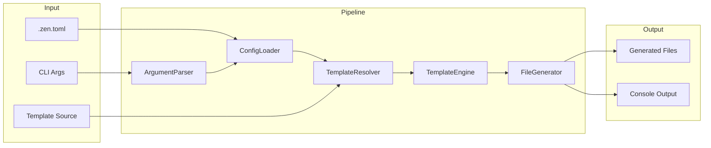

# Zen CLI Design

> VERSION: 1.5.0 | STATUS: draft | UPDATED: 2025-12-12

## Overview

This document defines the technical design for Zen CLI, a TypeScript command-line tool that generates AI coding agent configuration files from templates. The design implements a pipeline architecture: CLI parses arguments, loads configuration, resolves template sources, renders templates with feature flags, and writes output files with conflict resolution.

## Architecture

### Affected Layers

CLI Layer, Core Engine, I/O Layer

### High-Level Architecture



### Module Organization

```
src/
├── cli/
│   └── index.ts           # CLI entry, command definitions
├── commands/
│   ├── generate.ts        # Generate command orchestration
│   └── diff.ts            # Diff command orchestration
├── core/
│   ├── config.ts          # ConfigLoader
│   ├── feature-resolver.ts # FeatureResolver
│   ├── template-resolver.ts # TemplateResolver
│   ├── template.ts        # TemplateEngine
│   ├── generator.ts       # FileGenerator
│   ├── resolver.ts        # ConflictResolver
│   └── differ.ts          # DiffEngine
├── utils/
│   ├── fs.ts              # File system helpers
│   └── logger.ts          # Console output (chalk)
└── types/
    └── index.ts           # Shared type definitions
```

### Architectural Decisions

- PIPELINE OVER EVENT: Sequential pipeline for predictable flow and error handling. Alternatives: event-driven (complexity), middleware chain (over-engineering)
- FAIL-FAST: Stop on first error to prevent partial/inconsistent output. Alternatives: continue-on-error (complex recovery), collect-all-errors (confusing UX)
- SHALLOW GIT FETCH: Use degit for fast, minimal fetches without .git history. Alternatives: full clone (slow, wasteful), sparse checkout (complex)
- BINARY DETECTION BEFORE DIFF: The `diff` library is text-only; binary files must be detected before diffing. Use `isbinaryfile` npm package (well-maintained, popular) for null-byte detection. Alternatives: manual null-byte scan (reinventing wheel), file extension heuristic (incomplete)

## Components and Interfaces

### ArgumentParser

Parses CLI arguments using citty, validates inputs, and produces a raw options object for downstream processing. Supports both `generate` and `diff` subcommands.

IMPLEMENTS: CLI-1 AC-1.1, CLI-1 AC-1.2, CLI-1 AC-1.3, CLI-2 AC-2.1, CLI-2 AC-2.3, CLI-3 AC-3.1, CLI-4 AC-4.1, CLI-4 AC-4.2, CLI-5 AC-5.1, CLI-6 AC-6.1, CLI-7 AC-7.1, CLI-8 AC-8.1, CLI-9 AC-9.1, CLI-9 AC-9.2, CLI-9 AC-9.3, CLI-10 AC-10.1, CLI-10 AC-10.2, CLI-11 AC-11.1, CLI-11 AC-11.2, CLI-11 AC-11.3, CFG-5 AC-5.2, DIFF-7 AC-7.1, DIFF-7 AC-7.2, DIFF-7 AC-7.3, DIFF-7 AC-7.4, DIFF-7 AC-7.5, DIFF-7 AC-7.6, FP-2 AC-2.1, FP-2 AC-2.2, FP-2 AC-2.4, FP-4 AC-4.1, FP-4 AC-4.2, FP-4 AC-4.3, FP-4 AC-4.5

```typescript
interface RawCliOptions {
  output?: string;
  template?: string;
  features?: string[];
  preset?: string[];
  removeFeatures?: string[];
  force?: boolean;
  dryRun?: boolean;
  config?: string;
  refresh?: boolean;
}

interface ArgumentParser {
  parse(argv: string[]): RawCliOptions;
}
```

### ConfigLoader

Loads TOML configuration from file, merges with CLI arguments (CLI wins), and produces resolved options with defaults applied. Parses the `[presets]` table for named feature bundles.

IMPLEMENTS: CFG-1 AC-1.1, CFG-1 AC-1.2, CFG-1 AC-1.3, CFG-1 AC-1.4, CFG-2 AC-2.1, CFG-2 AC-2.2, CFG-2 AC-2.3, CFG-3 AC-3.1, CFG-3 AC-3.2, CFG-3 AC-3.3, CFG-3 AC-3.4, CFG-3 AC-3.5, CFG-3 AC-3.6, CFG-4 AC-4.1, CFG-4 AC-4.2, CFG-4 AC-4.3, CFG-4 AC-4.4, CFG-5 AC-5.1, CFG-6 AC-6.1, CFG-6 AC-6.2, CLI-2 AC-2.2, CLI-4 AC-4.3, CLI-7 AC-7.2, FP-1 AC-1.1, FP-1 AC-1.2, FP-1 AC-1.3, FP-1 AC-1.4, FP-3 AC-3.1, FP-3 AC-3.2, FP-3 AC-3.3, FP-5 AC-5.1, FP-5 AC-5.2, FP-5 AC-5.3

```typescript
interface PresetDefinitions {
  [presetName: string]: string[];
}

interface FileConfig {
  output?: string;
  template?: string;
  features?: string[];
  preset?: string[];
  'remove-features'?: string[];
  force?: boolean;
  'dry-run'?: boolean;
  refresh?: boolean;
  presets?: PresetDefinitions;
}

interface ResolvedOptions {
  output: string;
  template: string | null;
  features: string[];
  preset: string[];
  removeFeatures: string[];
  force: boolean;
  dryRun: boolean;
  refresh: boolean;
  presets: PresetDefinitions;
}

interface ConfigLoader {
  load(configPath: string | null): Promise<FileConfig | null>;
  merge(cli: RawCliOptions, file: FileConfig | null): ResolvedOptions;
}
```

### FeatureResolver

Computes the final feature set from base features, activated presets, and removals. Validates that referenced preset names exist in the presets table.

IMPLEMENTS: FP-2 AC-2.3, FP-6 AC-6.1, FP-6 AC-6.2, FP-6 AC-6.3, FP-6 AC-6.4, FP-6 AC-6.5, FP-7 AC-7.1, FP-7 AC-7.2, FP-4 AC-4.4

```typescript
interface FeatureResolutionInput {
  baseFeatures: string[];
  presetNames: string[];
  removeFeatures: string[];
  presetDefinitions: PresetDefinitions;
}

interface FeatureResolver {
  resolve(input: FeatureResolutionInput): string[];
  validatePresets(presetNames: string[], definitions: PresetDefinitions): void;
}
```

### TemplateResolver

Detects template source type (local vs Git), fetches remote templates to cache, and returns a resolved local path.

IMPLEMENTS: CLI-3 AC-3.2, CLI-3 AC-3.3, CLI-8 AC-8.2, TPL-1 AC-1.1, TPL-1 AC-1.2, TPL-1 AC-1.3, TPL-1 AC-1.4, TPL-2 AC-2.1, TPL-2 AC-2.2, TPL-2 AC-2.3, TPL-2 AC-2.4, TPL-2 AC-2.5, TPL-2 AC-2.6, TPL-3 AC-3.1, TPL-3 AC-3.2, TPL-3 AC-3.3, TPL-3 AC-3.4, TPL-10 AC-10.1, TPL-10 AC-10.2, TPL-10 AC-10.3

```typescript
type TemplateSourceType = 'local' | 'git' | 'bundled';

interface ResolvedTemplate {
  type: TemplateSourceType;
  localPath: string;
  source: string;
}

interface TemplateResolver {
  resolve(source: string | null, refresh: boolean): Promise<ResolvedTemplate>;
  detectType(source: string): TemplateSourceType;
  getCachePath(source: string): string;
}
```

### TemplateEngine

Wraps Eta for template rendering. Loads templates, provides feature flag context, handles empty output detection, and supports partials.

IMPLEMENTS: TPL-4 AC-4.1, TPL-4 AC-4.2, TPL-4 AC-4.3, TPL-4 AC-4.4, TPL-5 AC-5.1, TPL-5 AC-5.2, TPL-5 AC-5.3, TPL-6 AC-6.1, TPL-6 AC-6.2, TPL-7 AC-7.1, TPL-7 AC-7.2, TPL-8 AC-8.1, TPL-8 AC-8.2, TPL-8 AC-8.3, TPL-8 AC-8.4, TPL-11 AC-11.1, TPL-11 AC-11.2

```typescript
interface TemplateContext {
  features: string[];
}

interface RenderResult {
  content: string;
  isEmpty: boolean;
  isEmptyFileMarker: boolean;
}

interface TemplateEngine {
  configure(templateDir: string): void;
  render(templatePath: string, context: TemplateContext): Promise<RenderResult>;
}
```

### FileGenerator

Orchestrates the generation process: walks template directory, invokes template engine, manages output structure, and coordinates conflict resolution.

IMPLEMENTS: GEN-1 AC-1.1, GEN-1 AC-1.2, GEN-1 AC-1.3, GEN-2 AC-2.1, GEN-2 AC-2.2, GEN-2 AC-2.3, GEN-3 AC-3.1, GEN-3 AC-3.2, GEN-3 AC-3.3, GEN-8 AC-8.1, GEN-8 AC-8.2, GEN-8 AC-8.3, GEN-11 AC-11.3, TPL-9 AC-9.1, TPL-9 AC-9.2

```typescript
interface GenerateOptions {
  templatePath: string;
  outputPath: string;
  features: string[];
  force: boolean;
  dryRun: boolean;
}

interface FileAction {
  type: 'create' | 'overwrite' | 'skip' | 'skip-empty' | 'skip-user';
  sourcePath: string;
  outputPath: string;
}

interface GenerationResult {
  actions: FileAction[];
  created: number;
  overwritten: number;
  skipped: number;
  skippedEmpty: number;
  skippedUser: number;
}

interface FileGenerator {
  generate(options: GenerateOptions): Promise<GenerationResult>;
  walkTemplates(dir: string): AsyncIterable<string>;
  computeOutputPath(templatePath: string, templateRoot: string, outputRoot: string): string;
}
```

### ConflictResolver

Handles file conflicts by comparing existing file content with new content, skipping identical files without prompting. For actual conflicts, prompts user with multi-select interface (all files checked by default) for action (overwrite/skip) unless force mode is enabled.

IMPLEMENTS: CLI-5 AC-5.2, CLI-5 AC-5.3, GEN-4 AC-4.1, GEN-4 AC-4.2, GEN-4 AC-4.3, GEN-5 AC-5.1, GEN-5 AC-5.2, GEN-5 AC-5.3, GEN-5 AC-5.4, GEN-5 AC-5.5, GEN-5 AC-5.6, GEN-5 AC-5.7, GEN-6 AC-6.3, GEN-10 AC-10.3

```typescript
type ConflictChoice = 'overwrite' | 'skip';

interface ConflictItem {
  outputPath: string;
  sourcePath: string;
  newContent: string;
  existingContent: string;
}

interface BatchConflictResolution {
  overwrite: string[]; // List of output paths to overwrite
  skip: string[]; // List of output paths to skip
}

interface ConflictResolver {
  resolveBatch(conflicts: ConflictItem[], force: boolean, dryRun: boolean): Promise<BatchConflictResolution>;
}
```

### Logger

Provides styled console output using chalk. Handles info, success, warning, error messages and generation summary display. Displays warning when no files are created or overwritten. For diff output, colorizes additions (green), deletions (red), and displays summary.

IMPLEMENTS: CLI-6 AC-6.3, GEN-6 AC-6.4, GEN-7 AC-7.1, GEN-7 AC-7.2, GEN-7 AC-7.3, GEN-7 AC-7.4, GEN-9 AC-9.1, GEN-9 AC-9.2, GEN-9 AC-9.3, GEN-9 AC-9.4, GEN-9 AC-9.5, GEN-9 AC-9.6, GEN-11 AC-11.1, GEN-11 AC-11.2, GEN-11 AC-11.4, TPL-7 AC-7.3, DIFF-4 AC-4.3, DIFF-4 AC-4.4, DIFF-4 AC-4.5

```typescript
interface Logger {
  info(message: string): void;
  success(message: string): void;
  warn(message: string): void;
  error(message: string): void;
  fileAction(action: FileAction): void;
  summary(result: GenerationResult): void;
  diffLine(line: string, type: 'add' | 'remove' | 'context'): void;
  diffSummary(result: DiffResult): void;
}
```

### DiffEngine

Compares generated template output against existing target files. Generates to a temp directory, performs byte-for-byte comparison, and produces unified diff output.

IMPLEMENTS: DIFF-1 AC-1.1, DIFF-1 AC-1.2, DIFF-1 AC-1.3, DIFF-2 AC-2.1, DIFF-2 AC-2.2, DIFF-2 AC-2.3, DIFF-2 AC-2.4, DIFF-2 AC-2.5, DIFF-3 AC-3.1, DIFF-3 AC-3.2, DIFF-3 AC-3.3, DIFF-4 AC-4.1, DIFF-4 AC-4.2, DIFF-4 AC-4.3, DIFF-4 AC-4.4, DIFF-4 AC-4.5, DIFF-5 AC-5.1, DIFF-5 AC-5.2, DIFF-5 AC-5.3, DIFF-6 AC-6.1, DIFF-6 AC-6.2, DIFF-6 AC-6.3

```typescript
interface DiffOptions {
  templatePath: string;
  targetPath: string;
  features: string[];
}

type FileDiffStatus = 'identical' | 'modified' | 'new' | 'extra' | 'binary-differs';

interface FileDiff {
  relativePath: string;
  status: FileDiffStatus;
  unifiedDiff?: string; // Present only for 'modified' text files
}

interface DiffResult {
  files: FileDiff[];
  identical: number;
  modified: number;
  newFiles: number;
  extraFiles: number;
  hasDifferences: boolean;
}

interface DiffEngine {
  diff(options: DiffOptions): Promise<DiffResult>;
  createTempDir(): Promise<string>;
  cleanupTempDir(tempPath: string): Promise<void>;
  compareFiles(generatedPath: string, targetPath: string): Promise<FileDiff>;
  isBinaryFile(filePath: string): Promise<boolean>;
}
```

## Data Models

### Core Types

- RESOLVED_OPTIONS: Fully resolved configuration with all defaults applied, used throughout the pipeline
- FILE_ACTION: Represents a single file operation with its outcome, used for logging and summary
- GENERATION_RESULT: Aggregated results of a generation run with counts by action type
- CONFLICT_ITEM: Individual file conflict containing paths and content for comparison
- BATCH_CONFLICT_RESOLUTION: Result of batch conflict resolution with overwrite and skip lists
- FILE_DIFF: Represents comparison result for a single file with status and optional unified diff
- DIFF_RESULT: Aggregated diff results with file list and summary counts

```typescript
// ResolvedOptions - immutable after construction
interface ResolvedOptions {
  readonly output: string;
  readonly template: string | null;
  readonly features: readonly string[];
  readonly force: boolean;
  readonly dryRun: boolean;
  readonly refresh: boolean;
}

// FileAction - tagged union for file operations
type FileAction =
  | { type: 'create'; sourcePath: string; outputPath: string }
  | { type: 'overwrite'; sourcePath: string; outputPath: string }
  | { type: 'skip-user'; sourcePath: string; outputPath: string }
  | { type: 'skip-empty'; sourcePath: string; outputPath: string };

// GenerationResult - aggregated outcome
interface GenerationResult {
  readonly actions: readonly FileAction[];
  readonly created: number;
  readonly overwritten: number;
  readonly skipped: number;
  readonly skippedEmpty: number;
  readonly skippedUser: number;
}

// ConflictItem - individual file conflict for batch resolution
interface ConflictItem {
  readonly outputPath: string;
  readonly sourcePath: string;
  readonly newContent: string;
  readonly existingContent: string;
}

// BatchConflictResolution - result of batch conflict resolution
interface BatchConflictResolution {
  readonly overwrite: string[]; // Output paths to overwrite
  readonly skip: string[]; // Output paths to skip (includes identical content)
}

// FileDiff - comparison result for a single file
type FileDiffStatus = 'identical' | 'modified' | 'new' | 'extra' | 'binary-differs';

interface FileDiff {
  readonly relativePath: string;
  readonly status: FileDiffStatus;
  readonly unifiedDiff?: string; // Present only for 'modified' text files
}

// DiffResult - aggregated diff outcome
interface DiffResult {
  readonly files: readonly FileDiff[];
  readonly identical: number;
  readonly modified: number;
  readonly newFiles: number;
  readonly extraFiles: number;
  readonly hasDifferences: boolean;
}
```

### Entities

### TemplateFile

Represents a template file discovered during directory traversal.

- PATH (string, required): Relative path from template root
- ABSOLUTE_PATH (string, required): Absolute file system path
- IS_PARTIAL (boolean, required): Whether file is in _partials/ or starts with _

### CachedTemplate

Represents a cached Git template.

- SOURCE (string, required): Original Git source specifier
- LOCAL_PATH (string, required): Path in cache directory
- FETCHED_AT (Date, required): When template was fetched
- REF (string, optional): Git ref (branch/tag/commit) if specified

## Correctness Properties

- P1 [CLI Override]: CLI arguments always override config file values for the same option
  VALIDATES: CFG-4 AC-4.1, CFG-4 AC-4.2

- P2 [Features Replace]: Features from CLI completely replace config features (no merge)
  VALIDATES: CFG-4 AC-4.4

- P3 [Empty Skip]: Empty or whitespace-only template output results in no file creation
  VALIDATES: TPL-7 AC-7.1

- P4 [Empty Marker]: Template containing only `<!-- ZEN:EMPTY_FILE -->` creates an empty file
  VALIDATES: TPL-7 AC-7.2

- P5 [Underscore Exclusion]: Files/directories starting with `_` are never written to output
  VALIDATES: GEN-8 AC-8.1, GEN-8 AC-8.2, TPL-9 AC-9.1, TPL-9 AC-9.2

- P6 [Directory Mirror]: Output directory structure exactly mirrors template structure (excluding underscore paths)
  VALIDATES: GEN-1 AC-1.1, GEN-1 AC-1.2

- P7 [Dry Run Immutable]: Dry-run mode never modifies the file system
  VALIDATES: GEN-6 AC-6.1, GEN-6 AC-6.2

- P8 [Force No Prompt]: Force mode never prompts for conflict resolution
  VALIDATES: GEN-4 AC-4.3, CLI-5 AC-5.2

- P11 [Content Identity Skip]: When existing file content exactly matches new content, file is skipped without prompting
  VALIDATES: GEN-5 AC-5.7

- P9 [Local No Cache]: Local template paths are used directly without caching
  VALIDATES: TPL-1 AC-1.4

- P10 [Git Cache Reuse]: Git templates use cached version unless --refresh is specified
  VALIDATES: TPL-3 AC-3.2

- P12 [Diff Read-Only]: Diff command never modifies the target directory
  VALIDATES: DIFF-1 AC-1.3

- P13 [Temp Cleanup Guaranteed]: Temp directory is always deleted, even on error
  VALIDATES: DIFF-6 AC-6.1, DIFF-6 AC-6.2, DIFF-6 AC-6.3

- P14 [Exact Comparison]: File comparison is byte-for-byte exact (whitespace-sensitive)
  VALIDATES: DIFF-2 AC-2.1

- P15 [Exit Code Semantics]: Exit 0 means identical, exit 1 means differences, exit 2 means error
  VALIDATES: DIFF-5 AC-5.1, DIFF-5 AC-5.2, DIFF-5 AC-5.3

- P16 [Preset Validation]: Referencing a non-existent preset name results in an error
  VALIDATES: FP-2 AC-2.3

- P17 [Feature Resolution Order]: Final features = (baseFeatures ∪ presetFeatures) \ removeFeatures
  VALIDATES: FP-6 AC-6.1, FP-6 AC-6.2, FP-6 AC-6.3, FP-6 AC-6.4

- P18 [Feature Deduplication]: Final feature set contains no duplicates
  VALIDATES: FP-6 AC-6.5, FP-7 AC-7.2

- P19 [Preset Union]: Multiple presets are merged via set union
  VALIDATES: FP-7 AC-7.1

- P20 [Silent Removal]: Removing a non-existent feature does not cause an error
  VALIDATES: FP-4 AC-4.4

## Error Handling

### ConfigError

Configuration loading and parsing errors.

- FILE_NOT_FOUND: Specified config file does not exist (when --config provided)
- PARSE_ERROR: TOML syntax error with line number
- INVALID_TYPE: Config value has wrong type
- INVALID_PRESET: Preset value is not an array of strings
- UNKNOWN_PRESET: Referenced preset name does not exist in presets table

### TemplateError

Template resolution and rendering errors.

- SOURCE_NOT_FOUND: Local template path does not exist
- FETCH_FAILED: Git fetch failed (network, auth, repo not found)
- RENDER_ERROR: Eta template syntax error with location

### GenerationError

File generation errors.

- PERMISSION_DENIED: Cannot create directory or write file
- DISK_FULL: Insufficient disk space

### DiffError

Diff operation errors.

- TARGET_NOT_FOUND: Target directory does not exist
- TARGET_NOT_READABLE: Cannot read target directory or files
- TEMP_DIR_FAILED: Failed to create or write to temp directory

### Error Strategy

PRINCIPLES:
- Fail fast on first error
- Provide actionable error messages with file paths
- Write errors to stderr
- Exit with non-zero code on any error
- Include suggestions for common errors (e.g., "Did you mean...?" for typos)

## Testing Strategy

### Property-Based Testing

- FRAMEWORK: fast-check
- MINIMUM_ITERATIONS: 100
- TAG_FORMAT: @validates: P{n}

```typescript
// Validates: P1 (CLI Override)
test.prop([fc.string(), fc.string()])('CLI overrides config', (cliValue, configValue) => {
  const cli = { output: cliValue };
  const config = { output: configValue };
  const result = configLoader.merge(cli, config);
  expect(result.output).toBe(cliValue);
});

// Validates: P5 (Underscore Exclusion)
test.prop([fc.string().filter(s => s.startsWith('_'))])('underscore files excluded', (filename) => {
  const actions = generator.processFile(filename);
  expect(actions).toHaveLength(0);
});
```

### Unit Testing

- DESCRIPTION: Test individual components in isolation
- AREAS: ConfigLoader merge logic, TemplateResolver type detection, TemplateEngine empty detection, ConflictResolver prompt logic

### Integration Testing

- DESCRIPTION: Test full generation pipeline with real templates
- SCENARIOS: Local template generation, Git template caching, Conflict resolution flow, Dry-run output verification

## Requirements Traceability

SOURCE: .zen/specs/REQ-cli.md, .zen/specs/REQ-config.md, .zen/specs/REQ-templates.md, .zen/specs/REQ-generation.md, .zen/specs/REQ-diff.md, .zen/specs/REQ-feature-presets.md

- CLI-1 AC-1.1 → ArgumentParser
- CLI-1 AC-1.2 → ArgumentParser
- CLI-1 AC-1.3 → ArgumentParser
- CLI-2 AC-2.1 → ArgumentParser
- CLI-2 AC-2.2 → ConfigLoader
- CLI-2 AC-2.3 → ArgumentParser
- CLI-3 AC-3.1 → ArgumentParser
- CLI-3 AC-3.2 → TemplateResolver
- CLI-3 AC-3.3 → TemplateResolver
- CLI-4 AC-4.1 → ArgumentParser
- CLI-4 AC-4.2 → ArgumentParser
- CLI-4 AC-4.3 → ConfigLoader
- CLI-5 AC-5.1 → ArgumentParser
- CLI-5 AC-5.2 → ConflictResolver (P8)
- CLI-5 AC-5.3 → ConflictResolver
- CLI-6 AC-6.1 → ArgumentParser
- CLI-6 AC-6.2 → FileGenerator (P7)
- CLI-6 AC-6.3 → Logger
- CLI-7 AC-7.1 → ArgumentParser
- CLI-7 AC-7.2 → ConfigLoader
- CLI-8 AC-8.1 → ArgumentParser
- CLI-8 AC-8.2 → TemplateResolver (P10)
- CLI-9 AC-9.1 → ArgumentParser
- CLI-9 AC-9.2 → ArgumentParser
- CLI-9 AC-9.3 → ArgumentParser
- CLI-10 AC-10.1 → ArgumentParser
- CLI-10 AC-10.2 → ArgumentParser
- CLI-11 AC-11.1 → ArgumentParser
- CLI-11 AC-11.2 → ArgumentParser
- CLI-11 AC-11.3 → ArgumentParser
- CFG-1 AC-1.1 → ConfigLoader
- CFG-1 AC-1.2 → ConfigLoader
- CFG-1 AC-1.3 → ConfigLoader
- CFG-1 AC-1.4 → ConfigLoader
- CFG-2 AC-2.1 → ConfigLoader
- CFG-2 AC-2.2 → ConfigLoader
- CFG-2 AC-2.3 → ConfigLoader
- CFG-3 AC-3.1 → ConfigLoader
- CFG-3 AC-3.2 → ConfigLoader
- CFG-3 AC-3.3 → ConfigLoader
- CFG-3 AC-3.4 → ConfigLoader
- CFG-3 AC-3.5 → ConfigLoader
- CFG-3 AC-3.6 → ConfigLoader
- CFG-4 AC-4.1 → ConfigLoader (P1)
- CFG-4 AC-4.2 → ConfigLoader (P1)
- CFG-4 AC-4.3 → ConfigLoader
- CFG-4 AC-4.4 → ConfigLoader (P2)
- CFG-5 AC-5.1 → ConfigLoader
- CFG-5 AC-5.2 → ArgumentParser
- CFG-6 AC-6.1 → ConfigLoader
- CFG-6 AC-6.2 → ConfigLoader
- TPL-1 AC-1.1 → TemplateResolver
- TPL-1 AC-1.2 → TemplateResolver
- TPL-1 AC-1.3 → TemplateResolver
- TPL-1 AC-1.4 → TemplateResolver (P9)
- TPL-2 AC-2.1 → TemplateResolver
- TPL-2 AC-2.2 → TemplateResolver
- TPL-2 AC-2.3 → TemplateResolver
- TPL-2 AC-2.4 → TemplateResolver
- TPL-2 AC-2.5 → TemplateResolver
- TPL-2 AC-2.6 → TemplateResolver
- TPL-3 AC-3.1 → TemplateResolver
- TPL-3 AC-3.2 → TemplateResolver (P10)
- TPL-3 AC-3.3 → TemplateResolver
- TPL-3 AC-3.4 → TemplateResolver
- TPL-4 AC-4.1 → TemplateEngine
- TPL-4 AC-4.2 → TemplateEngine
- TPL-4 AC-4.3 → TemplateEngine
- TPL-4 AC-4.4 → TemplateEngine
- TPL-5 AC-5.1 → TemplateEngine
- TPL-5 AC-5.2 → TemplateEngine
- TPL-5 AC-5.3 → TemplateEngine
- TPL-6 AC-6.1 → TemplateEngine
- TPL-6 AC-6.2 → TemplateEngine
- TPL-7 AC-7.1 → TemplateEngine (P3)
- TPL-7 AC-7.2 → TemplateEngine (P4)
- TPL-7 AC-7.3 → Logger
- TPL-8 AC-8.1 → TemplateEngine
- TPL-8 AC-8.2 → TemplateEngine
- TPL-8 AC-8.3 → TemplateEngine
- TPL-8 AC-8.4 → TemplateEngine
- TPL-9 AC-9.1 → FileGenerator (P5)
- TPL-9 AC-9.2 → FileGenerator (P5)
- TPL-10 AC-10.1 → TemplateResolver
- TPL-10 AC-10.2 → TemplateResolver
- TPL-10 AC-10.3 → TemplateResolver
- TPL-11 AC-11.1 → TemplateEngine
- TPL-11 AC-11.2 → TemplateEngine
- GEN-1 AC-1.1 → FileGenerator (P6)
- GEN-1 AC-1.2 → FileGenerator (P6)
- GEN-1 AC-1.3 → FileGenerator
- GEN-2 AC-2.1 → FileGenerator
- GEN-2 AC-2.2 → FileGenerator
- GEN-2 AC-2.3 → FileGenerator
- GEN-3 AC-3.1 → FileGenerator
- GEN-3 AC-3.2 → FileGenerator
- GEN-3 AC-3.3 → FileGenerator
- GEN-4 AC-4.1 → ConflictResolver
- GEN-4 AC-4.2 → ConflictResolver
- GEN-4 AC-4.3 → ConflictResolver (P8)
- GEN-5 AC-5.1 → ConflictResolver
- GEN-5 AC-5.2 → ConflictResolver
- GEN-5 AC-5.3 → ConflictResolver
- GEN-5 AC-5.4 → ConflictResolver
- GEN-5 AC-5.5 → ConflictResolver
- GEN-5 AC-5.6 → ConflictResolver
- GEN-5 AC-5.7 → ConflictResolver (P11)
- GEN-6 AC-6.1 → FileGenerator (P7)
- GEN-6 AC-6.2 → FileGenerator (P7)
- GEN-6 AC-6.3 → ConflictResolver
- GEN-6 AC-6.4 → Logger
- GEN-7 AC-7.1 → Logger
- GEN-7 AC-7.2 → Logger
- GEN-7 AC-7.3 → Logger
- GEN-7 AC-7.4 → Logger
- GEN-8 AC-8.1 → FileGenerator (P5)
- GEN-8 AC-8.2 → FileGenerator (P5)
- GEN-8 AC-8.3 → FileGenerator (P5)
- GEN-9 AC-9.1 → Logger
- GEN-9 AC-9.2 → Logger
- GEN-9 AC-9.3 → Logger
- GEN-9 AC-9.4 → Logger
- GEN-9 AC-9.5 → Logger
- GEN-9 AC-9.6 → Logger
- GEN-10 AC-10.1 → ArgumentParser
- GEN-10 AC-10.2 → ArgumentParser
- GEN-10 AC-10.3 → ConflictResolver
- GEN-11 AC-11.1 → Logger
- GEN-11 AC-11.2 → Logger
- GEN-11 AC-11.3 → FileGenerator
- GEN-11 AC-11.4 → Logger
- DIFF-1 AC-1.1 → DiffEngine
- DIFF-1 AC-1.2 → DiffEngine
- DIFF-1 AC-1.3 → DiffEngine (P12)
- DIFF-2 AC-2.1 → DiffEngine (P14)
- DIFF-2 AC-2.2 → DiffEngine
- DIFF-2 AC-2.3 → DiffEngine
- DIFF-2 AC-2.4 → DiffEngine
- DIFF-2 AC-2.5 → DiffEngine
- DIFF-3 AC-3.1 → DiffEngine
- DIFF-3 AC-3.2 → DiffEngine
- DIFF-3 AC-3.3 → DiffEngine
- DIFF-4 AC-4.1 → DiffEngine
- DIFF-4 AC-4.2 → DiffEngine
- DIFF-4 AC-4.3 → Logger
- DIFF-4 AC-4.4 → Logger
- DIFF-4 AC-4.5 → Logger
- DIFF-5 AC-5.1 → DiffEngine (P15)
- DIFF-5 AC-5.2 → DiffEngine (P15)
- DIFF-5 AC-5.3 → DiffEngine (P15)
- DIFF-6 AC-6.1 → DiffEngine (P13)
- DIFF-6 AC-6.2 → DiffEngine (P13)
- DIFF-6 AC-6.3 → DiffEngine (P13)
- DIFF-7 AC-7.1 → ArgumentParser
- DIFF-7 AC-7.2 → ArgumentParser
- DIFF-7 AC-7.3 → ArgumentParser
- DIFF-7 AC-7.4 → ArgumentParser
- DIFF-7 AC-7.5 → ArgumentParser
- DIFF-7 AC-7.6 → ArgumentParser
- FP-1 AC-1.1 → ConfigLoader
- FP-1 AC-1.2 → ConfigLoader
- FP-1 AC-1.3 → ConfigLoader
- FP-1 AC-1.4 → ConfigLoader
- FP-2 AC-2.1 → ArgumentParser
- FP-2 AC-2.2 → ArgumentParser
- FP-2 AC-2.3 → FeatureResolver (P16)
- FP-2 AC-2.4 → ArgumentParser
- FP-3 AC-3.1 → ConfigLoader
- FP-3 AC-3.2 → ConfigLoader
- FP-3 AC-3.3 → ConfigLoader
- FP-4 AC-4.1 → ArgumentParser
- FP-4 AC-4.2 → ArgumentParser
- FP-4 AC-4.3 → ArgumentParser
- FP-4 AC-4.4 → FeatureResolver (P20)
- FP-4 AC-4.5 → ArgumentParser
- FP-5 AC-5.1 → ConfigLoader
- FP-5 AC-5.2 → ConfigLoader
- FP-5 AC-5.3 → ConfigLoader
- FP-6 AC-6.1 → FeatureResolver (P17)
- FP-6 AC-6.2 → FeatureResolver (P17)
- FP-6 AC-6.3 → FeatureResolver (P17)
- FP-6 AC-6.4 → FeatureResolver (P17)
- FP-6 AC-6.5 → FeatureResolver (P18)
- FP-7 AC-7.1 → FeatureResolver (P19)
- FP-7 AC-7.2 → FeatureResolver (P18)

## Library Usage Strategy

### Framework Features

- CITTY: Command definition, argument parsing, help generation, version display
- ETA: Template rendering, partial includes, context passing
- SMOL_TOML: TOML parsing with error location
- DEGIT: Shallow Git fetches, ref support, subdirectory extraction
- CLACK_PROMPTS: Interactive select prompts for conflict resolution
- CHALK: Styled terminal output (colors, bold, dim)

### External Libraries

- citty (latest): CLI framework — argument parsing, help, subcommands
- eta (3.x): Template engine — fast, TypeScript-native, partials
- smol-toml (1.x): TOML parser — lightweight, spec-compliant
- degit (2.x): Git fetcher — shallow clones without .git
- @clack/prompts (latest): Interactive prompts — styled, accessible
- chalk (5.x): Terminal colors — ESM-native, no dependencies
- fast-check (3.x): Property-based testing — generators, shrinking
- diff (latest): Unified diff generation — cross-platform text comparison
- isbinaryfile (latest): Binary file detection — null-byte heuristic, well-maintained

## Change Log

- 1.0.0 (2025-12-11): Initial design based on requirements
- 1.1.0 (2025-12-11): Updated ConflictResolver interface to match implementation, added missing data models
- 1.2.0 (2025-12-11): Added GEN-9 AC-9.6 implementation to Logger for empty generation warning
- 1.3.0 (2025-12-11): Added DiffEngine component, diff data models, correctness properties P12-P15, DiffError types, and DIFF-* traceability
- 1.4.0 (2025-12-11): Added DIFF-4 AC-4.3, AC-4.4, AC-4.5 to Logger IMPLEMENTS; added diffLine method; added isbinaryfile library and BINARY DETECTION architectural decision
- 1.5.0 (2025-12-12): Added FeatureResolver component, preset/remove-features support in ConfigLoader and ArgumentParser, correctness properties P16-P20, and FP-* traceability
