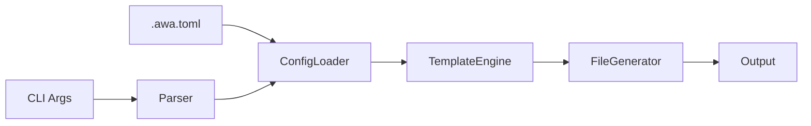

# Design Specification

## Overview

This design implements a CLI pipeline architecture for template-based code generation. The pipeline flows through argument parsing, configuration loading, template resolution, rendering, and file output with conflict resolution.

## Architecture

### High-Level Architecture

Sequential pipeline for predictable flow and error handling.



### Module Organization

```
src/
├── cli/
│   └── index.ts
├── core/
│   ├── config.ts
│   ├── template.ts
│   └── generator.ts
└── utils/
    └── fs.ts
```

### Architectural Decisions

- PIPELINE OVER EVENT: Sequential pipeline for predictable flow and error handling. Alternatives: event-driven, middleware chain

## Components and Interfaces

### CFG-ConfigLoader

Loads TOML configuration from file, merges with CLI arguments (CLI wins), and produces resolved options with defaults applied.

IMPLEMENTS: CFG-1_AC-1, CFG-1_AC-2, CFG-4_AC-1

```typescript
interface ConfigLoader {
  load(configPath: string | null): Promise<FileConfig | null>;
  merge(cli: RawCliOptions, file: FileConfig | null): ResolvedOptions;
}
```

### GEN-FileGenerator

Writes rendered templates to the output directory with conflict detection and dry-run support.

IMPLEMENTS: GEN-6_AC-1, GEN-6_AC-2

```typescript
interface FileGenerator {
  generate(files: RenderedFile[], options: GenerateOptions): Promise<GenerateResult>;
}
```

## Data Models

### Core Types

- RESOLVED_OPTIONS: Fully resolved configuration with all defaults applied

```typescript
interface ResolvedOptions {
  readonly output: string;
  readonly template: string | null;
  readonly features: readonly string[];
  readonly force: boolean;
}
```

## Correctness Properties

- CFG_P-1 [CLI Override]: CLI arguments always override config file values for the same option
  VALIDATES: CFG-4_AC-1, CFG-4_AC-2

- GEN_P-2 [Dry Run Immutable]: Dry-run mode never modifies the file system
  VALIDATES: GEN-6_AC-1, GEN-6_AC-2

## Error Handling

### ConfigError

Configuration loading and parsing errors

- FILE_NOT_FOUND: Config file does not exist when --config provided
- PARSE_ERROR: TOML syntax error with line number

### Strategy

PRINCIPLES:

- Fail fast on first error
- Provide actionable error messages with file paths
- Exit with non-zero code on any error

## Testing Strategy

### Property-Based Testing

- FRAMEWORK: fast-check
- MINIMUM_ITERATIONS: 100

```typescript
// @awa-test: CFG_P-1
test.prop([fc.string(), fc.string()])('CLI overrides config', (cliValue, configValue) => {
  const cli = { output: cliValue };
  const config = { output: configValue };
  const result = configLoader.merge(cli, config);
  expect(result.output).toBe(cliValue);
});
```

### Unit Testing

Test individual components in isolation

- AREAS: CFG-ConfigLoader merge logic, TPL-TemplateResolver type detection

## Requirements Traceability

### REQ-CFG-config.md

- CFG-1_AC-1 → CFG-ConfigLoader (CFG_P-1)
- CFG-4_AC-1 → CFG-ConfigLoader (CFG_P-1)

### REQ-GEN-generator.md

- GEN-6_AC-1 → GEN-FileGenerator (GEN_P-2)

## Library Usage

### Framework Features

- CITTY: Command definition, argument parsing, help generation

### External Libraries

- citty (latest): CLI framework
- smol-toml (1.x): TOML parser

## Change Log

- 1.0.0 (2025-01-10): Initial design
