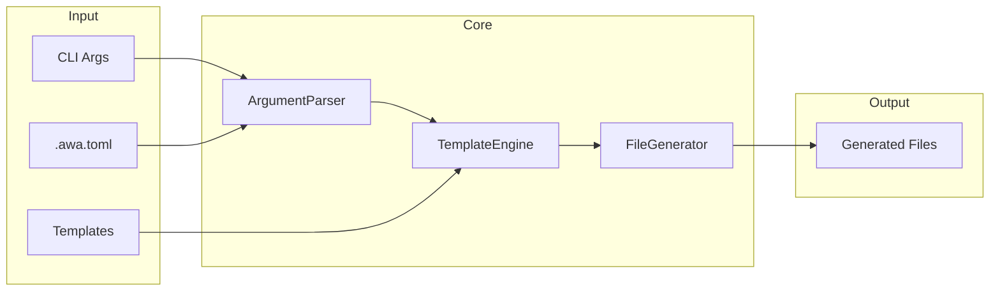
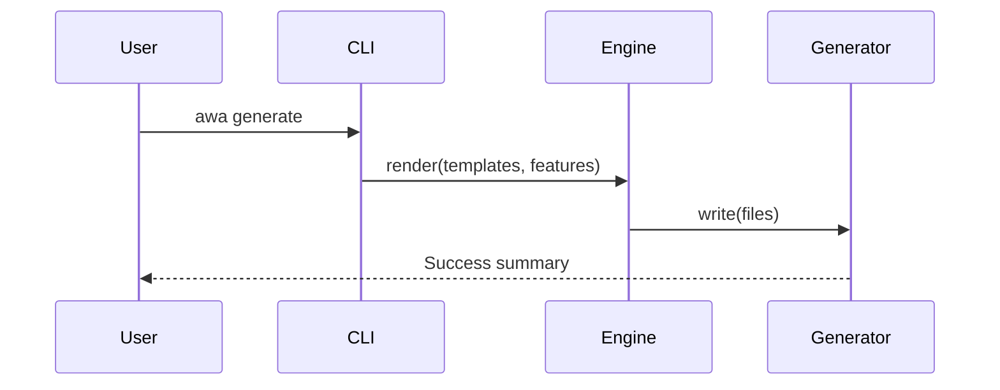

# Architecture

## Project Purpose

awa CLI generates AI coding agent configuration files from templates, enabling developers to quickly scaffold consistent agent setups across projects.

## System Overview

- CLI Layer
- Core Engine
- Template System
- I/O Layer

## Technology Stack

- `Node.js 20` — Runtime environment
- `TypeScript 5` — Type-safe development
- `Eta 3` — Template rendering
- `Commander` — CLI framework

## High-Level Architecture



## Directory Structure

```
src/           # Source code
src/cli/       # CLI entry and commands
src/core/      # Core engine logic
src/utils/     # Shared utilities
templates/     # Bundled templates
```

## Component Details

### CLI Layer

Handles argument parsing and command dispatch.

RESPONSIBILITIES

- Parse CLI arguments and options
- Load and merge configuration
- Dispatch to appropriate command handlers

CONSTRAINTS

- Must fail fast on invalid arguments
- Must support --help and --version

### Template Engine

Renders templates with feature flag context.

RESPONSIBILITIES

- Load templates from local or remote sources
- Render with Eta templating
- Detect empty output for conditional file creation

### File Generator

Writes rendered output to the file system.

RESPONSIBILITIES

- Write files with conflict detection
- Support dry-run mode
- Generate diff output

## Component Interactions

The CLI parses arguments, loads configuration, then passes resolved options to the template engine which renders files through the generator.

### Generate Command Flow



## Architectural Rules

- All file I/O must go through the I/O layer
- Core engine must not depend on CLI layer
- Templates must be stateless and deterministic
- Errors must provide actionable messages with file paths
- All public APIs must have TypeScript types

## Release Status

STATUS: Alpha — Core functionality implemented. API may change without notice.

## Developer Commands

- `npm install` — Install dependencies
- `npm run dev` — Run in development mode
- `npm test` — Run test suite
- `npm run lint` — Run linter
- `npm run build` — Build for production

## Change Log

- 1.0.0 (2025-01-10): Initial architecture
- 1.1.0 (2025-01-15): Added diff command
